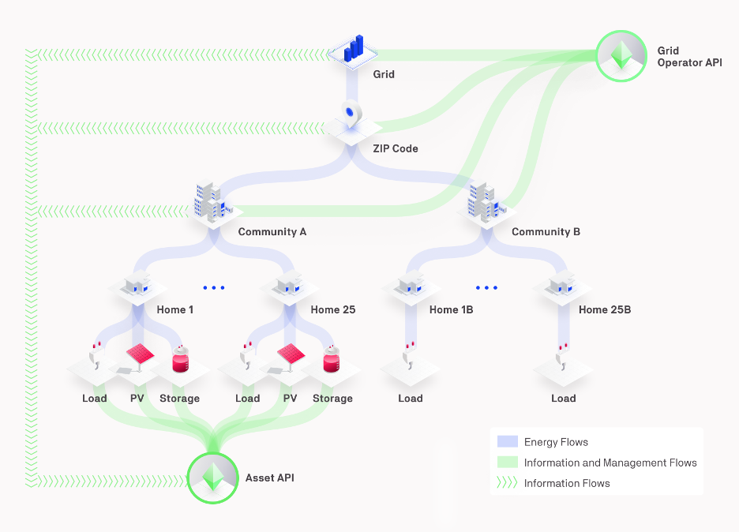

To enable users to run a collaboration, Grid Singularity has developed a **Software Development Kit - SDK** ([gsy-e-sdk](https://github.com/gridsingularity/gsy-e-sdk){target=_blank}), that allows users to perform the following functions;

* **Asset Trading**: The [Asset API](asset-api-template-script.md) allows aggregators who manage individual and community  energy assets to connect to the Grid Singularity Exchange and actively place bids and offers on their behalf. Aggregators can create custom strategies with the goal of optimizing trading for managed assets (Learn more about default trading strategies here);

* **Grid Management**: The [Grid Operator API](grid-operator-api-template-script.md) allows grid operators (DSO, DNO and TSO) to oversee multiple (sub)markets’ statistics and results in real-time and influence trading behavior by implementing custom (dynamic) grid fee strategies.

Examples of template agent scripts (flexible Python scripts) to connect to the Grid Singularity Exchange through the [Software Development Kit](https://github.com/gridsingularity/gsy-e-sdk){target=_blank} are available in the Grid Singularity’s GitHub repository for the [Asset API](https://github.com/gridsingularity/gsy-e-sdk/blob/master/gsy_e_sdk/setups/asset_api_template.py) and [Grid Operator API](https://github.com/gridsingularity/gsy-e-sdk/blob/master/gsy_e_sdk/setups/grid_operator_api_template.py){target=_blank} and are explained in sections below (respectively [here](asset-api-template-script.md) and [here](grid-operator-api-template-script.md)).

<figure markdown>
  {:text-align:center"}
  <figcaption><b>Figure 5.1</b>: Asset API and Grid Operator API interfacing with energy assets and markets in the Grid Singularity Exchange.
</figcaption>
</figure>
