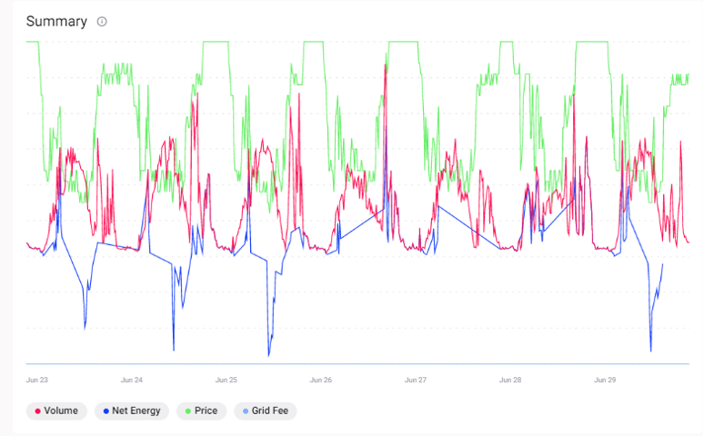

This market summary shows the net energy and volume in kWh for each 15 minute market slot. The average energy price and grid fees, if applied to this market are also shown in €/kWh.

<figure markdown>
  {:text-align:center"}
  <figcaption><b>Figure 3.13</b>: Summary of volume traded, net energy, average price and grid fee in the Grid Singularity’s simulation interface (Singularity Map)
</figcaption>
</figure>
