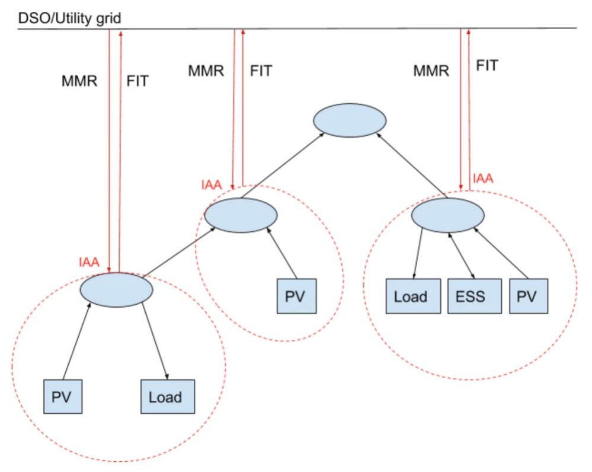

## Alternative Pricing Schemes

**How to configure Alternative Pricing**

To enable comparison of 4 different pricing schemes:

- (0) D3A pricing (trading according the D3A hierarchical market model)
- (1) no-scheme pricing (`GridAgent` buys at 0 ct/kWh and sells for `market_maker_rate`)
- (2) feed-in-tariff pricing (`GridAgent` buys at `feed_in_tariff_percentage * market_maker_rate` and sells for `market_maker_rate`)
- (3) net metering pricing (`GridAgent` buys at `market_maker_rate` and sells for `market_maker_rate`)

set the command line flag `--compare-alt-pricing`.
This will run separate `d3a-simulation`s with all 4 alternative pricing schemes in parallel for the selected setup file. 
The results of each simulation are stored in separate subfolders in the `export-path`.

If you want to run a simulation only for one specific pricing scheme, set it via a `ConstSetting` in the setup file in which you are configuring your grid, e.g. by adding the following line:

```
ConstSettings.IAASettings.AlternativePricing.PRICING_SCHEME = 1
```

(You should not set this parameter and use the `--compare-alt-pricing` cli parameter combined)

The feed-in-tariff (FIT) is a percentage that is set in the `ConstSetting`s as well, the default is 50%. Set this parameter yourself via a `ConstSetting` in the setup file in which you are configuring your grid, by adding the following line (e.g. FIT = 60% of `market_maker_rate`):

```
ConstSettings.IAASettings.AlternativePricing.FEED_IN_TARIFF_PERCENTAGE = 60
```

For more information we refer to Alternative Pricing Mechanisms.

## Alternative Pricing Mechanisms

In the D3A, the D3A pricing mechanism (determined through the D3A market structure) can be compared to other pricing mechanisms that are currently being used by utilities and grid providers. By setting one of the three pricing schemes below, the user can calculate the energy bills from a simulation according to that scheme. This is done by adjusting the feed-in-tariff (FIT). Many energy markets have a FIT that fits one of the three scenarios that can each be configured and run in the D3A. 

The cost to buy electricity from the utility is known in the D3A as the market maker rate (MMR). This is because in grid connected scenarios, a community or local grid is connected to the utility grid which is modeled as an infinite power plant and sells power at the utility rate. This rate is called the market maker rate because it sets the price basis for the other buyers and sellers in the market.

There are three alternative pricing schemes:

1. **No Pricing scheme**: In this scheme, the households or grid customers have a 0% FIT and cannot sell any surplus energy they produce to the grid for additional income. They buy energy from the grid at the utility rate (MMR).
2. **Feed In Tariff (FIT)**: In this scheme, the households or grid customers have 50% FIT (50% is the default value; it is configurable) at which they can sell surplus energy to the grid for 50% of the MMR. They buy energy from the grid at the utility rate (MMR). 
3. **Net Metering (NM)**: In this scheme, the households or grid customers have a 100% FIT, which is also known as net metering. This means that they can sell surplus energy to the utility at the same rate that they must pay to buy. In many implementations this means that the customer simply rolls back their meter when supplying the grid with energy and pays the net energy they have consumed each paying period times the utility rate (MMR). (In the case of 100% FIT, the customer could actually make a net income if they produce more than they consume under a flat MMR.)

How the D3A engine simulates these alternative pricing schemes:

All areas at the lowest level (with their own meter) are disconnected. Areas that contain children/devices are considered "households" or "grid customers". These households are allowed to trade internally; this way, household PV's are still able to supply to that respective household load, just as you would expect. The surplus PV energy is "sold" to the IAA of the household; the IAA does not connect to the higher level market as would be the case in D3A trading, but connects directly to a "`GridAgent`". This `GridAgent` reimburses the household IAA according to the FIT. Any energy bought, for instance when a household PV (if any) does not supply enough energy, is provided by the `GridAgent` at the MMR.

See picture; in case of `--compare-alt-price` is flagged; the D3A grid is isolated according to the red dotted lines; and IAA are connected to the DSO/Utility grid.

