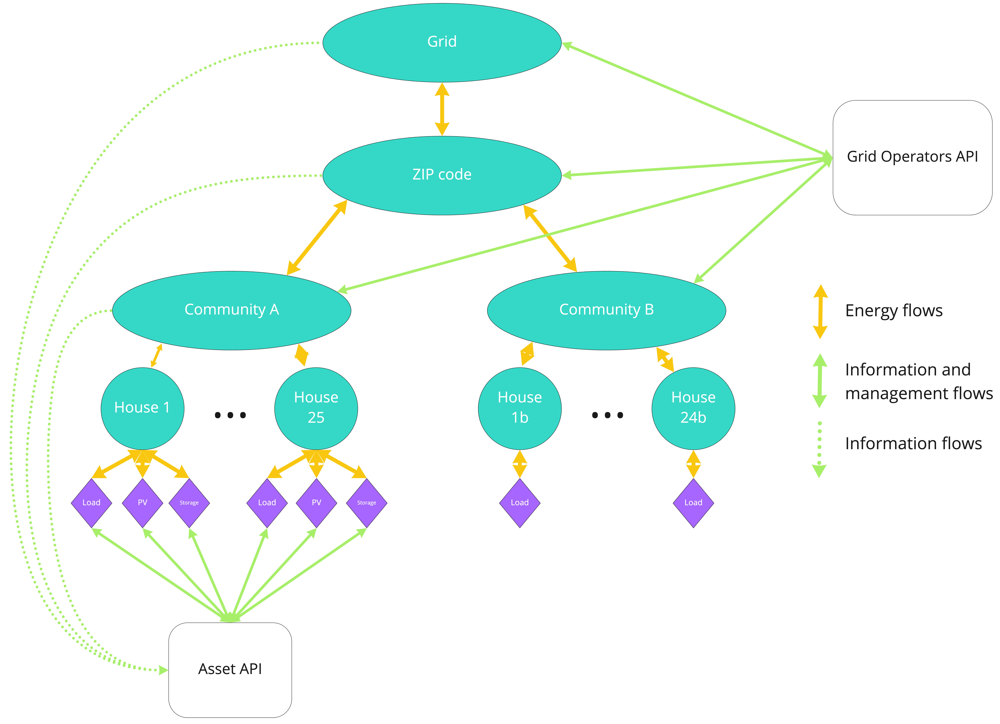

There are 2 available APIs to interact with a running simulation. The first one is the [Asset API](assets-api.md) and allows to manage multiple assets by implementing custom trading strategies. The second API is the [Grid Operators API](grid-api.md) that allows to manage multiple markets by implementing grid fee strategies based on the market statistics.




### API Client Installation
Note, if you are running the d3a using a virtual machine and vagrant, the latest api-client is already installed on your machine and you can skip to the `Launch Simulation` section below. If you are running the d3a locally, please follow the following instructions.

#### Install Redis server. Open a new terminal and type
``` 
brew install redis
```

#### Install d3a-client
```
mkvirtualenv d3a-api-env
pip install git+https://github.com/gridsingularity/d3a-api-client.git
```

#### Update d3a-client (as needed when an update is deployed)

```
pip uninstall d3a-api-client
pip install git+https://github.com/gridsingularity/d3a-api-client.git
```
