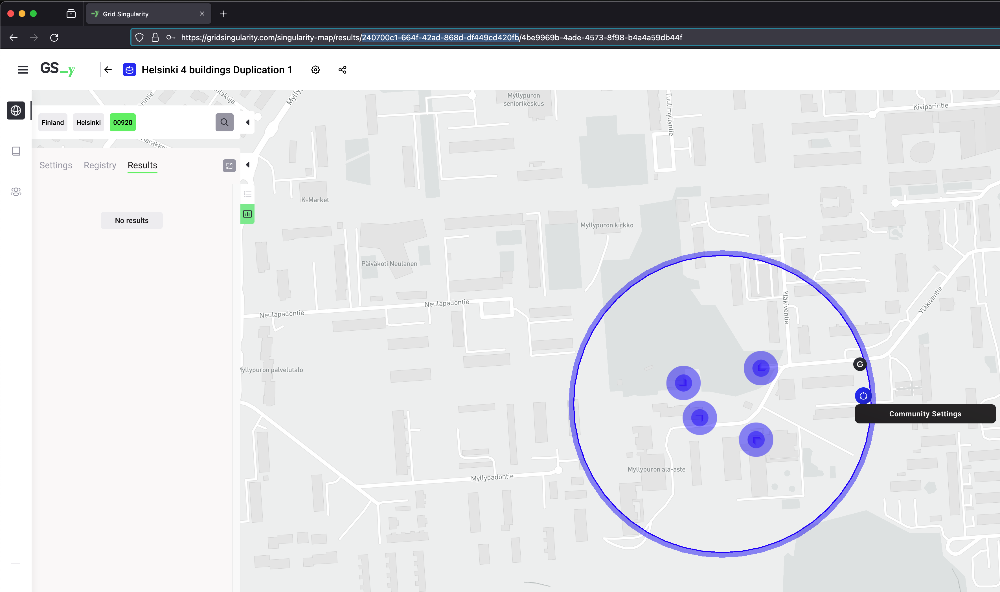

##Definition
To enable users to interact with a running collaboration or a canary test network, two different application interfaces (APIs) are available. The [Asset API](assets-api.md) allows the user to manage multiple energy assets by implementing custom trading strategies. The [Grid Operator API](grid-operator-api.md) allows the user to manage multiple markets by implementing custom grid fee strategies. Both interfaces allow strategies to incorporate market and asset statistics. Two examples of template API scripts are available in the Grid Singularity’s GitHub repository: [Asset API](https://github.com/gridsingularity/d3a/blob/master/src/d3a/setup/odyssey_momentum/assets_api_template.py) and [Grid Operator API](https://github.com/gridsingularity/d3a/blob/master/src/d3a/setup/odyssey_momentum/markets_api_template.py).  These two APIs interact with Grid Singularity simulations through the open source Grid Singularity’s [API client](https://github.com/gridsingularity/d3a-api-client). 


##API Client Installation##

_Note:_ If you are running the Grid Singularity energy exchange engine using a virtual machine and `vagrant`, the latest `api-client` is already installed on your machine and you can skip to the [Launch Simulation](api-overview.md#launch-simulation) section below. If you are running the engine locally, please follow the following instructions.

###Install Redis server. Open a new terminal and type

```
brew install redis
```

To install redis in Ubuntu follow the [link](https://redis.io/topics/quickstart)

###Install d3a-client

```
mkvirtualenv d3a-api-env
pip install git+https://github.com/gridsingularity/d3a-api-client.git
```

###Update d3a-client (as needed when an update is deployed)

```
pip uninstall d3a-api-client
pip install git+https://github.com/gridsingularity/d3a-api-client.git
```

Lastly for the Grid Operator API, 3 additional packages are required for the template script to work: 

```
pip install pandas
pip install openpyxl
pip install tabulate
```


##Registration - Simulations run on the User Interface

To connect the API to simulations, the user needs to register and be approved for a collaborative simulation by following these [steps](collaboration.md#how-to-connect). Once the user successfully registers for the relevant assets or markets, the user needs to adapt their API scripts. 

##Registration - Simulations run on the Backend

###Start Redis server

To use the API locally, your script interacts with the simulation using a local Redis instance. To start the redis instance, open a new terminal and run the following command :

```
redis-server /usr/local/etc/redis.conf
```

###Open external connection to API for Assets

In the setup file (template available [here](https://github.com/gridsingularity/d3a/blob/master/src/d3a/setup/api_setup/default_community.py)), an asset must be designated as open to external connection via the API. This is controlled when setting up the simulation in the setup file by designating the ExternalStrategy for each relevant energy assets :

```
Area('Family 3 children+PV+Batt',
                         [
                             Area('Load 3 L17', strategy=LoadProfileExternalStrategy(
                                 daily_load_profile=os.path.join(current_dir,
                                                                 "resources/CHR41 Family with 3 children, both at work HH1.csv"),
                                 initial_buying_rate=Load_initial_buying_rate,
                                 final_buying_rate=Load_final_buying_rate),
                                  ),
                             Area('PV 3 (5kW)', strategy=PVUserProfileExternalStrategy(
                                 power_profile=os.path.join(current_dir, "resources/Berlin_pv.csv"),
                                 panel_count=5,
                                 initial_selling_rate=30,
                                 final_selling_rate=11),
                                  ),
                             Area('Tesla Powerwall 3', strategy=StorageExternalStrategy(initial_soc=10,
54min_allowed_soc=10,
battery_capacity_kWh=14,
max_abs_battery_power_kW=5,
initial_buying_rate=0,
final_buying_rate=25,
initial_selling_rate=30,                                                                              final_selling_rate=25.1),
                                  ),
                         ])
```


By default, trading strategies do not allow API connections unless the `ExternalStrategy` is used. Please also ensure that the appropriate libraries are imported to use the API. 

###Open Markets for external connection

The API supports multiple markets managed with the Grid Operator API. Access is controlled when setting up the simulation, using the `Area` class’ boolean argument called `external_connection_available`:

```
 Area(
'Community',[
...
 ], grid_fee_constant=4, external_connection_available=True),
```

If set to `True`, the area allows all the [Grid Operator API](grid-operator-api.md) to connect to that market, receive statistics and change grid fees. By default, this `external_connection_available` is set to `False`.

###Launch simulation

This requires you to have the [backend codebase](https://github.com/gridsingularity/d3a) installed on your machine to run simulations (see [installation instructions](ios-installation-instructions.md)). First navigate to the D3A folder in a new terminal, then activate the D3A environment with the command:

```
workon d3a
```

An template setup is already available in github and ready to be run [here](https://github.com/gridsingularity/d3a/blob/master/src/d3a/setup/api_setup/default_community.py) (data available for the July 2021). 

To run this simulation and wait for the API template script to execute:

```
d3a -l INFO run -t 15s -s 15m --setup api_setup.default_community --slot-length-realtime 5 --start-date 2021-07-01 --enable-external-connection --paused
```


_For more information on launching a simulation on the backend please visit [this page](general-settings.md#simulation-launch)._

After few seconds, the simulation should begin, waiting for the API template as mentioned in the figure below:


##Initialise and start the API :

Before launching the API script, the user needs to adapt the following information in their script (script template available here) : 

###Oracle name

This parameter is only relevant when using the API on the User-Interface. This defines the name of the aggregator / API name that manages the markets and energy assets. Once the name is set it cannot be changed within the same running collaboration.

```
oracle_name = 'oracle'
```


###Assets/markets list

The list of assets / markets needs to be updated to include the assets registered to user through the registration process, in arrays as follows :

```
load_names = ['Load 1 L13', 'Load 2 L21', 'Load 3 L17']
pv_names = ['PV 1 (4kW)', 'PV 3 (5kW)']
storage_names = ['Tesla Powerwall 3']
```


```
market_names = ["Grid", "Community"]
```

The API script has an *automatic* connection method to manage energy assets. If `automatic` is `True`, the API client will automatically connect to all energy assets that the user is registered to. This option is only available for simulations running on the [User-Interface](https://www.d3a.io/).

###Launching the API client: 

The API client is launched with a **cli command**. To launch the agent, you need to open a new terminal and activate d3a-api-client environment

```
workon d3a-api-env
```

And go to the d3a-api-client repository

```
cd path_to_repository/d3a-api-client
```

The api launch cli command takes several arguments that can be listed with: 

```
d3a-api-client run --help
```

The arguments are : 

*   `base-setup-path` --> Set the base path where user's client script resides, otherwise `d3a_api_client/setups` is taken as default for user's client scripts. Users can provide either an absolute or a relative file path.
*   `setup` --> Name of user's API client module/script.
*   `username` --> Username of agent authorized to communicate with respective collaboration/CN.
*   `password` --> Password of respective agent
*   `domain-name` --> D3A domain name
*   `web-socket` --> D3A websocket URI
*   `simulation-id` --> UUID of the collaboration or Canary Network (CN)
*   `simulation-config-path` --> Path to the JSON file that contains the user's collaboration/CN information. This file can be downloaded from the "Registry" page on the D3A website. `simulation-id`, `domain-name`, and `web-socket` CLI-settings will be overwritten by the settings in the file
*   `run-on-redis` --> This flag targets the local testing of the API client, where no user authentication is required. A locally running redis server and d3a simulation are needed here.

The API agent can interface with a local simulation (d3a backend) or a collaboration/Canary Network (User-Interface). There are 3 methods to parse the required information when launching the API to connect to the UI: 

1. Simulation configuration file
2. Cli command
3. Environment variables

####Simulation configuration file:

The simulation configuration file is a JSON format file downloadable on the User-Interface. It contains all the information about the simulation setup (username, simulation name and UUID, domain name, websocket domain name, global settings of the simulation and the registry, consisting of all the grid hierarchy including markets and assets and whether or not the user is connected to those). To download this file the user needs to go to the registry page of the relevant collaboration/CN and click on the top right edit icon and Download API Client Summary.


To run the API agent you can run the following command by adapting the arguments to your case:

```
d3a-api-client --log-level INFO run  --setup asset_api_template -u username -p password -i absolute_path/my_simulation_config.json 
```

####CLI command:

Instead of passing the JSON file, the user can directly pass the relevant variables as arguments in the CLI commands. For that to work, users need to pass the domain name and websocket name (both are optional parameters and only relevant when connecting to specific domains) and the simulation_id. The simulation_id corresponds to the Universally Unique IDentifier. This token can be found in the URL of a collaboration or a Canary Network in the User Interface. 



To run the API agent you can run the following command by adapting the arguments to your case:

```commandline
d3a-api-client --log-level INFO run  --setup asset_api_template -u username -p password --simulation-id UUID
```

####Environnement variables:

The last method to launch the API is to send the set the required variable in the environment. To do that users can simply define those parameters at the top of their script as follow:

```
os.environ["API_CLIENT_USERNAME"] = "username"
os.environ["API_CLIENT_PASSWORD"] = "password"
os.environ["API_CLIENT_SIMULATION_ID"] = "simulation_uuid"
```

To run the API agent you can run the following command by adapting the arguments to your case:

```
d3a-api-client --log-level INFO run  --setup asset_api_template
```

####Local simulation:

To interact with a locally running simulation (backend simulation), username, passwords, domain and websocket names and simulation_id are not necessary. There is only an additional flag required in the CLI command : `--run-on-redis`.  

```
d3a-api-client --log-level INFO run --setup asset_api_template --run-on-redis
```

####Log levels:

The API CLI command can receive a _--log-level_ argument. Adjusting this parameter will increase or reduce the level of information displayed in the terminal, while the agent is running. There are 4 levels (classed from low detailed to high: 

#####ERROR

Display only critical errors from the api client or the d3a (for instance, if d3a responds with an error in a command that the API client is sending, the error log should include it)

#####WARNING

Display critical and non-critical error messages  (for instance if the API agent is over bidding its energy requirement)

#####INFO

Display critical and non-critical errors messages and general information such as market progression and trades

#####DEBUG

Display full information on the agent (for instance all command and response, such as placing bids and offers on the market)
