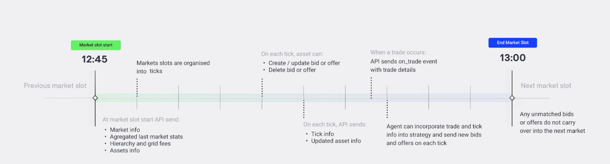

Each market cycle lasts 15 minutes and is divided into ticks. The bids and offers can be posted within the market cycle at each tick until the cycle ends.

<figure markdown>
  {:text-align:center"}
  <figcaption><b>Figure 5.4</b>: Market slot overall structure and Asset API events.
</figcaption>
</figure>

At the beginning of each market slot, the [Asset API](asset-api-template-script.md) receives markets and assets information structured in a nested dictionary according to the grid hierarchy. Each market provides statistics such as minimum, median and maximum trade rates, total energy volume traded, grid fees and each asset returns the last bills and energy volume traded in the previous market slot.

At each tick of the market slot, the Asset API receives updated asset information (e.g. remaining energy to buy/sell) and can post/update/delete bids and offers.

When the trade occurs, trade details are sent by the Asset API. If there are unmatched bids or offers, they are not carried to the next market cycle.

In order to facilitate bid and offer management and scheduling, a python file with the [class Oracle](https://github.com/gridsingularity/gsy-e-sdk/blob/master/gsy_e_sdk/setups/asset_api_template.py){target=_blank} is provided. The Oracle class acts as an information aggregator for all of the energy assets (e.g. loads, PVs and storage) managed by the user, and allows the user to post bids and offers on their behalf. Several functions are triggered for different types of [events](events.md), and can be overridden.


### Each new market slot
```
def on_market_cycle(self, market_info):
```

When a new market slot is available the client will get notified via an event. It is possible to capture this event and perform operations after it by overriding the on_market_cycle method, used to gather aggregated information about the assets and last market slot statistics, define the trading strategy and place the first bids/offers.

In the variable market_info the user will get a dictionary with information on the market and assets. The user receives information for each asset he/she manages. The return values have the following structure:


```json
{'slot_completion': '0%',
 'market_slot': '2014-10-01T00:15',
 'grid_tree': {'477999f1-fd6e-4c68-8cc8-e8e52049de8e': {'last_market_bill': {'accumulated_trades': {}, 'external_trades': {}},
 'last_market_stats': {'min_trade_rate': 26.0, 'max_trade_rate': 26.0, 'avg_trade_rate': 26.0, 'median_trade_rate': 26.0, 'total_traded_energy_kWh': 7.5239405},
 'last_market_fee': 4,
'current_market_fee': 4,
 'area_name': 'Grid', 'children': {'f02313bb-16c4-427b-90d2-d753822fe21c': {'last_market_bill': {'accumulated_trades': {}, 'external_trades': {}},
 'last_market_stats': {'min_trade_rate': 30.0, 'max_trade_rate': 30.0, 'avg_trade_rate': 30.0, 'median_trade_rate': 30.0, 'total_traded_energy_kWh': 7.5239405},
 'last_market_fee': 4,
 'current_market_fee': 4,
 'area_name': 'Community', 'children': {'44d19495-39e8-42e0-be2f-0432e644e5e5': {'last_market_bill': {'accumulated_trades': {}, 'external_trades': {}},
'last_market_stats': {'min_trade_rate': None, 'max_trade_rate': None, 'avg_trade_rate': None, 'median_trade_rate': None, 'total_traded_energy_kWh': None},
'last_market_fee': 0.0,
'current_market_fee': None,
'area_name': 'Member 1', 'children': {'075834dd-5438-4287-8393-781a4a8068f5': {'asset_info': {'energy_requirement_kWh': 0.06802025, 'energy_active_in_bids': 0.0, 'energy_traded': 0.0, 'total_cost': 0.0},
 'last_slot_asset_info': {'energy_traded': 0.0, 'total_cost': 0.0},
 'asset_bill': {},
 'area_name': 'Load 1'}, '2e7866d8-34c6-49ad-a388-fd5876a3e679': {'asset_info': {'available_energy_kWh': 0.0, 'energy_active_in_offers': 0, 'energy_traded': 0, 'total_cost': 0}, 'last_slot_asset_info': {'energy_traded': 0, 'total_cost': 0}, 'asset_bill': {}, 'area_name': 'PV 1'}, '22c495b2-4b2b-43ba-8c76-3eb956014975': {'asset_info': {'energy_to_sell': 0.0, 'energy_active_in_bids': 0, 'energy_to_buy': 1.36275, 'energy_active_in_offers': 0, 'free_storage': 10.0, 'used_storage': 0.0, 'energy_traded': 0.0, 'total_cost': 0.0}, 'last_slot_asset_info': {'energy_traded': 0.0, 'total_cost': 0.0}, 'asset_bill': {}, 'area_name': 'Storage 1'}}}, '5c0c05dd-2e23-4866-a113-e08797a2094e': {'last_market_bill': {'accumulated_trades': {}, 'external_trades': {}},
'last_market_stats': {'min_trade_rate': 30.0, 'max_trade_rate': 30.0, 'avg_trade_rate': 30.0, 'median_trade_rate': 30.0, 'total_traded_energy_kWh': 0.064779},
'last_market_fee': 0.0,
'current_market_fee': None,
'feed_in_tariff_rate': 21.9,
'market_maker_rate': 22,
'event': 'market',
'num_ticks': 10.0,
'simulation_id': None
'feed_in_tariff_rate': 21.9,
'market_maker_rate': 22,
'event': 'market', 'num_ticks': 10.0,
'simulation_id': None
}
```

### On % of market completion

```
def on_tick(self, tick_info):
```

At each 10% of market slot completion (e.g. 10%, 20%, 30%, …), the same information as market_info will be passed, with updated asset energy requirements based on trades. This can be used to update the user’s bid or offer price at these milestones.

### On event or response

```
def on_event_or_response(self, message):
```

Each time the managed assets are triggered with an event or get any responses (from sending the batch commands such as trades confirmations), this information is repassed through on_event_or_response. This information can be stored locally or acted upon.

### On finish

```
def on_finish(self, finish_info):
```

This executes when the simulation finishes, and can be used to trigger exporting data, training a model or exiting the code.
