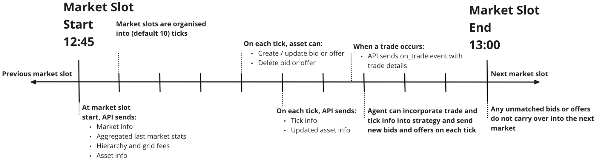

The Grid Singularity API client allows you to create agents that follow custom trading strategies to buy and sell energy in the energy market. The agent can request and receive information through the Asset API, feed that information into an algorithm, and post bids or offers on a live simulated exchange. 



The new market cycle begins after every 15 minutes and is divided into 10 ticks till the end of the market cycle. The bids and offers are made within the market cycle at every tick till the cycle ends.

**Start of the market slot**

The API sends the market info, aggregated last market slot stats, grid hierarchy and asset info.

**Each tick of the market slot**

*   Market slots are organised into 10 available ticks where the agent can make decisions
*   API agent receives updated asset information (e.g. remaining energy to buy/sell)
*   API agent can post/update/delete bid and offer

When the trade occurs, on_trade events with trade details are sent by the API. If there are unmatched bids or offers, they are not carried to the next market cycle.

##API Events

In order to facilitate bid and offer management and scheduling, a python file with the class Oracle is provided. The Oracle class acts as an information aggregator for all of the energy assets (e.g. loads, PVs and storages) you manage, and allows you to post bids and offers on their behalf. A few functions are triggered on different types of events, and can be overridden, useful to take actions when market events occur.

###Each new market slot
```
def on_market_cycle(self, market_info):
```

When a new market slot is available the client will get notified via an event. It is possible to capture this event and perform operations after it by overriding the `on_market_cycle` method.

In the variable market_info you will get a dictionary with information on the market and your assets. You receive information for each asset you manage. The return values have the following structure:


```json
{'slot_completion': '0%',
 'market_slot': '2014-10-01T00:15',
 'grid_tree': {'477999f1-fd6e-4c68-8cc8-e8e52049de8e': {'last_market_bill': {'accumulated_trades': {}, 'external_trades': {}},
 'last_market_stats': {'min_trade_rate': 26.0, 'max_trade_rate': 26.0, 'avg_trade_rate': 26.0, 'median_trade_rate': 26.0, 'total_traded_energy_kWh': 7.5239405},
 'last_market_fee': 4, 
'current_market_fee': 4,
 'area_name': 'Grid', 'children': {'f02313bb-16c4-427b-90d2-d753822fe21c': {'last_market_bill': {'accumulated_trades': {}, 'external_trades': {}},
 'last_market_stats': {'min_trade_rate': 30.0, 'max_trade_rate': 30.0, 'avg_trade_rate': 30.0, 'median_trade_rate': 30.0, 'total_traded_energy_kWh': 7.5239405},
 'last_market_fee': 4,
 'current_market_fee': 4,
 'area_name': 'Community', 'children': {'44d19495-39e8-42e0-be2f-0432e644e5e5': {'last_market_bill': {'accumulated_trades': {}, 'external_trades': {}}, 
'last_market_stats': {'min_trade_rate': None, 'max_trade_rate': None, 'avg_trade_rate': None, 'median_trade_rate': None, 'total_traded_energy_kWh': None},
'last_market_fee': 0.0,
'current_market_fee': None, 
'area_name': 'Member 1', 'children': {'075834dd-5438-4287-8393-781a4a8068f5': {'asset_info': {'energy_requirement_kWh': 0.06802025, 'energy_active_in_bids': 0.0, 'energy_traded': 0.0, 'total_cost': 0.0},
 'last_slot_asset_info': {'energy_traded': 0.0, 'total_cost': 0.0},
 'asset_bill': {},
 'area_name': 'Load 1'}, '2e7866d8-34c6-49ad-a388-fd5876a3e679': {'asset_info': {'available_energy_kWh': 0.0, 'energy_active_in_offers': 0, 'energy_traded': 0, 'total_cost': 0}, 'last_slot_asset_info': {'energy_traded': 0, 'total_cost': 0}, 'asset_bill': {}, 'area_name': 'PV 1'}, '22c495b2-4b2b-43ba-8c76-3eb956014975': {'asset_info': {'energy_to_sell': 0.0, 'energy_active_in_bids': 0, 'energy_to_buy': 1.36275, 'energy_active_in_offers': 0, 'free_storage': 10.0, 'used_storage': 0.0, 'energy_traded': 0.0, 'total_cost': 0.0}, 'last_slot_asset_info': {'energy_traded': 0.0, 'total_cost': 0.0}, 'asset_bill': {}, 'area_name': 'Storage 1'}}}, '5c0c05dd-2e23-4866-a113-e08797a2094e': {'last_market_bill': {'accumulated_trades': {}, 'external_trades': {}},
'last_market_stats': {'min_trade_rate': 30.0, 'max_trade_rate': 30.0, 'avg_trade_rate': 30.0, 'median_trade_rate': 30.0, 'total_traded_energy_kWh': 0.064779},
'last_market_fee': 0.0, 
'current_market_fee': None,
'feed_in_tariff_rate': 21.9,
'market_maker_rate': 22,
'event': 'market', 
'num_ticks': 10.0, 
'simulation_id': None
'feed_in_tariff_rate': 21.9,
'market_maker_rate': 22,
'event': 'market', 'num_ticks': 10.0,
'simulation_id': None
}
```

###On % of market completion

```
def on_tick(self, tick_info):
```

Each 10% of market slot completion (e.g. 10%, 20%, 30%, …), the same information as market_info will be passed, with updated asset energy requirements based on trades. This can be used to update your bid or offer price at these milestones.

###On event or response

```
def on_event_or_response(self, message):
```

Each time the assets you manage are triggered with an event or get any responses (from sending the batch commands such as trades, bids/offers confirmations), this information is passed through `on_event_or_response`. This information can be stored locally or acted upon.

###On finish

```
def on_finish(self, finish_info):
```

This executes when the simulation finishes, and can be used to trigger exporting data, training a model or exiting the code.

##API Commands

The oracle is able to request information and post bids and offers for multiple assets at the same time by aggregating multiple commands in a single batch to be executed at the same time. The following are the different commands available for the Asset API :

###bid_energy()

Places an energy bid to the registered market. This command receives 4 arguments : 

*   **area_uuid**: Universal Unique Identifier of the selected asset
*   **energy**:  energy in kWh
*   **price**: price in Euro cents
*   **replace_existing**: if set to TRUE replace all existing bids with a new one

Here is an example:

```
self.add_to_batch_commands.bid_energy(area_uuid = "2e7866d8-34c6-49ad-a388-fd5876a3e679", energy = 2, price = 60, replace_existing = True)
```

###bid_energy_rate()

Places an energy bid to the registered market. This batch command receives 4 arguments : 

*   **area_uuid**: Universal Unique Identifier  of the selected asset
*   **energy**: energy in kWh
*   **rate**: price per volume in Euro cents/kWh
*   **replace_existing**: if set to TRUE replace all existing bids with a new one

Here is an example:

```
self.add_to_batch_commands.bid_energy_rate(area_uuid = "2e7866d8-34c6-49ad-a388-fd5876a3e679", energy = 2, rate = 30, replace_existing = True)
```

###update_bid_energy()

Update the bid of an asset to a new price. This command receives 3 arguments : 

*   **area_uuid**: Universal Unique Identifier  of the selected asset
*   **energy**:  energy in kWh
*   **price**: price in Euro cents

Here is an example:

```
self.add_to_batch_commands.update_bid_energy(area_uuid = "2e7866d8-34c6-49ad-a388-fd5876a3e679", energy = 2, price = 60)
```

###lists_bids()

Lists all posted bids on the selected market. This command takes 1 argument: **area_uuid** which is the Universal Unique Identifier of the selected market.

Here is an example:

```
self.add_to_batch_commands.list_bids(area_uuid="62f827ec-ef86-4782-b5c3-88327751d97d")
```

###delete_bid()

Delete a bid posted on the market using its ID. This command receives 2 arguments : 

*   **area_uuid**: Universal Unique Identifier of the selected asset
*   **bid_id**: ID of the selected bid. If None, all the bids posted by the selected asset will be deleted.

Here is an example:

```
self.add_to_batch_commands.delete_bid(area_uuid="62f827ec-ef86-4782-b5c3-88327751d97d", bid_id = "2e7866d8-3dg6-49ad-afe8-fd5876a3e679")
```

###offer_energy()

Places an energy offer to the registered market. This command receives 4 arguments : 

*   **area_uuid**: Universal Unique Identifier  of the selected asset
*   **energy**:  energy in kWh
*   **price**: price in Euro cents
*   **replace_existing**: if set to TRUE replace all existing bids with a new one

Here is an example:

```
self.add_to_batch_commands.offer_energy(area_uuid = "2e7866d8-34c6-49ad-a388-fd5876a3e679", energy = 2, price_cents = 60, replace_existing = True)
```

###offer_energy_rate()

Places an energy offer to the registered market. This command receives 4 arguments : 

*   **area_uuid**: Universal Unique Identifier  of the selected asset
*   **energy**:  energy in kWh
*   **rate**: price per volume in Euro cents/kWh
*   **replace_existing**: if set to TRUE replace all existing offers with a new one

Here is an example:

```
self.add_to_batch_commands.offer_energy_rate(area_uuid = "2e7866d8-34c6-49ad-a388-fd5876a3e679", energy = 2, rate = 30, replace_existing = True)
```

###update_offer_energy()

Update the offer of an asset to a new price. This command receives 3 arguments : 

*   **area_uuid**: Universal Unique Identifier  of the selected asset
*   **energy**:  energy in kWh
*   **price**: price in Euro cents

Here is an example:

```
self.add_to_batch_commands.update_offer_energy(area_uuid = "2e7866d8-34c6-49ad-a388-fd5876a3e679", energy = 2, price_cents = 30)
```

###lists_offers()

Lists all posted offers on the selected market. This command takes 1 argument: **area_uuid** which is the Universal Unique Identifier of the selected market.

Here is an example:

```
self.add_to_batch_commands.list_offers(area_uuid="62f827ec-ef86-4782-b5c3-88327751d97d")
```

###delete_offer()

Delete an offer posted on the market using its ID. This command receives 2 arguments : 

*   **area_uuid**: Universal Unique Identifier  of the selected asset
*   **offer_id**: ID of the selected offer. If None, all the bids posted by the selected asset will be deleted.

Here is an example:

```
self.add_to_batch_commands.delete_offer(area_uuid="62f827ec-ef86-4782-b5c3-88327751d97d", bid_id = "2e7866d8-3dg6-49ad-afe8-fd5876a3e679")
```

###device_info()

Get device info (returns required energy for Load devices, available energy for PVs and energy to buy/sell for storage). This command receives 1 argument: **area_uuid** which is the Universal Unique Identifier of the selected asset

```
self.add_to_batch_commands.device_info(area_uuid="62f827ec-ef86-4782-b5c3-88327751d97d")
```

###Execute

After adding all the wanted commands in the batch, the API can execute it with the following command:

```
response = self.execute_batch_commands()
```

In return the simulation will provide a detailed response for all commands submitted.

*Note: The total amount of energy to bid/offer at any point is limited to the energy requirement/available of the asset. Additionally, the price of your bids/offers must be a positive float otherwise it will get rejected by the market.*

##API template script

A simple trading strategy is available in the [template agent](https://github.com/gridsingularity/d3a-api-client/blob/master/d3a_api_client/setups/asset_api_template.py). This shows an example of what can be done with this API, and offers a flexible structure, easy to modify to implement custom smart trading strategies. See the `TODO` flags there to see how you may configure your trading strategy and extract market and asset data. 

[Here](https://github.com/gridsingularity/d3a-api-client/blob/master/d3a_api_client/setups/asset_api_template.py#L16-L31), the name of the oracle and the list of the connected devices are defined. If the user is running the API to the UI and automatic is set to True, the script will automatically connect to all assets the user is approved to. 

The event `on_market_cycle` is used to gather market information through market_info and assets information, define the trading strategy and place the first bids/offers. The [first information](https://github.com/gridsingularity/d3a-api-client/blob/master/d3a_api_client/setups/asset_api_template.py#L65-L70) to be gathered is the Market Maker price and Feed-in Tariff and calculate the average value between them. These values are required to set the boundaries of the pricing trading strategy.

In these [lines](https://github.com/gridsingularity/d3a-api-client/blob/master/d3a_api_client/setups/asset_api_template.py#L65-L70), the API script stores energy assets information such as the energy requirements for the loads, the energy available for the PVs and the State Of Charge for the storage. This information when aggregated could be valuable when designing a smarter strategy.

After that, the API client [creates a nested dictionary](https://github.com/gridsingularity/d3a-api-client/blob/master/d3a_api_client/setups/asset_api_template.py#L103-L143), containing various information for each asset. First we get the name of the assets and the fees between the assets and the [market maker](model-market-maker.md). The `Aggregator` class has a function that calculates the grid fees along the path between two assets or markets in the grid: [calculate_grid_fee](https://github.com/gridsingularity/d3a-api-client/blob/master/d3a_api_client/setups/asset_api_template.py#L109). This function takes 3 arguments:

*   **start_market_or_device_name**: UUID of the started market/asset 
*   **target_market_or_device_name**: UUID of the targeted market/asset 
*   **fee_type**: can either be `current_market_fee` or `last_market_fee`

These [fees](constant-fees.md) should be integrated in the pricing strategy in order to avoid any power outages for the loads and curtailment for the PVs. Lastly in this asset_strategy dictionary, the pricing strategy is defined for each asset individually. This allows assets to have independent strategies depending on their information and location in the grid.

The current pricing strategies are deterministic, representing a linear function bounded between the Feed-in Tariff - grid fee (lower boundary) and the Market Maker price + grid fee (upper boundary). Since the API client can post up to 10 bids/offers per market slot, the strategies incrementally ramp up (bids) or down (offers) for a total of 10 prices per energy asset. The final bid/offer price is set at least [2 API available ticks](https://github.com/gridsingularity/d3a-api-client/blob/master/d3a_api_client/setups/asset_api_template.py#L115) before the end of the market slot length (9th and 10th tick in our case) to make sure that the bids and offers are placed before the [market slot](markets.md#market-slots). 

Here are defined the [loads](https://github.com/gridsingularity/d3a-api-client/blob/master/d3a_api_client/setups/asset_api_template.py#L111-L122), [PVs](https://github.com/gridsingularity/d3a-api-client/blob/master/d3a_api_client/setups/asset_api_template.py#L124-L133) and [storages](https://github.com/gridsingularity/d3a-api-client/blob/master/d3a_api_client/setups/asset_api_template.py#L135-L143) pricing strategies.

In [these lines](https://github.com/gridsingularity/d3a-api-client/blob/master/d3a_api_client/setups/asset_api_template.py#L145-L179), the API script sends the first bid and/or offer for each energy asset. For each of them the API gets the energy requirements (load), available (storage) and energy to buy/sell (storage) through [_latest_grid_tree_flat.items()_](https://github.com/gridsingularity/d3a-api-client/blob/master/d3a_api_client/setups/asset_api_template.py#L151) (which is the `market_info` dictionary flattened). For each asset’s bid/offer, the API applies the price defined in the `asset_strategy` dictionary defined above. Once all the bids/offers commands have been set, the batch is [executed](https://github.com/gridsingularity/d3a-api-client/blob/master/d3a_api_client/setups/asset_api_template.py#L179).

At each on_tick event, the API agent can post new or update or delete existing bids and offers. This allows the API client to update their price strategy until all consumption and generation have been traded. In [these lines](https://github.com/gridsingularity/d3a-api-client/blob/master/d3a_api_client/setups/asset_api_template.py#L201-L233), the API client updates the existing bids/offers with new prices to optimize trades. The updated energy information is found in [_latest_grid_tree_flat.items()_](https://github.com/gridsingularity/d3a-api-client/blob/master/d3a_api_client/setups/asset_api_template.py#L201) and the prices for each bid/offer depends on the market slot progression. Once all commands are added to the batch, it is then executed.

After that, the [on_event_or_response](https://github.com/gridsingularity/d3a-api-client/blob/master/d3a_api_client/setups/asset_api_template.py#L235-L240) is overwritten. By default we do not perform any operation in this event but the user could add some if needed. For instance the user could record all the trades responses received in that event.

Lastly the API script overwrites the [on_finish event](https://github.com/gridsingularity/d3a-api-client/blob/master/d3a_api_client/setups/asset_api_template.py#L242-L247) so that whenever the function is triggered the script stops. If the user wishes to save some information recorded within the API client this would be the opportunity to export them to external files.

The [rest of the script](https://github.com/gridsingularity/d3a-api-client/blob/master/d3a_api_client/setups/asset_api_template.py#L250-L331) is used to connect to the energy assets of a running simulation/collaboration/canary network. These lines should work as is and no changes are required.


Please find the following tutorial describing the required steps to run the asset API locally and on a collaboration:

<iframe width="560" height="315" src="https://www.youtube.com/embed/oCcQ6pYFd5w" frameborder="0" allow="accelerometer; autoplay; encrypted-media; gyroscope; picture-in-picture" allowfullscreen></iframe>