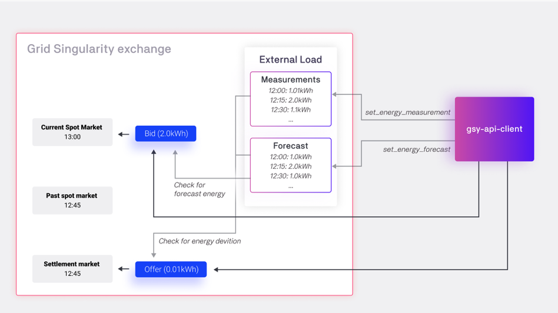
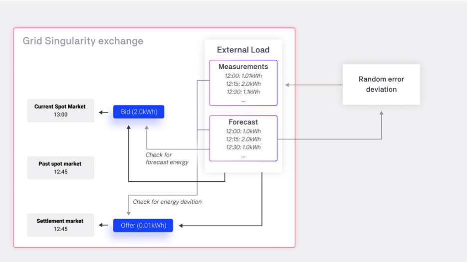

Prosumer assets can post orders ([bids/offers](trading-agents-and-strategies.md)) of their energy deviations to the settlement market in order to get compensated by another entity that deviated in the opposite direction. Energy deviations are calculated from the difference between the traded energy and measured energy for production or consumption.

##External asset strategies

###Energy Measurement and Forecasts
Aggregator users can post the forecasted and measured energy to the Grid Singularity exchange for each [market slot](market-types.md#market-slots) via the [Asset API](configure-trading-strategies-walkthrough.md) with the batch commands _set_energy_forecast_ and _set_energy_measurement_. To enable these batch commands the asset must have either _PVForecastExternalStrategy_ or _LoadForecastExternalStrategy_ set as a strategy in the Grid Singularity Exchange setup file.

Measurements should be set in the current market cycle for the unsettled deviation to be calculated.

<figure markdown>
  {:text-align:center"}
  <figcaption><b>Figure 4.10</b>: Settlement market posting energy deviations mechanism with external asset strategies.
</figcaption>
</figure>

###Posting of Orders

Posting and updating bids and offers works the same as in the [spot markets](market-types.md#spot-market). If the provided _time_slot_ is a settlement market already, the order is placed or updated in the settlement market. The external client can only post maximally the amount of energy of the deviation to the settlement market.

###Unsettled Deviation
To find out the amount of deviated energy, a key named _unsettled_deviation_kWh_ is added on the _assets_info_ dictionary. Its value is itself a dictionary with past time slots as keys and the unsettled energy as values. An example is shown below:

```python
{
 'unsettled_deviation_kWh': {'2022-01-14T00:00': -8.3, '2022-01-14T01:00': -10.5},
 'available_energy_kWh': 10,
 'energy_active_in_offers': 0,
 'energy_traded': 0,
 'total_cost': 0
}
```

There will appear as many time slots as they fit in the amount of hours specified on [`ConstSettings.SettlementMarketSettings.ENABLE_SETTLEMENT_MARKETS`](https://github.com/gridsingularity/gsy-framework/blob/175a9c3c3295b78e3b5d7610e221b6f2ea72f6ec/gsy_framework/constants_limits.py#L70){target=_blank}. The value in each time slot is the maximal amount of energy that can be posted (please also see [Settlement Market Rotation](market-types.md#settlement-market-structure)).

The sign of the unsettled energy can vary depending on wether more energy was traded than measured or vice versa.

If a PV asset has a *negative* deviation, it implies that more energy was produced/measured than traded, and it is possible to offer it in the settlement market. To have a *positive* deviation would imply that more energy was traded than it was produced, and the asset now has to make up for it by posting bids.

If a Load asset has a *negative* deviation, it implies that more energy was initially bid (and traded) than the one that was actually used, and can then be offered on the settlement market. To have a *positive* deviation would imply that more energy was consumed than it was traded, and the asset now has to make up for it by posting bids.

In conclusion, regardless of wether the asset is a PV or a Load, if the unsettled deviation is negative, the energy should be offered, and if positive, bid.

Example settlement market strategy:

```python
if self._can_place_in_settlement_market(asset_info):
    for market_slot, energy in asset_info["unsettled_deviation_kWh"].items():
        if energy and energy > 0:
            self.add_to_batch_commands.bid_energy(asset_uuid=area_uuid,
                                                  energy=energy, price=30,
                                                  time_slot=market_slot)
        elif energy and energy < 0:
            self.add_to_batch_commands.offer_energy(asset_uuid=area_uuid,
                                                    energy=-energy, price=1,
                                                    time_slot=market_slot)
```
where the method `self._can_place_in_settlement_market()` is defined as follows:

```python
def _can_place_in_settlement_market(asset_info):
    return "unsettled_deviation_kWh" in asset_info and (
            asset_info["unsettled_deviation_kWh"] != 0)
```

##Template asset strategies

###Energy Measurement and Forecasts

For the template strategies, the forecasted energy is provided by the user, either by uploading a profile or setting up a predefined PV or Load. The forecasted energy is used to post bids or offers to the spot markets.

The actual measured energy is calculated by a random deviation of the forecasted value. A gaussian random error is simulated (positive and negative deviances around the forecasted energy value possible). The intensity of this random deviation can be controlled by the following setting that represents the relative standard deviation, so the width of the random deviation around the energy forecast:

[`ConstSettings.SettlementMarketSettings.RELATIVE_STD_FROM_FORECAST_FLOAT`](https://github.com/gridsingularity/gsy-framework/blob/175a9c3c3295b78e3b5d7610e221b6f2ea72f6ec/gsy_framework/constants_limits.py#L71){target=_blank}.

<figure markdown>
  {:text-align:center"}
  <figcaption><b>Figure 4.11</b>: Settlement market posting energy deviations mechanism with template asset strategies.
</figcaption>
</figure>

##Posting of Orders

The template strategies will post orders (bids / offers) with energy values equal to the energy deviations for each market. For example, if a PV forecasted to produce 5kWh of energy for the 12:00 market, but the simulated measured energy reveals that it only produced 4kWh for that time slot, the template strategy will post a bid to the 12:00 settlement market with the energy 1kWh. The behavior for the price increase of this bid is the same as in the spot market: the energy rate of the bid is increased during the market until the final selling rate is reached.

As the settlement market will stay available for longer than the normal spot market (configurable by [`Const.Settings.SettlementMarketSettings.MAX_AGE_SETTLEMENT_MARKET_HOURS`](https://github.com/gridsingularity/gsy-framework/blob/175a9c3c3295b78e3b5d7610e221b6f2ea72f6ec/gsy_framework/constants_limits.py#L69){target=_blank}, please also see [here](market-types.md#settlement-market)), the template strategy will not update the orders as frequent as in the normal spot market, but in the interval that can be set by the parameter [`SettlementTemplateStrategiesConstants.UPDATE_INTERVAL_MIN`](https://github.com/gridsingularity/gsy-e/blob/7f5d2866cfd8b8327e590a1377db2d9bd2909746/src/gsy_e/constants.py#L72).
