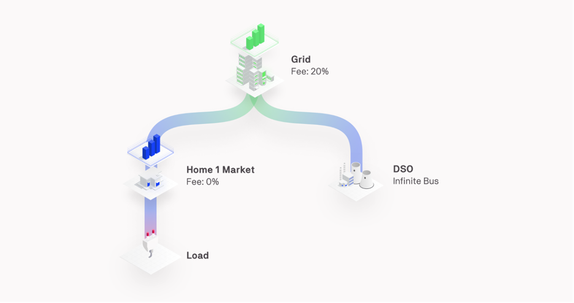
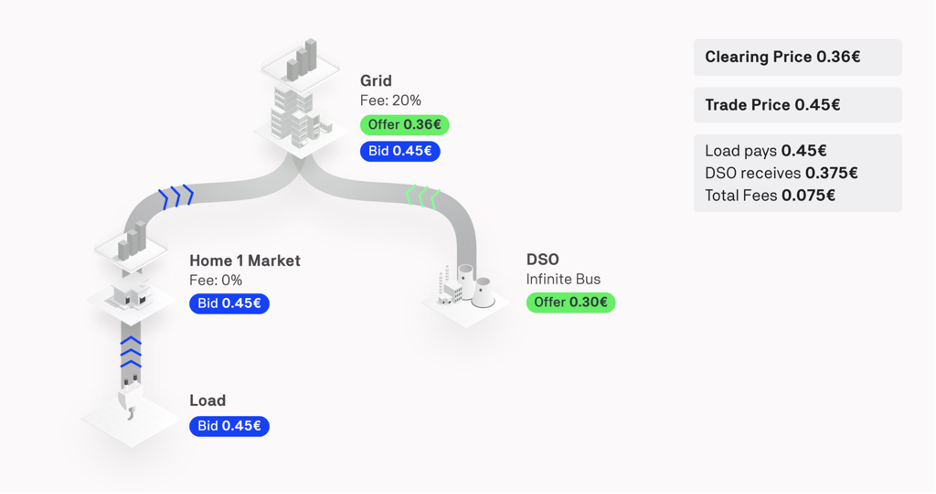
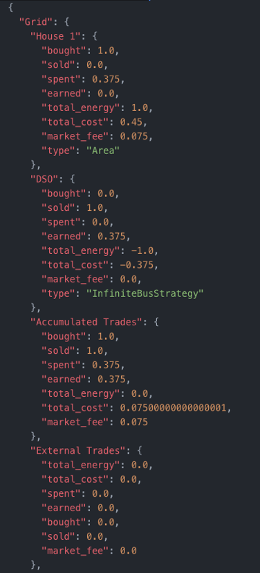
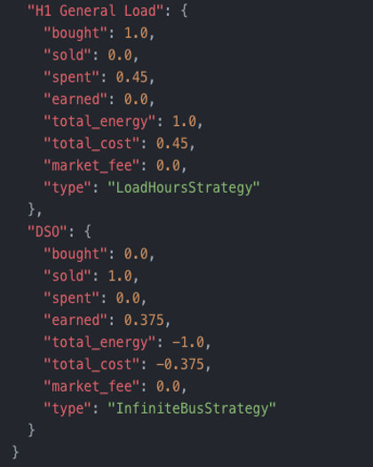

The cumulative energy bills for each market and energy asset are reported on the UI Results page and in a JSON file bills.json for a backend simulation. The bills are reported as the cash flow through each market.

<figure markdown>
  {:text-align:center"}
  <figcaption><b>Figure 2.18</b>: Example grid setup showing connection to the grid.
</figcaption>
</figure>

This configuration is simulated for one day using the Pay-as-Bid market type and the load bidding to buy energy at 12:00, leading to the propagation of the load bid and the grid operator offer until they are matched as shown in the figure below:

<figure markdown>
  {:text-align:center"}
  <figcaption><b>Figure 2.19</b>: Example grid setup showing connection to the grid.
</figcaption>
</figure>

The bid and the offer are forwarded to the higher-level Grid market and are matched in this market with a clearing price (and trade price) of €0.45. For more information on how grid fees are calculated, please read the [grid fees documentation](grid-fee-accounting.md).

In the bills.json file, the cash flow in each market is reported as follows:

"Parent market": {
"Agent": {
"bought": Energy that has been bought during the simulation [kWh],
"sold": Energy that has been sold during the simulation [kWh],
"spent": Amount of money that has been spent in trades during the simulation [€] ,
"earned": Amount of money that has been earned in trades during the simulation [€],
"total_energy": energy bought - energy sold [kWh],
"total_cost": money spent in trades - money earned in trades [€],
"market_fee": Money spent in the "Parent area" as grid fees [€] ,
"type": Type of agent. Can either be a market  or the name of the asset strategy
},
},

Shown below are the results of the previous example. The first set of results is from the highest market, in this case the Grid market:

<figure markdown>
  {:text-align:center"}
  <figcaption><b>Figure 2.20</b>: Example of bills results in the Grid level.
</figcaption>
</figure>

In the Grid market, House 1 has bought 1 kWh from the Gris and spent €0.375 for this trade. House 1 also pays the €0.075 grid fee that the Grid market is charging. The total cost of 1 kWh of energy is €0.375 + €0.075 = €0.45

One level down the hierarchy, the House 1 market is displayed in the figure below:

The House 1 market has no information on the other markets’ grid fees, so only considers its own fees in the bills table. Therefore, the Load spends €0.45 (€0.0375 + €0.075) for 1 kWh of energy that is externally supplied to House 1, with no grid fee added since House 1 has no fees.

<figure markdown>
  {:text-align:center"}
  <figcaption><b>Figure 2.21</b>: Example of bills results in the House 1 level.
</figcaption>
</figure>

Finally, the bills of each energy asset are shown:

<figure markdown>
  {:text-align:center"}
  <figcaption><b>Figure 2.22</b>: Example of bills for all assets in the configuration.
</figcaption>
</figure>
