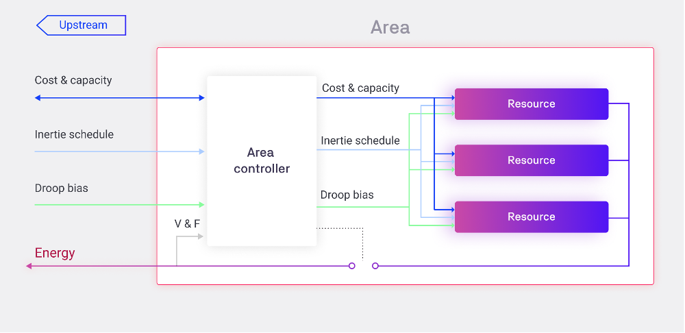

##Definition
Electrical power systems are characterized by voltage and frequency and the flow of electricity is a continuous process. Buffering or storing electrical energy at each node is still not feasible, therefore electrical energy needs to be generated exactly at the time of consumption. Differences in supply and demand causes the nominal frequency (50Hz in EU) to deviate. Consequently, supply and demand need to be monitored in real time to implement adjustments to maintain equilibrium and nominal frequency. Significant deviation from the nominal leads to [cascading effect culminating in a blackout](https://fsr.eui.eu/publications/?handle=1814/67610){target=_blank}. Transmission system operators (TSOs) oversee fast, flexible, fossil fuel-based generation units and demand response service from large consumers, ensuring the continuation of operation during significant transient faults in the energy system. These generators form the basis of frequency control strategies used in balancing these electrical systems.

Each control strategy has specific purposes and features and can be categorized in three groups, as shown in the figure below.

1. **Primary Control** (Frequency Containment Reserve - FCR)
2. **Secondary Control** (Automatic Frequency Restoration Reserves - aFRR)
3. **Tertiary Control** (Manual Frequency Restoration Reserves - mFRR)

<figure markdown>
  {:text-align:center"}
  <figcaption><b>Figure 4.4</b>: <a href="http://citeseerx.ist.psu.edu/viewdoc/summary?doi=10.1.1.126.3675">The three tiers of grid control and its activation structure</a>
</figcaption>
</figure>

##In conventional grid structures

**Primary control** is an automatic function that is almost instantaneously activated to stabilise the frequency drops/spikes. It is the fastest type of frequency control with a response time of a few seconds and operates using a joint process involving all TSOs of the synchronous area. This is shown in the figure below. For example, if there is an increase in demand, the energy used to compensate for this demand comes from the kinetic energy stored in large rotating synchronous generators that start decreasing its velocity. This is referred to as [Inertial response](https://eepower.com/technical-articles/frequency-control-in-a-power-system/#){target=_blank}. For the generators to recover the speed, the speed controller of each generator acts to increase the generator power to clear the imbalance. Within a period of 30 seconds, each generating unit is able to generate the required power and stabilise this production for at least 15 minutes or depending on the requirements of the TSO within the synchronous region. Primary control is done using generation plants that are connected to the high voltage power supply with the exception of renewable energy sources which are non-schedulable due to its intermittent nature.

<figure markdown>
  {:text-align:center"}
  <figcaption><b>Figure 4.5</b>: <a href="https://www.nrel.gov/news/program/2020/inertia-and-the-power-grid-a-guide-without-the-spin.html">Recovery of the system from a contingency event and action by primary frequency control (PFR)</a>
</figcaption>
</figure>

**Secondary control** is performed automatically by all the generators to restore the nominal frequency, the power exchanges and reserve of the generators used in primary control. The generators involved in this regulation function through dedicated reserve power that are set in conjunction with central controllers. The reserve control power is negotiated in a contract conjunction with the TSO and is a percentage of the maximum available power with a predefined minimum value to ensure that it can be dispatched whenever needed. This service is remunerated according to the set contracts.

**Tertiary control** is not an automatic function and is executed upon request by the grid operator. The reserve margins used for the secondary control are restored through tertiary control.

The differences between the primary, secondary and tertiary frequency control is the time the production and response can be activated, and the remuneration for each. Primary frequency control is symmetrical as the capacity for control has been scheduled and usually balances between ramping up and down the production and therefore not remunerated. Secondary and tertiary control are not symmetrical as the capacity can be used only for ramping up or down the production to restore the frequency and are remunerated.

##Review of the three levels of regulation

<table class="table">
  <tr>
   <th>
   </th>
   <th>Response Time
   </th>
   <th>Duration Time
   </th>
   <th>Operation
   </th>
   <th>Purpose
   </th>
  </tr>
  <tr>
   <td>Primary Control
   </td>
   <td>10-30 Seconds
   </td>
   <td>15 Minutes
   </td>
   <td>Automatic
   </td>
   <td>Act in case of frequency variation in order to stabilize frequency value
   </td>
  </tr>
  <tr>
   <td>Secondary Control
   </td>
   <td>200 Seconds
   </td>
   <td>120 minutes
   </td>
   <td>Automatic
   </td>
   <td>Act to bring back frequency value to the nominal value and restore the power reserve of the generators used for the primary frequency control
   </td>
  </tr>
  <tr>
   <td>Tertiary Control
   </td>
   <td>15 Minutes
   </td>
   <td>Indicated by TSO
   </td>
   <td>Upon Request
   </td>
   <td>Act to restore power reserves of the generators used for the secondary frequency control
   </td>
  </tr>
</table>

***Table 4.1***: *[Main features of frequency control strategies](https://eepower.com/technical-articles/frequency-control-in-a-power-system/#){target=_blank}*

In our **transactive energy low voltage grid structure** primary, secondary and tertiary control are controlled by an area controller called the balancing agent.

<figure markdown>
  {:text-align:center"}
  <figcaption><b>Figure 4.6</b>: Area control structure of market consisting of all three tiers of control (source: Martin Fornage, A generalized transactive energy-based framework: Enphase Energy. Powerpoint presentation 2015)
</figcaption>
</figure>

The balancing agent monitors the health of the system and is in control of all its allocated resources. It also had the ability to control the physical connect and disconnect from upstream and downstream resources according to the type of control required.

**Primary control** happens simultaneously as the spot market through a droop curve. Grid forming assets have different droop curves based on their behaviour (Loads, Storage, PV) which are used to keep the voltage and frequency towards nominal in case of a deviation. Local balancing is therefore done through primary control.

**Secondary control (Inertia Control)** is done through a time schedule. The schedule is received from the upper tertiary control or from a ledger. Secondary balancing agents adjust the primary balancing agents resources within its market by disconnecting and connecting them in case of failure of upstream structure or failure to meet the schedule.

**Tertiary control** negotiates the schedules upstream or downstream at lowest cost of operation and provides a marketplace for energy in and out of the market area. The inputs of the tertiary control are the bids, offers and error signals from secondary control. The outputs are the schedules to resources.
