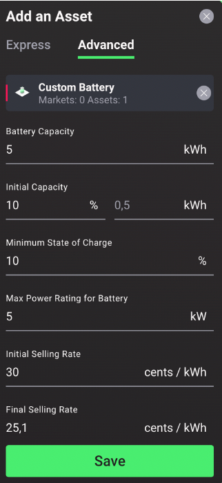

Batteries (also known as energy storage) are energy assets that save the surplus energy produced and store it for use at a later time. Adding a battery to a home or community will increase the self-consumption and self-sufficiency levels and enhance the potential of flexibility service for grid operators.

##Battery/Storage Configuration Options:

###Express Mode
In the express battery configuration mode, the user is provided with a template (synthetic) custom battery to include as an asset at a select location in the simulated local energy market by naming the asset and setting its location:

1. Name: select a unique name for the battery;
2. Location: the location selected by the user is automatically uploaded.

###Advanced Mode
In the advanced battery configuration mode, the following settings are available as shown in the figure and explained below:
<figure markdown>
  {:style="height:600px;width:300px";text-align:center"}
  <figcaption><b>Figure 2.13</b>: Battery (Storage) Advanced Configuration Options in the Grid Singularity Exchange web-based interface (Singularity Map)
</figcaption>
</figure>

1. Battery capacity: set the total energy capacity in kWh
2. Initial capacity: set the initial capacity of the battery in terms of Initial State of Charge (SOC) in % or Initial Energy in kWh
3. Minimum SOC: set the minimum amount of energy to leave unconsumed in the battery (note: batteries usually have a safeguard disabling them to discharge below a specific threshold to increase life expectancy)
4. Max power rating for battery: set the power limit (charge and discharge) for each market slot in kW (note: this parameter limits the maximum sold and bought energy)
5. Initial selling rate: set the initial  rate for selling energy at the beginning of each market slot in cents/kWh
6. Final selling rate: set the final rate for selling energy at the end of each market slot in cents/kWh
7. Rate decrease: enter a value for the explicit rate decrease increment per update interval in cents/kWh
8. Initial buying rate: set the initial rate for buying energy at the beginning of each market slot in cents/kWh
9. Final buying rate: set the final rate for buying energy at the end of each market slot in cents/kWh
10. Rate increase: enter a value for the explicit rate increase increment per update interval in cents/kWh
11. Linear Pricing: If activated, a rate increase/decrease per amount of time (update interval) is calculated automatically in a way that the price increases/decreases linearly over the market slot time. The rate is calculated starting at the Initial selling rate and ending at the Final selling rate at the end of the market slot, based on the following formulae for increase and decrease, respectively:
    12. `energy_rate_increase = (final_buying_rate - initial_buying_rate) / max(int((slot_length / update_interval) -1), 1)`;
    13. `energy_rate_decrease_per_update = (initial_selling_rate - final_selling_rate) / max(int((slot_length / update_interval) -1), 1)`;

    note: bidding behaviour is derived from a linear fitted curve of a buying rate between initial_buying_rate and final_buying_rate and a selling rate between initial_selling_rate and final_selling_rate within the bidding interval
12. Update interval: set the frequency at which the rate is updated
13. Capacity based method: if activated, energy will be sold at lower prices during high state of charge - SOC (when the battery has more energy stored) and at higher prices during low SOC (when the battery can afford to sell its stored energy for less). In this case, the offer price for the storage is calculated according to the following formula: `offer_rate = initial_selling_rate - ((initial_selling_rate - final_selling_rate)/*soc/100)`

As an example, considering an initial_selling_rate of 30 cents/kWh and a final_selling_rate of 20 cents/kWh, a storage with an SOC of 1% would sell its energy at 29.9 cents/kWh, and a battery at 100% SOC would sell its energy at 20 cents/kWh.

Note: The default setting of the battery component is 100% energy conversion efficiency.  It is not possible to change this setting at the moment but it may be in the future versions of the software. Interested contributors may propose such additions to our open source code on [GitHub](https://github.com/gridsingularity/gsy-e){target=_blank}.

##Storage Behaviour in Local Energy Markets

In general all bids and offers follow the physical constraint of the set `max_abs_battery_power_kW value. The accumulated energy per market slot cannot exceed this power value times the length of the market slot, in hours. Energy sold and bought cancel each other out, meaning that if 2kWh are both sold and bought in the same market slot, the relative power remains 0kW.

For the buying rate increase and selling rate decrease behaviour, please see the [Trading Strategies page](default-trading-strategy.md).

###Buying energy in the [One-Sided Market](one-sided-pay-as-offer.md)

On each tick, the storage scans the connected market for affordable offers* if there is storage space to be filled (if the current SOC is lower than 100%). Once an offer is found, it is either fully or partially accepted, depending on the demand. The storage always seeks 100% SOC when buying energy.

*affordable offers are offers that have a price lower or equal to the current acceptable energy rate. The acceptable energy rate changes during a market slot depending on the `initial_buying_rate, final_buying_rate, energy_rate_decrease_per_update` and `update_interval setting.

###Buying energy in the [Two-Sided Market](two-sided-pay-as-bid.md)

On each tick, the storage either places a bid for the quantity of energy it needs to reach 100% SOC or updates the price of an existing bid in the market where the bid rate depends on the initial_buying_rate, final_buying_rate, energy_rate_decrease_per_update and update_interval setting.

###Selling energy

At the beginning of each market slot, the storage places an offer for all the energy it has stored (not including the energy that is needed to keep the storage at least at min_allowed_soc). This offer is updated at each update_interval pursuant to the rate decrease settings. This mechanism applies in both one and two-sided market types. Consequently, it is possible for the storage to have both an offer and a bid placed in the same market.
