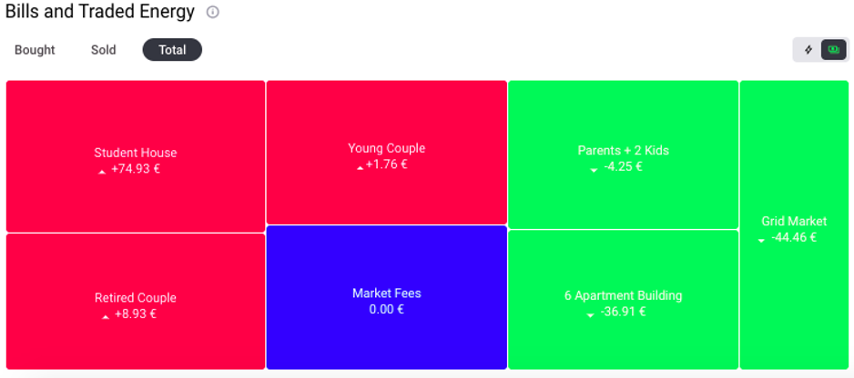

This indicator shows the net energy (energy bought minus energy sold) in terms of € and kWh for each home in the community, as well as Grid Fees and the Grid Market. Each value shown is the total traded in this market for the length of the simulation. The energy values marked in green have a net export of energy while those marked in red have a net import of energy. Bills show the net amount paid or owed, marked in red or green. As an example, the grid market in the figure below is overall selling energy to the community (net exporting). If grid fees are added to the simulation, they will also show up in the energy bills table.

***Figure 2.21***. *Total energy bills and net energy traded in Euro (€).*
