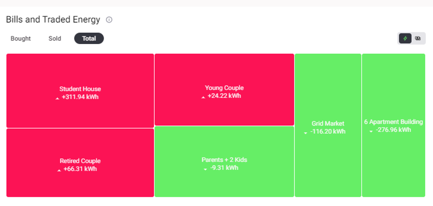
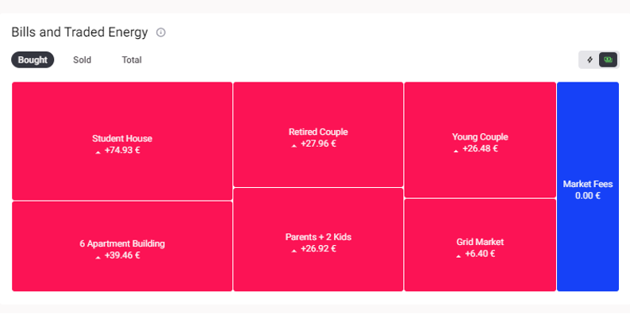
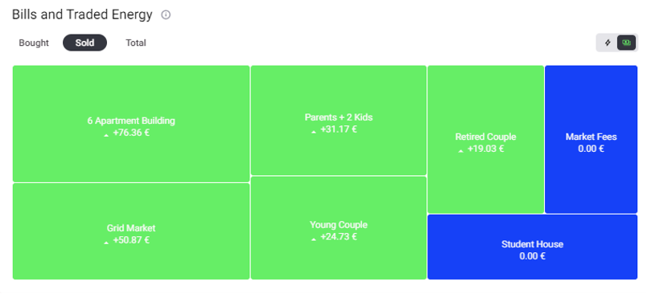
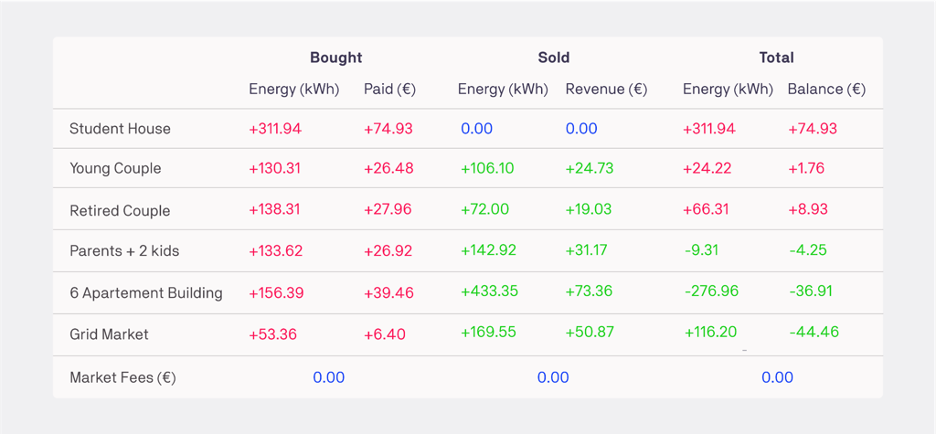

The category shows the net energy (energy bought minus energy sold) in terms of € and kWh for each home in the community, as well as Grid Fees and the Grid Market. Each value shown is the total traded in this market for the length of the simulation. The homes marked in green have a net export of energy while those marked in red have a net import of energy. As an example, the grid market in the Figure 2.16 below is overall selling energy to the community (net exporting), the 6 Apartment Building and Parents + 2 Kids are also net exporting, while the Young Couple, Retired Couple and Student House are all net importing. The tooltip at the top right of the table allows users to switch between viewing these results in terms of bills in the currency selected or the traded energy in kWh.

***Figure 2.17***. *Total Community Bills and Traded Energy Results in Euro (€).*

In Figure 2.17, the total (net bills) for the different participants in this community are displayed for the duration that the simulation was run, which is 1 week in this example. The Student House has to pay an energy bill of €74.93, the Young Couple a bill of €1.76 and the Retired Couple a bill of €8.93 in this simulated scenario. Meanwhile, the Parents + 2 Kids Home and the 6 Apartment Building had net savings of €4.25 and €36.91 respectively, meaning that both of these homes made profits of these amounts over the simulated week. The Grid Market, which represents the electricity grid, received €44.46 from this community in this same timeframe. This figure represents the sum of the energy bills that all of the individual homes in this community paid in electricity bills to the grid during this time.

***Figure 2.18***. *Total Community Bills and Traded Energy Results in kWh.*

Figure 2.18 displays the total energy net bought or sold for the different participants in this community, for the duration the simulation was run for. The net energy for the Student House, for example, is an import of 311.94 kWh. The other participants in this market, including both homes and the grid, have been the suppliers of this energy. Detailed energy transactions can be seen in the trades chart below.

Users can also view the Bills and Traded Energy Results in Terms of Energy Bought or Energy Sold by selecting their respective sections above the results graph.

***Figure 2.19***. *Bills and Traded Energy in terms of Energy Bought.*

Figure 2.19 shows the bills for the bought energy for the different participants in the community.  In this example, the Student House has bought energy from other participants for a total of €74.93.

***Figure 2.20***. *Bills and Traded Energy in terms of Energy Sold.*

Figure 2.20 shows the bills for the sold energy for the different participants in the community. In this example, the 6 Apartment Building has sold energy to other participants worth €76.36, while the Student House hasn’t sold any energy.

The bills and traded energy results can be summarized in the table below as an example of the images above. The table shows the cumulative trade volumes of all market participants and the costs associated with trades in the community market. For each market and energy asset, the energy bought and sold during the simulation is listed, along with a total net energy consumption.

***Figure 2.21***. *Bought, sold and total energy displayed in energy (kWh) and monetary (€) terms.*
