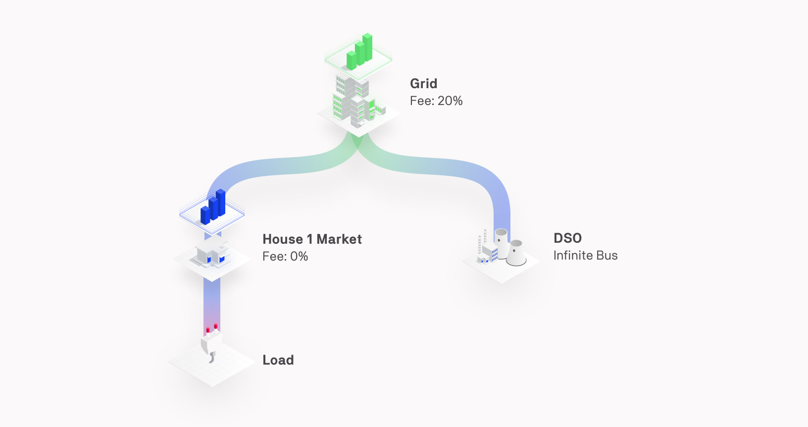
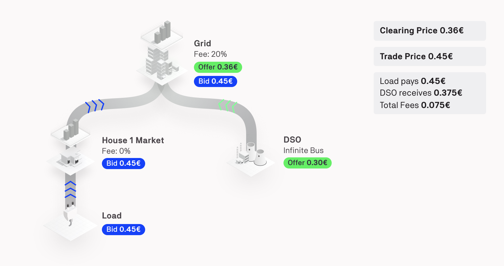
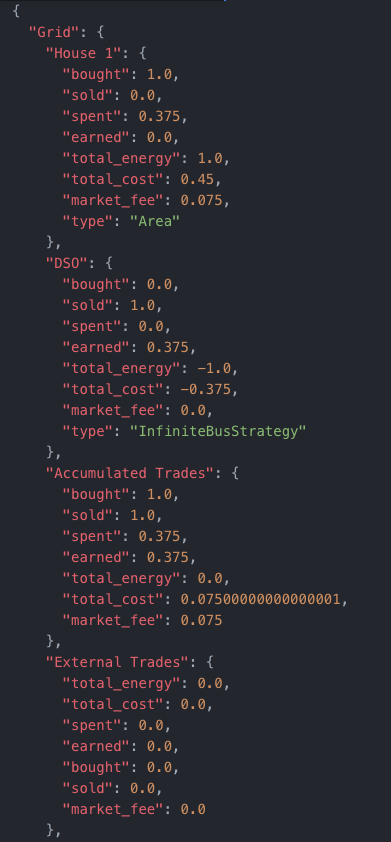
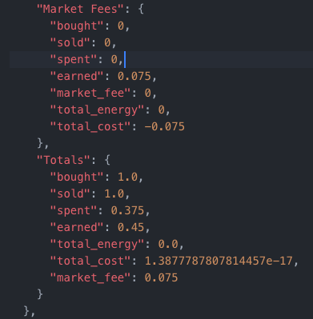
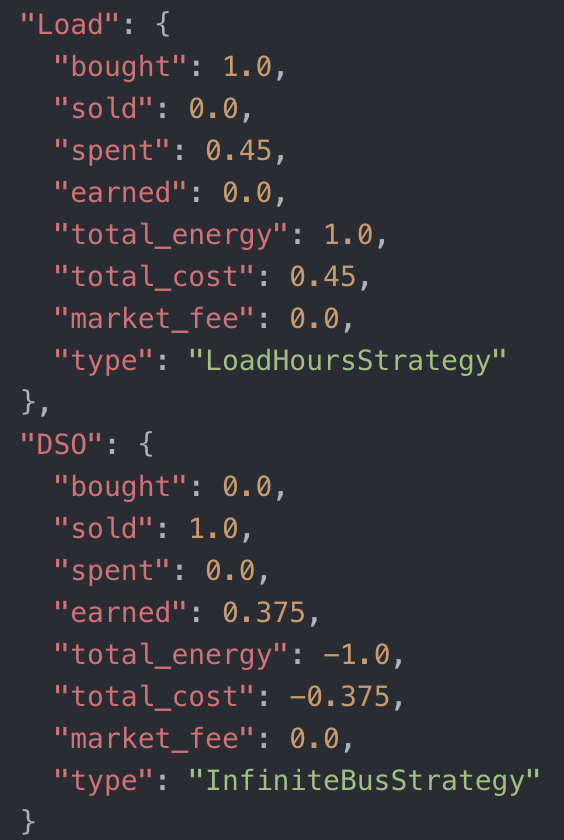

All the cumulated bills of each area and device is reported in the JSON file “bills.json” at the end of the simulation. The bills are reported according to the various markets' point of view.

In order to have a visual example, let’s take this configuration : 

{:style="display: block;margin-left: auto;margin-right: auto;height:300px;width:550px"}

In this example we will simulate this configuration for one day using the Pay as Bid market type and the load only have to buy some energy at 12:00. 

Let’s now see more precisely the only trade of the day and the propagation of the bid of the load and the offer of the DSO until they are matched : 

{:style="display: block;margin-left: auto;margin-right: auto;height:400px;width:750px"}

The bid and the offer is forwarded to the upper market (for more information on this process, please read the [grid fees documentation](grid-fees.md)) and are matched in the Grid market with a clearing price (and trade price) of 0.45 €.

In the bills.json file, bills will be reported multiple times according to the different market point of view.For each bill we will have the following structure : 

- “Parent area“: {
    - "Agent": {
        - "bought": Energy that has been bought during the simulation [kWh],
        - "sold": Energy that has been sold during the simulation [kWh],
        - "spent": Amount of money that has been spent in trades during the simulation [€] ,
        - "earned": Amount of money that has been earned in trades during the simulation [€],
        - "total_energy": energy bought - energy sold [kWh],
        - "total_cost": money spent in trades - money earned in trades [€],
        - "market_fee": Money spent to the “Parent area“ as grid fees [€] ,
        - "type": Type of the agent. Can either be an Area or the name of the device strategy
    - },
- },

Now we will look at the results of our previous example. The first point of view is the highest market and in our case the Grid market : 

{:style="display: block;margin-left: auto;margin-right: auto;height:600px;width:280px"}

From the point of view of the Grid, the House 1 area has bought 1 kWh from the DSO and spent 0.375€ in this trade. House 1 also pays the market fee that the Grid is charging : 0.075€. 

After that we go down in the hierarchy  and look from the House 1 market :

{:style="display: block;margin-left: auto;margin-right: auto;height:580px;width:260px"}

The House 1 market has no information on the other markets and this why from its point of view the Load has spent 0.45€ (0.0375+0.075) for 1 kWh and no fees are added up because this market has no fee.

At the very end of the results we have the bills of each device (from their point of view):

{:style="display: block;margin-left: auto;margin-right: auto;height:400px;width:255px"}

With this we see that the Load, from his point of view has bought 1 kWh for 0.45€. From the point of view of the DSO, this latter only received 0.375€ for 1 kWh.