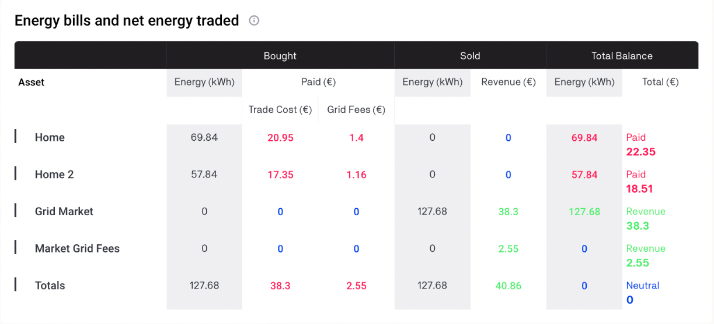
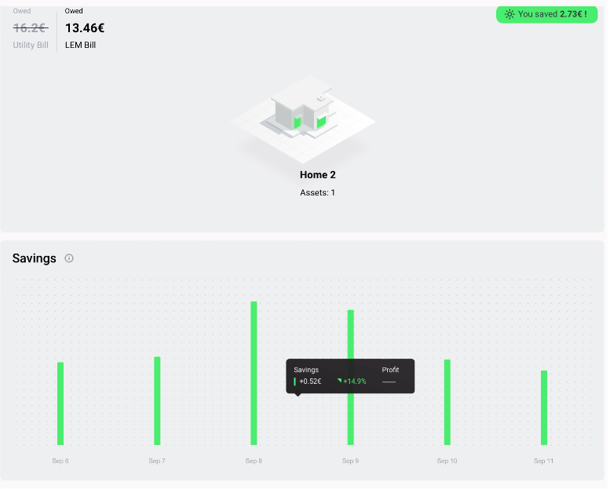

The net energy traded (energy bought minus energy sold) traded in the local energy market (LEM) is calculated over a defined time frame (weekly or monthly) and expressed in kilowatt hours (kWh) for each participant and the LEM (energy community), respectively.

The energy cost (bill) is calculated over a defined time frame (weekly or monthly) and expressed in Euros (€). The energy bills and net energy traded table is divided into three columns showing energy bought, sold and the resulting balance. The energy values marked in green indicate a net export of energy, while those marked in red indicate a net import of energy. Bills show the net amount paid or revenue generated, marked in red and green, respectively. For example, in the table below, the utility as an external LEM supplier (also termed the grid market) has sold more energy to the LEM (community) than it has bought from the community (net export), thereby showing revenue for the utility in the "total balance" column.

When the grid charges are included in the simulation configuration,  a market grid fee row appears in the table as shown in the table below.

<figure markdown>
  {:text-align:center"}
  <figcaption><b>Figure 3.3</b>: Example of energy bills and net energy traded table in the Results Dashboard, Grid Singularity’s simulation interface (Singularity Map)
</figcaption>
</figure>

The energy cost savings indicator shows the financial savings from participating in local energy trading over a defined time frame (weekly or monthly).

The energy cost savings value is calculated as follows:

Energy cost savings (€) = Energy bill prior to local trading (total energy demand supplied by external supplier (kWh) * (energy price set by external supplier + applicable grid fees) € - energy bill with activated local energy trading (€) (LEM Bill)

There are two ways in which the energy cost savings are illustrated on the Grid Singularity Exchange simulation interface (Singularity Map): as an absolute value for the selected period and as a bar chart that plots daily savings for the selected home (energy community member), comparing the cost with and without participation in local energy trading i.e. LEM Bill vs. Utility Bill. Both of these figures are shown below.

<figure markdown>
  {:text-align:center"}
  <figcaption><b>Figure 3.4</b>: Weekly cost savings for a home with three assets over a period of one week in the Grid Singularity’s simulation interface (Singularity Map). The top value shows the absolute values while the bar chart at the bottom represents daily savings
</figcaption>
</figure>
