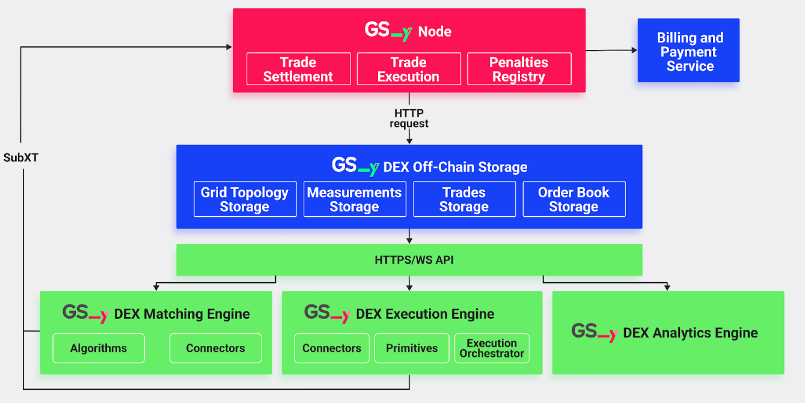
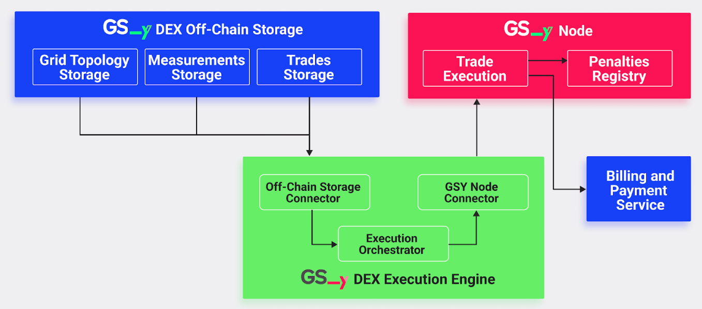

The GSY DEX Execution Engine is a core component of the Grid Singularity Decentralised Exchange ([GSY DEX](blockchain.md){target=_blank}) responsible for the execution or reconciliation of settled trades securely, transparently and in accordance with the agreed terms upon the energy delivery verification.

Once a trade has been matched by the [GSY DEX Matching Engine](blockchain-matching-engine.md){target=_blank}, the GSY DEX Execution Engine handles the execution or reconciliation of the trades by processing energy measurements retrieved from the [GSY DEX Off-Chain Storage](blockchain-off-chain-storage.md){target=_blank} to verify energy delivery (validating whether the actual energy production and consumption correspond to matched trades) and enforcing penalties when there is a deviation between traded and delivered energy (underproduction or overconsumption). The calculated penalties are submitted to the GSY Node for clearance and financial reconciliation administered by the applicable billing and payments service. In brief, the GSY DEX Execution Engine acts as the critical link between off-chain trade settlement and on-chain financial enforcement.

### GSY DEX Execution Engine Core Functionality
Spot and futures trading requires predictions of energy used at both the asset and network level, often associated with high prediction errors. Thus, although a balancing mechanism addresses the energy imbalances on the physical level, financial exchanges might still not be executed, causing a mismatch between the physical energy delivery and the market accounting. Multiple solutions for mismatch mitigation can be provided by the [GSY DEX](blockchain.md){target=_blank}, to be applied pursuant to respective local regulation:

- Allow the grid operator to set prices or enforce penalties for any energy mismatch,
- Implement final gate closure time one day after delivery (or another selected time), allowing post-delivery trading for balance responsible parties to trade imbalances in real-time, and/or
- Allow post-delivery trading for all market participants.

In this version of the GSY DEX Execution Engine (v.1), the first solution (penalty enforcement for any energy mismatch) has been implemented. Future versions will include alternative solutions. Note that the penalty enforcement described here is activated only in cases where this function is not already provided by a payment service that is directly incorporated as a pallet enabling the payment worker in the [GSY Node](gsy-node.md){target=_blank} (latter is the case in the EU co-financed [FEDECOM](https://fedecom-project.eu){target=_blank} Project and it is still under development).

The operation of the GSY DEX Execution Engine comprises the following functions:

- Data Retrieval: The GSY DEX Execution Engine polls the [GSY DEX Off-Chain Storage](blockchain-off-chain-storage.md){target=_blank} in regular intervals (each 15 minutes, or at another selected trading interval) for the latest trades and corresponding energy production and consumption measurements. It leverages time-window queries, using calculated start_time and end_time based on 900-second market intervals, to ensure that it processes data in fixed, predictable market slots. On-chain timestamping is used as a common time source.
- Energy Deviation and Penalty Calculation: For each trade, the GSY DEX Execution Engine compares the energy volume that was traded (as per the order parameters) with the energy delivered. Optionally, a penalty for the deviated energy is attributed to the buyer and seller. This penalty mechanism is only enabled if there is no on-chain remuneration engine.
    - For the buyer of the trade, if the delivered energy exceeds the traded energy, the engine calculates the penalty as:

            delta_consumed = measured_energy - traded_energy
            penalty = delta_consumed * penalty_rate
        and the penalty is assigned to the buyer.

    - For the seller of the trade, if the delivered energy is less than the traded energy, the penalty is calculated as:

            delta_produced = traded_energy - measured_energy
            penalty = delta_produced * penalty_rate
        and the penalty is assigned to the seller.

- Submission to [GSY Node](gsy-node.md){target=_blank}: Once penalties are computed, the GSY DEX Execution Engine assembles these into one batch and submits it to the GSY Node in the form of extrinsics. This is performed using the [Subxt](https://github.com/paritytech/subxt){target=_blank} library to sign and send transactions, ensuring that penalties are recorded on-chain and that the appropriate financial consequences are enacted. The GSY Node’s runtime includes a dedicated [Trade Execution](blockchain-execution-engine.md#trade-execution-pallet-gsy-dex-execution-engine--gsy-node-communication){target=_blank} pallet to process penalties and update user accounts accordingly. It also includes the **Penalties Registry**, responsible for saving any penalties that the GSY DEX Execution Engine reports to the blockchain, maintaining an immutable record of penalties to enhance transparency and trustworthiness of the exchange operation.

### GSY DEX Execution Engine Implementation

The GSY DEX Execution Engine is built in Rust, taking full advantage of its powerful [Tokio library](https://tokio.rs/){target=_blank}, which is an event-driven, non-blocking I/O platform for writing asynchronous applications with a strong type system, facilitating straightforward interconnection with other components of the GSY DEX, ensuring secure and precise calculations. The  GSY DEX Execution Engine system is structured into several modules:

- The Connectors Module is responsible for inter-service communication that relates to the Execution Engine; it fetches trade and energy measurement data from the [GSY DEX Off-Chain Storage](blockchain-off-chain-storage.md){target=_blank} and submits penalty extrinsics to the GSY Node through the [Subxt](https://github.com/paritytech/subxt){target=_blank} library. <i>Note that it should not be confused with the GSY DEX Matching Engine’s Connectors Module, responsible for the inter-service communication of the Matching Engine.</i>
- The Primitives Module encompasses the core data structures and the penalty calculation logic. Notably, it includes an updated Penalty struct that records essential information, such as the penalised account (determined as the buyer when relating to consumption deviation and the seller when relating to production deviation), the market UUID, the trade UUID, and the computed penalty cost.
- The Execution Orchestrator Module coordinates the overall execution cycle by periodically invoking functions that retrieve data and compute penalties. It also invokes the Connectors Module to submit penalties to the [GSY Node](gsy-node.md){target=_blank}.

<figure markdown>
  {:text-align:center"}
  <figcaption><b>Figure 6.19</b>: GSY DEX Key Components and Dataflow
</figcaption>
</figure>

The GSY DEX Execution Engine is highly configurable via the following command-line arguments:

- **offchain_host**: Specifies the hostname or URL of the Off-Chain Storage service that holds trade and energy measurement data. The default value is `"http://127.0.0.1"`.
- **offchain_port**: Indicates the port number at which the Off-Chain Storage service is running. The default value is `"8080"`.
- **node_host**: Defines the hostname or URL of the GSY Node with which the Execution Engine will communicate (typically via WebSocket). The default value is `"ws://127.0.0.1"`.
- **node_port**: Specifies the port number for the GSY Node’s WebSocket connection. The default value is `"9944"`.
- **polling_interval**: Sets the time interval (in seconds) at which the Execution Engine polls the Off-Chain Storage for new trades and measurements. The default value is `30` seconds.
- **market_duration**: Determines the duration of a market slot in seconds. This parameter is used to round the current timestamp down to the nearest 900-second boundary to define a consistent trading window. The default value is `900` seconds.
- **penalty_rate**: Represents the penalty rate in cents per kWh (or another currency). This rate is used to calculate the penalty cost by multiplying the energy discrepancy (delta) by the penalty rate and then applying a scaling factor (10,000) to convert the floating-point result into an integer value. The default value is `0.10` cents per kWh.

The codebase is containerised using Docker, which ensures that it can scale effectively and operate reliably alongside other GSY DEX components.

### GSY DEX Execution Engine Communication Protocol

<figure markdown>
  {:text-align:center"}
  <figcaption><b>Figure 6.20</b>: GSY DEX Execution Engine Communication Protocol
</figcaption>
</figure>

As described above, the GSY DEX Execution Engine is designed to operate as an autonomous service within the [GSY DEX](blockchain.md){target=_blank} platform, ensuring that the energy delivered in a trade accurately corresponds to the energy bid or offered upon trade match. The following sections describe the data communication protocol between the GSY DEX Execution Engine and other GSY DEX system components, with a high level overview provided here below.

To operate, the GSY DEX Execution Engine reads the matched trades by calling the GET `/trades?start_time={start_time}&end_time={end_time}`  REST API endpoint of the GSY DEX Off-Chain Storage. Additionally, energy measurements are retrieved from the Off-Chain Storage by calling the GET  `/measurements?start_time={start_time}&end_time={end_time}` REST API endpoint of the Off-Chain Storage. The endpoints return lists of JSON objects containing trades and energy measurements for the period defined by the endpoints’ arguments. The start and end times define a fixed market slot (derived by rounding down the current timestamp to the nearest 900-second boundary and adding 899 seconds to define the interval). This results in 15-minute time periods (or another selected trade interval), corresponding to the time when each market is open. The time-based processing ensures that trades and measurements are handled within consistent market intervals, minimising discrepancies and simplifying penalty calculations.

Once the data is fetched, the GSY DEX Execution Engine compares the traded energy with the delivered energy. For consumption trades, where measured energy is positive and exceeds the traded energy, the difference is calculated and, after applying a penalty rate and a scaling factor, a penalty is computed and assigned to the buyer. Conversely, for production trades, where delivered energy is negative and falls short of the traded energy, the corresponding penalty is applied to the seller. The computed penalty is encapsulated in a dedicated structure that includes the following fields:

- **penalised_account**: A string representing the account identifier of the penalised participant. For consumption trades, this is the buyer’s account and for production trades, it is the seller’s account.
- **market_uuid**: A string that uniquely identifies the market in which the trade occurred, used to correlate the penalty with a specific market.
- **trade_uuid**: A string representing the unique identifier of the trade that triggered the penalty, ensuring traceability of the penalty back to the original trade.
- **penalty_cost**: A u64 value representing the calculated penalty cost. This cost is derived from the energy deviation between what was delivered and what was traded, multiplied by the penalty rate and then scaled (by 10,000) to convert the floating-point result into an integer suitable for on-chain submission.

After penalties are calculated, the GSY DEX Execution Engine communicates with the GSY Node by constructing and submitting penalty extrinsics. These extrinsics are built by converting the internal penalty structures into the node’s expected SCALE‑encoded types, and signed using an exchange operator key. The [GSY Node](gsy-node.md){target=_blank} then verifies and processes these penalties, triggering the necessary account adjustments, via the Trade Execution pallet, which is described below. As noted above, the penalty mechanism is only enabled if there is no on-chain remuneration engine.

### Trade Execution Pallet (GSY DEX Execution Engine / GSY Node Communication)
The GSY Node Trade Execution pallet interacts with the GSY DEX Execution Engine to provide an important decentralised trade execution functionality by registering, verifying and processing the penalties for any deviation between traded and measured energy. It consists of one critical component:

- **PenaltiesSubmitted**: Emitted when the penalty extrinsics have been accepted by the GSY Node and the penalty is added to the **Penalties Registry**

#### Trade Execution Pallet Errors
- **NotARegisteredExchangeOperator**: Ensures that only registered exchange operators can submit penalties to the pallet storage. Registered exchange operators are representatives of an entity that is legally contracted to provide an energy exchange service.

#### Trade Execution Pallet Dispatchable Functions
- **submit_penalties**: Validates that the account that submitted the penalties is an exchange operator account. If this is confirmed, the raw penalty is scaled by a factor of 10,000 and rounded to ensure the penalty cost is represented as an u64 value. Subsequently, the submitted penalties are added to the Trade Execution Pallet storage, and the applicable billing and payment service is notified in order to update the balance of the penalised account.
