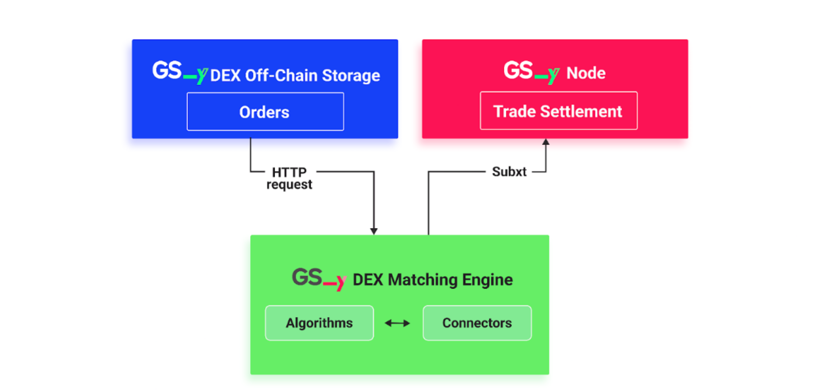

The GSY Matching Engine is a critical component of the Grid Singularity Decentralised Exchange ([GSY DEX](blockchain.md)) purposed to efficiently and securely match the select market supply with demand, based on participant preferences and market conditions. Whilst it can be used for any commodity, the GSY Matching Engine has been tailored for the electricity market. It integrates directly with the [GSY Off-Chain Storage](blockchain-off-chain-storage.md) for real-time bid and offer access via its Order Book Storage, and with the [GSY Node](gsy-node.md) for trade settlement in conjunction with a trade execution (energy delivery) verification service provided by the [GSY Execution Engine](blockchain-system-components-overview.md#gsy-dex-execution-engine). The GSY Matching Engine deploys a [pay-as-bid](market-types.md#two-sided-pay-as-bid-market) strategy, ensuring that buyers and sellers receive the best possible prices for their energy trades. Future versions will integrate pay-as-clear and automated market maker (AMM) as alternative trading mechanisms. Furthermore, the intent is to render the GSY Matching Engine available as an autonomous service application in the [Energy Web SmartFlow Launchpad](https://www.smartflow.org/#products){target=_blank}, leveraging the Energy Web infrastructure and facilitating integration with a wider range of third-party applications, even beyond the energy market.

Multi-attribute auctions, which account for participant preferences and applicable market conditions, require more advanced clearing algorithms than single attribute auctions, such as those based on price alone. The optimal approach is to engage [off-chain workers](blockchain-off-chain-storage.md) to operate matching algorithms and then require either the use of trusted execution environments (enclaves) or on-chain verification to determine whether the matching algorithm was correctly executed. To enable this solution, the matching process is decoupled from the settlement verification and moved to a dedicated component, the Matching Engine. The GSY DEX Matching Engine has been designed to operate as (one or multiple) individual autonomous service(s), responsible for identifying suitable matches for multiple open order books. In order to manage the available GSY Matching Engine services, the GSY Node needs to register each such service and associate it with a user account responsible for operating the respective service. Grid Singularity will facilitate the Matching Engine registration process for the [GSY DEX](blockchain.md).


The GSY DEX Matching Engine reads open bids and offers through the [GSY DEX Matching API](#gsy-dex-matching-api) and submits matches for validation based on the [process](matching-api-walkthrough.md) determined for the Grid Singularity Exchange. Since the exchange’s verification function (part of GSY Node) only checks the validity of each match rather than the result of a specific matching algorithm, there is no longer a need for an agreed matching algorithm, arbitration technique, or redundant off-chain worker computation. This alleviates the need for additional on-chain computational cost, avoiding a corresponding increase to the gas costs associated with matching. Moreover, the GSY Node verification function is able to ascertain whether the bid and offer limitations are satisfied by the matches generated by the GSY Matching Engine (for instance, if the clearing energy rate is lower than or equal to the bid rate and higher than or equal to the offer rate). Therefore, multiple competing GSY Matching Engines can calculate matches for different markets in parallel, each using their own matching algorithm, and afterwards the GSY Node can select and verify the matches that are eligible for clearing, and reject those that are violating their bid and offer requirements. Finally, as the verification function is executed on-chain any potential errors or fraud attempts, such as double counting of trades and matching results, are eliminated. The validation of the actual delivery of the traded energy cannot be performed at this time, due to the fact that the energy is traded ahead-of-time. Another GSY DEX service, the [GSY Execution Engine](blockchain-system-components-overview.md#gsy-dex-execution-engine), is tasked with reading the asset measurements of produced or consumed energy, thereby validating whether the energy delivery corresponds to the traded energy.

The main functions of the GSY DEX Matching Engine are the following:


- Order Retrieval: The GSY Matching Engine retrieves orders from the [GSY DEX Off-Chain Storage](blockchain-off-chain-storage.md). This storage system holds all active bids and offers, which the GSY Matching Engine reads in order to match suitable counterparts for energy trades.
- Matching Process: Pursuant to the [pay-as-bid](market-types.md#two-sided-pay-as-bid-market) strategy, the GSY Matching Engine pairs bids and offers according to price and quantity to maximise value for the exchange participants. Buy orders are organised in a descending order of price, prioritising buyers willing to pay more, while sell orders are arranged in an ascending order, prioritising sellers willing to sell energy at lower prices. This strategy ensures that both parties upon clearance pay or receive the desired price for their energy trade based on their submitted bids and offers.
- Submission to [GSY Node](gsy-node.md): Once the GSY Matching Engine has identified the optimal matches, it submits these matches to the [GSY Node](gsy-node.md) for further processing and execution. This seamless integration with the [GSY Node](blockchain-system-components-overview.md#gsy-node) and the [GSY DEX Off-Chain Storage](blockchain-off-chain-storage.md) allows for efficient energy trading by offloading the GSY Node from the most computationally intensive operations of the matching process. At the same time, the immutability and integrity of the data are not jeopardised, since the GSY Node also participates in the verification process. Lastly, the [GSY Execution Engine](blockchain-system-components-overview.md#gsy-dex-execution-engine) verifies that the energy trades correspond to the energy delivery.

To summarise, the GSY Matching Engine is [designed](development-path.md) as an autonomous [GSY DEX](blockchain-system-components-overview.md) service, applied in conjunction with other services of the decentralised Grid Singularity Exchange, to achieve the following performance optimisation:

- Enhanced Performance: The matching process is a computationally and memory-intensive operation that requires significant computational resources. By creating a dedicated matching engine, we ensure that the [GSY Node](gsy-node.md) can continue to handle other platform functions without being overloaded by the resource-intensive matching process.
- Gas/Transaction Costs: By creating a dedicated matching engine that interacts with the off-chain storage for the most computationally intensive operations rather than using the GSY Node to execute the entire matching process on-chain, transaction costs are significantly reduced.
- Scalability: The GSY Matching Engine independent architecture ensures the platform remains responsive and efficient as the volume of market participants and transactions expands without affecting the performance of the [GSY Node](gsy-node.md).
- Flexibility: As a standalone service, the GSY Matching Engine can be easily updated or modified without impacting other platform components. This allows for the continuous improvement of the order matching process and overall energy trading experience for platform users. Moreover, the GSY Matching Engine enables operation of multiple different matching algorithms in parallel, thus providing the flexibility to use different matching algorithms per market or energy community. This facilitates conformance to local regulation, by not restricting Community Managers to a single matching process, but allowing them to tailor the matching process to their needs.


## GSY DEX Matching Engine Implementation

The GSY DEX Matching Engine is implemented in [Rust](https://www.rust-lang.org/){target=_blank}, in order to take advantage of the ease of interconnection with other components of the GSY DEX, especially with the GSY Node, and the Rust performance benefits compared to other programming languages. The Matching Engine’s operation revolves around a loop that continuously submits requests to the [GSY DEX Off-Chain Storage](blockchain-off-chain-storage.md) as to whether new open offers or bids have been created. If the Off-Chain Storage reports that new offers and bids have been created, the Matching Engine calls the applicable matching algorithm to calculate the matches and then transmits the calculated matches to the GSY Node. The main Rust modules that comprise the Matching Engine are the Algorithms Module and the Connectors Module.


<figure markdown>
  {:text-align:center"}
  <figcaption><b>Figure 6.16</b>: The GSY DEX Matching Engine Dataflow
</figcaption>
</figure>


The GSY DEX Matching Engine [Algorithms Module](https://github.com/gridsingularity/gsy-decentralized-exchange/tree/main/gsy-matching-engine/src/algorithms){target=_blank} stores the available matching algorithms. Currently the [two-sided pay-as-bid](market-types.md#two-sided-pay-as-bid-market) algorithm is supported, with additional matching algorithms to be added in the future, either by Grid Singularity or a third party via the GSY DEX Matching API. Furthermore, the design of the Algorithms Module allows multiple algorithms to be deployed in parallel. For instance, different matching algorithms can be applied in different energy communities, or in different buildings within an energy community to optimise their asset configuration

The currently applied two-sided pay-as-bid algorithm does not require the offer and bid to fully match each other’s respective energy consumption and production. The algorithm can also conclude a bid-offer match that partially trades the energy required by the bid and/or provided by the offer, with the expectation that the rest of the required or offered energy will be traded at a later time. Subsequently, the residual energy of the bid and/or the offer can be processed by the Matching Engine either in the same list of matches, or in one of the following lists of matches by creating  a new offer and bid that will represent the residual energy.

The [Connectors Module](https://github.com/gridsingularity/gsy-decentralized-exchange/tree/main/gsy-matching-engine/src/connectors){target=_blank} handles the interconnection with the GSY Off-Chain Storage and the GSY Node. The Rust library [Subxt](https://github.com/paritytech/subxt){target=_blank} (developed by Parity), which is the most common and robust way of interacting with Substrate nodes, is used for the interconnection with the GSY Node. For the interconnection with the GSY Off-Chain Storage, [reqwest](https://crates.io/crates/reqwest){target=_blank} and [tokio](https://tokio.rs/){target=_blank} are used as an asynchronous HTTP client.

The GSY DEX Matching Engine has been customised for the energy market by setting the traded commodity to energy and using kWh for the traded volume and cents/kWh for the trade rate and adapting other relevant parameters.


## GSY DEX Matching API

The GSY DEX Matching API defines the protocol of communication between the Matching Engine and other components of the GSY DEX, following the defined process for the [Grid Singularity Engine](matching-api-walkthrough.md). The API has two components, one for the inputs required by the Matching Engine to calculate the possible bid-offer matches, and one for transmitting the calculated matches to the GSY Node, in order for energy trades to be generated and trade settlement to be performed.

The inputs required by the GSY DEX Matching Engine are the open bids and the offers that are available for a [market slot](markets.md#market-slots) (energy delivery time period). These are retrieved not via the GSY Node, but by leveraging the API of the GSY DEX Off-Chain Storage, thereby minimising the gas cost required for the operation of the Matching Engine, and consequently decreasing the computational effort required from the GSY Node.

The bid-offer matches calculated by the Matching Engine are transmitted to the GSY Node via the [Trade Settlement Pallet](#gsy-dex-matching-engine-gsy-node-communication-trade-settlement-pallet). This GSY Node pallet provides dispatchable functions that can be remotely called, in order to accept the list of bid-offer matches calculated by the Matching Engine, validate them, and subsequently create the energy trades.


### GSY DEX Matching Engine / GSY Off-Chain Storage Communication

To calculate the bid and offer matches, the GSY Matching Engine reads the open offers and bids from the [Off-Chain Storage](blockchain-off-chain-storage.md) by calling the `GET /order` [REST API endpoint of the Off-Chain Storage](blockchain-off-chain-storage.md#http-rest-api-schema). The endpoint will return lists of JSON objects containing all open `Bid` and `Offer` structures, which will then be used to generate the `BidOfferMatch` objects during the order matching process. The JSON format of the output is the following:


```json
[
  {
    "type": "Bid",
    "buyer": <account id of the energy buyer who submitted the bid>,
    "nonce": <unique identifier of the bid, autoincremented int>,
    "bid_component": {
      "area_uuid": <unique identifier of the asset or market area that posted the bid>,
      "market_uuid": <unique identifier of the market that the bid belongs to>,
      "time_slot": <timestamp of the expected energy consumption>,
      "creation_time": <time that the bid was posted to the exchange>,
      "energy": <energy in kWh * scaling factor, that the buyer is willing to buy>,
      "energy_rate": <energy_rate, in cents/kWh that the buyer is willing to pay>
    }
  },
  {
    "type": "Offer",
    "seller": <account id of the energy seller who submitted the offer>,
    "Nonce": <unique identifier of the offer, autoincremented int>,
    "offer_component": {
      "area_uuid": <unique identifier of the asset or market area that posted the offer>,
      "Market_uuid": <unique identifier of the market that the offer belongs to>,
      "time_slot": <timestamp of the expected energy production>,
      "creation_time": <time that the offer was posted to the exchange>,
      "energy": <energy in kWh * scaling factor, that the seller is willing to sell>,
      "energy_rate": <energy_rate, in cents/kWh that the seller is willing to earn>
    }
  }
]

```
<figcaption><b>Figure 6.17</b>: Template of GSY DEX Off-Chain Storage Bid and Offer structures that are read by the GSY DEX Matching Engine</figcaption>


### GSY DEX Matching Engine / GSY Node Communication - Trade Settlement Pallet

The Trade Settlement pallet provides a decentralised trade verification functionality that allows its users to:

- Verify whether bid-offer matches can result in an energy trade and whether any of the matches violate a mandatory requirement of the bid or offer (e.g. the clearing rate of a match may violate the bid or offer energy rate);
- Generate the energy trade and perform the financial clearing between the buyer and the seller of energy; and
- Transmit the trade to the Off-Chain Storage for any further processing (e.g. by the Analytics Engine to generate performance indicators).

Moreover, the pallet supports partial offer / bid matching, meaning that the energy from an offer or bid can be used partially and that it is not mandatory that it be used in full. The pallet is able to update the respective bid / offer with the residual energy (energy that remains after the trade was performed) and use the residual energy for matches that are processed at a later time.


#### Communication Overview

In order to persist a batch of matches, the GSY Matching Engine calls the `settle_trades` pallet method, including a vector of `BidOfferMatch` structures, each representing a single Offer-Bid match. The pallet method then validates these matches and executes the trade. The BidOfferMatch structure is part of the [Trades module](blockchain-installation.md#the-trades-module), and includes the following information:

- `market_id`: Unique identifier of the market to which the bid and offer of the match belong
- `time_slot`: Time slot of the market to which the Bid and Offer of the match belong. It signifies the time that the delivery of the traded energy should take place
- `bid`: The [Bid struct](blockchain-off-chain-storage.md#order-book-storage-database-schema) that represents the energy demand of the match
- `offer`: The [Offer struct](blockchain-off-chain-storage.md#order-book-storage-database-schema) that represents the energy supply of the match.
- `residual_bid`: Optional Bid struct that represents the residual energy that was not traded from the original Bid
- `residual_offer`: Optional Offer struct that represents the residual energy that was not traded from the original Offer
- `selected_energy`: The traded energy of the match, in kWh.
- `energy_rate`: The energy rate of the resulting trade, in cents/kWh.

#### Events

- `TradeCleared`: Emitted when a trade is created and cleared
- Since the [Order Book Registry](blockchain-installation.md#order-book-registry-pallet) and the Order Book Worker pallets are used by this pallet, all events emitted by them can also be emitted by the Trade Settlement pallet.

#### Errors

- `NotSameLength`: Ensure that bid, offer and trade vectors have the same length.
- `NoValidMatchToSettle`: Ensure that there are valid matches to settle.
- `OrdersNotExecutable`: Ensure that the order’s execution returns an OK(()) value.
- `OrderNotRegistered`: Ensure the order has been registered in the Order Book Registry.
- `OfferEnergyRateGreaterThanBidEnergyRate`: Ensure that the offered energy rate is lower than the bid energy rate.
- `OfferEnergyLessThanSelectedEnergy`: Ensure that the offered energy rate is higher than the  selected energy.
- `BidEnergyLessThanSelectedEnergy`: Ensure that the bid energy rate is higher than the  selected energy.
- `UnableToSubtractEnergy`: Ensure that the energy subtraction in the validation is correct.

#### Dispatchable functions

- `settle_trades`: Perform trade clearing / settlement for a list / vector of proposed matches. Proposed matches are of the type `Vec<BidOfferMatch<T::AccountId>>` thus allowing multiple BidOfferMatch objects to be settled at once from the dispatchable function. Uses functions of the Validator trait for the validation of each match, the orderbook_registry pallet for accessing the orders that consist of the match and creating the Trade object, and the orderbook_worker pallet for transmitting the result of the trade settlement to the Off-Chain Storage for any further processing.

#### Helper functions

- `validate`: Validates a single bid-offer match.
- `validate_bid_energy_component`: Validate the energy amount of the bid against a select energy amount.
- `validate_offer_energy_component`: Validate the energy amount of the offer against a select energy amount.
- `validate_energy_rate`: Validate the energy rate of the bid against the energy rate of the offer.
- `validate_residual_bid`: Validate the residual bid in the match.
- `validate_residual_offer`: Validate the residual offer in the match.
- `validate_time_slots`: Validate the time slot of the bid and the offer in the match.
