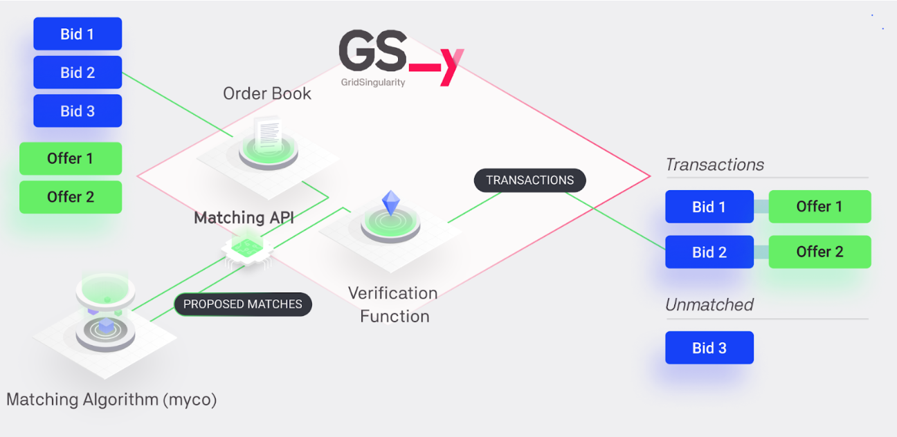

The GSY DEX Matching Engine is a critical component of the Grid Singularity Decentralised Exchange ([GSY DEX](blockchain.md){target=_blank}), which matches the select market supply with demand based on participant preferences and market conditions, facilitating seamless, optimised exchange clearance. It relies on the accompanying [GSY DEX Matching API](blockchain-matching-engine.md#gsy-dex-matching-api) to collect open bids and offers and apply relevant trading mechanisms and algorithms.

The GSY Matching Engine currently deploys a [two-sided pay-as-bid](market-types.md#two-sided-pay-as-bid-market){target=_blank} strategy, ensuring that buyers and sellers receive the best possible prices for their energy trades. Future versions will integrate pay-as-clear and automated market maker (AMM) as alternative trading mechanisms.  Furthermore, the intent is to render the GSY Matching Engine available as an autonomous service application in the [Energy Web SmartFlow Launchpad](https://www.smartflow.org/#products){target=_blank}, leveraging the Energy Web infrastructure and facilitating integration with a wider range of third-party applications, even beyond the energy market.

Inspired by the GSY concept of [Symbiotic Energy Markets](https://gridsingularity.medium.com/discussion-paper-grid-singularitys-implementation-of-symbiotic-energy-markets-bd3954af43c8){target=_blank}, the GSY DEX Matching Engine is designed to improve the existing matching approaches and advance the GSY’s vision to empower individuals with choices on their energy use, technically implemented as a multi-attribute double auction with dynamic pricing. Multi-attribute auctions require more complex and computationally intensive matching algorithms than single attribute auctions that are based on price alone. The optimal approach is to engage [off-chain workers](blockchain-off-chain-storage.md){target=_blank} to run matching algorithms and then require either the use of trusted execution environments (enclaves) or on-chain verification to determine whether the matching algorithm was correctly executed. To enable this functionality, the matching process is decoupled from the energy delivery verification (execution) in the GSY DEX system architecture.

Whilst it can be used for any commodity, the GSY DEX Matching Engine has been tailored for the electricity market. It integrates directly with the [GSY DEX Off-Chain Storage](blockchain-off-chain-storage.md){target=_blank} for real-time bid and offer access via its Order Book Storage, and with the [GSY Node](gsy-node.md){target=_blank}, for both user registry and the trade settlement in conjunction with a trade execution (energy delivery) verification service provided by the [GSY DEX Execution Engine](blockchain-execution-engine.md){target=_blank}.

Since the GSY DEX Matching Engine only checks the validity of each match rather than the result of a specific matching algorithm, there is no need for a predefined matching algorithm, arbitration technique, or redundant off-chain computation, which also reduces blockchain transaction costs (gas costs). The matching algorithm can vary between different communities, and can even be reconfigured or replaced without service interruption. The modular architecture design hence facilitates compliance with local regulation by not restricting community managers to a single matching process, but allowing them to tailor the matching process to their needs, including the choice of the applicable trading strategy and mechanism. The approach is regulation and governance agnostic, allowing communities the freedom to opt for any model of preference. This is technically done by facilitating operation of one or multiple autonomous matching services, with operation rights managed by the GSY Node Order Book Registry in interaction with the GSY DEX Matching Engine API.

The GSY DEX Matching Engine retrieves open bids and offers (trade orders) from the [GSY DEX Off-Chain Storage](blockchain-off-chain-storage.md){target=_blank} (Order Book Storage) through the [GSY DEX Matching API](blockchain-matching-engine.md#gsy-dex-matching-api){target=_blank}, which also applies the select trading mechanism and algorithms and then submits matches for verification by the [GSY DEX Execution Engine](blockchain-execution-engine.md){target=_blank}, with user and data access management validated on-chain by the [GSY Node](gsy-node.md){target=_blank}. This seamless integration with the GSY Node and the GSY DEX Off-Chain Storage allows for efficient energy trading by offloading the GSY Node from the most computationally intensive operations of the matching process. At the same time, the immutability and integrity of the data are not jeopardised, since the GSY Node participates in the most important stages of the verification process.

The GSY Node verification function is to ascertain whether the bid and offer limitations are satisfied by the matches generated by the GSY DEX Matching Engine (for instance, if the energy rate of the match is lower than or equal to the bid rate and higher than or equal to the offer rate). In addition, leveraging the GSY Node consensus mechanism,  it is possible to receive different sets of matches from multiple competing GSY Matching Engines and to accept only one of those sets, guaranteeing decentralised dispute resolution and safeguarding against malicious submissions. Moreover, the GSY Node verification function is modelled as a dispatchable function which emits events that are part of the block extrinsics, thus guaranteeing that any incorrect or malicious submissions from the Matching Engine are logged and available for audit.  Therefore, multiple competing GSY Matching Engines can calculate matches for different markets in parallel, each using their own matching algorithm, and afterwards the GSY Node can select and verify the matches that are eligible for clearing, and reject those that are violating their bid and offer requirements. Finally, as the verification function is executed on-chain any potential errors or fraud attempts, such as double counting of trades and matching results, are eliminated. The validation of the actual delivery of the traded energy cannot be performed at the same time when the energy is traded, due to the fact that trading occurs ahead of delivery (ex ante). The trade matching time is fully configurable, with a default of 15 minutes before the energy delivery — a timeframe aligned with intra-day or real-time trading models. Longer lead times (e.g., day-ahead) could be configured depending on market context. At the end of the trade cycle, the GSY DEX Execution Engine is tasked with reading the asset measurements of produced or consumed energy, thereby validating whether the energy delivery corresponds to the traded energy ex post.  The final outcome is then forwarded for financial clearance and analytics.


To summarise, the main functions of the GSY DEX Matching Engine are the following:

- Trade Order Retrieval: The GSY Matching Engine retrieves orders from the GSY DEX Off-Chain Storage. This storage system holds all active bids and offers, which the GSY Matching Engine reads in order to match suitable counterparts for energy trades.
- Matching Bids and Offers: Pursuant to a two-sided pay-as-bid strategy, the GSY Matching Engine pairs bids and offers according to price and quantity to maximise value for the exchange participants. Buy orders are organised in a descending order of price, prioritising buyers willing to pay more, while sell orders are arranged in an ascending order, prioritising sellers willing to sell energy at lower prices. This strategy ensures that both parties upon clearance pay or receive the desired price for their energy trade based on their submitted bids and offers.
- Submitting Bid-Offer Matches to the GSY Node: Once the GSY DEX Matching Engine has identified the optimal bid-offer matches, it submits these matches to the GSY Node for verification and final execution by the GSY DEX Execution Engine, and to the GSY DEX Off-Chain Storage for analytics.

To conclude, the GSY DEX Matching Engine has been designed as an autonomous GSY DEX service, applied in conjunction with other GSY DEX services, to achieve the following performance optimisation:

- Enhanced Throughput: The matching process, especially when it encompasses multiple attributes, is a computationally and memory-intensive operation that requires significant computational resources. By creating a dedicated matching engine, we ensure that the GSY Node can handle platform validation functions without the risk of being overloaded by the resource-intensive matching process.
- Gas/Transaction Costs: By creating a dedicated matching engine that interacts with the off-chain storage for the most computationally intensive operations rather than using the GSY Node to execute the entire matching process on-chain, transaction costs are significantly reduced.
- Scalability: The GSY DEX Matching Engine independent architecture ensures the platform remains responsive and efficient as the volume of market participants and transactions expands, without affecting the performance of the GSY Node.
- Flexibility: As a standalone service, the GSY DEX Matching Engine can be easily updated or modified without impacting other platform components. This allows for the continuous improvement of the order matching process and overall energy trading experience for platform users. Moreover, the GSY DEX Matching Engine enables operation of multiple, different matching algorithms in parallel, per market or energy community, facilitating compliance with local regulation.


## GSY DEX Matching Engine Implementation

The GSY DEX Matching Engine is implemented in [Rust](https://www.rust-lang.org/){target=_blank}, in order to take advantage of the ease of interconnection with other components of the GSY DEX, especially with the GSY Node, and the Rust performance benefits compared to other programming languages. The GSY DEX Matching Engine’s operation revolves around a loop that continuously submits requests to the [GSY DEX Off-Chain Storage](blockchain-off-chain-storage.md){target=_blank} as to whether new open offers or bids have been created. If the Off-Chain Storage reports that new offers and bids have been created, the Matching Engine calls the applicable matching algorithm to calculate the matches and then transmits the calculated matches to the GSY Node. The main Rust modules that comprise the GSY DEX Matching Engine are the Algorithms Module and the Connectors Module.


<figure markdown>
  {:text-align:center"}
  <figcaption><b>Figure 6.16</b>: The GSY DEX Matching Engine Dataflow
</figcaption>
</figure>


The GSY DEX Matching Engine [Algorithms Module](https://github.com/gridsingularity/gsy-decentralized-exchange/tree/main/gsy-matching-engine/src/algorithms){target=_blank} stores the available matching algorithms. Currently the [two-sided pay-as-bid](market-types.md#two-sided-pay-as-bid-market){target=_blank} algorithm is supported, with additional matching algorithms to be added in the future, either by Grid Singularity or a third party via the GSY DEX Matching API. Furthermore, the design of the Algorithms Module allows multiple algorithms to be deployed in parallel. For instance, different matching algorithms can be applied in different energy communities, or in different buildings within an energy community to optimise their asset configuration

The currently applied two-sided pay-as-bid algorithm does not require the offer and bid to fully match each other’s respective energy consumption and production. The algorithm can also conclude a bid-offer match that partially trades the energy required by the bid and/or provided by the offer, with the expectation that the rest of the required or offered energy will be traded at a later time. Subsequently, the residual energy of the bid and/or the offer can be processed by the GSY DEX Matching Engine either in the same list of matches, or in one of the following lists of matches by creating a new offer and bid that will represent the residual energy.  The GSY DEX Execution Engine processes only the trades that have been successfully matched and confirmed by the Matching Engine, regardless of whether they represent full or partial fulfilment of the original bid or offer. Any unmatched energy is excluded from delivery verification and penalty calculation, and may be resubmitted in subsequent trading rounds.

The [Connectors Module](https://github.com/gridsingularity/gsy-decentralized-exchange/tree/main/gsy-matching-engine/src/connectors){target=_blank} handles the interconnection with the GSY Off-Chain Storage and the GSY Node. The Rust library [Subxt](https://github.com/paritytech/subxt){target=_blank} (developed by Parity), which is the most common and robust way of interacting with Substrate nodes, is used for the interconnection with the GSY Node. For the interconnection with the GSY Off-Chain Storage, [tokio](https://tokio.rs/){target=_blank} and [reqwest](https://crates.io/crates/reqwest){target=_blank} are used as an asynchronous HTTP client.

The GSY DEX Matching Engine has been customised for the energy market by setting the traded commodity to energy and using kWh for the traded volume and cents/kWh for the trade rate and adapting other relevant parameters.


## GSY DEX Matching API

The GSY DEX Matching API defines the protocol of communication between the GSY DEX Matching Engine and other components of the GSY DEX to enable market clearance.  It  enables selected algorithms (also termed matching engines, or “mycos”) to read the exchange’s order book, run custom matching and submit the resulting energy transactions to be verified and executed by the exchange.


<figure markdown>
  {:text-align:center"}
  <figcaption><b>Figure 6.17</b>: GSY DEX Matching Process Dataflow
</figcaption>
</figure>

The API has two components, one for the inputs required by the GSY DEX Matching Engine to calculate the possible bid-offer matches, and one for transmitting the calculated matches to the GSY Node, in order for energy trades to be generated and trade settlement to be performed.

The inputs required by the GSY DEX Matching Engine are the open bids and the offers that are available for [a market slot](markets.md#market-slots){target=_blank} (energy delivery time period). These are retrieved not via the GSY Node, but by leveraging the API of the GSY DEX Off-Chain Storage, thereby minimising the gas cost (blockchain transaction cost) required for the operation of the Matching Engine, and consequently decreasing the computational effort required from the GSY Node.

The bid-offer matches calculated by the Matching Engine are transmitted to the GSY Node via the [Trade Settlement Pallet](blockchain-matching-engine.md#gsy-dex-matching-engine-gsy-node-communication-trade-settlement-pallet){target=_blank}. This GSY Node pallet provides dispatchable functions that can be remotely called, in order to accept the list of bid-offer matches calculated by the Matching Engine, validate them, and subsequently create the energy trades.

It is important to note that the Matching API is asynchronous towards the exchange, meaning that [it can request bids and offers](matching-api-commands.md){target=_blank} and submit matches to GSY Node  at any time, as long as the [market slot](matching-api-walkthrough.md){target=_blank} of the matches is open for trading.

_The GSY Matching API code is currently available in Python, as well as in Rust for the [GSY DEX Matching API](blockchain-matching-engine.md#gsy-dex-matching-api){target=_blank} implementation._


### GSY DEX Matching Engine / GSY Off-Chain Storage Communication

To calculate the bid and offer matches, the GSY Matching Engine reads the open offers and bids from the [Off-Chain Storage](blockchain-off-chain-storage.md){target=_blank} by calling the `GET /orders` availabla at the [REST API endpoint of the Off-Chain Storage](blockchain-off-chain-storage.md#http-rest-api-schema){target=_blank}. The endpoint will return lists of JSON objects containing all open `Bid` and `Offer` structures, which will then be used to generate the `BidOfferMatch` objects during the order matching process. The JSON format of the output is the following:


```json
[
  {
    "type": "Bid",
    "buyer": <account id of the energy buyer who submitted the bid>,
    "nonce": <unique identifier of the bid, autoincremented int>,
    "bid_component": {
      "area_uuid": <unique identifier of the asset or market area that posted the bid>,
      "market_id": <unique identifier of the market that the bid belongs to>,
      "time_slot": <timestamp of the expected energy consumption>,
      "creation_time": <time that the bid was posted to the exchange>,
      "energy": <energy in kWh * scaling factor, that the buyer is willing to buy>,
      "energy_rate": <energy_rate, in cents/kWh that the buyer is willing to pay>
    }
  },
  {
    "type": "Offer",
    "seller": <account id of the energy seller who submitted the offer>,
    "nonce": <unique identifier of the offer, autoincremented int>,
    "offer_component": {
      "area_uuid": <unique identifier of the asset or market area that posted the offer>,
      "market_id": <unique identifier of the market that the offer belongs to>,
      "time_slot": <timestamp of the expected energy production>,
      "creation_time": <time that the offer was posted to the exchange>,
      "energy": <energy in kWh * scaling factor, that the seller is willing to sell>,
      "energy_rate": <energy_rate, in cents/kWh that the seller is willing to earn>
    }
  }
]

```
<figcaption><b>Figure 6.18</b>: Template of GSY DEX Off-Chain Storage Bid and Offer structures that are read by the GSY DEX Matching Engine</figcaption>


### Trade Settlement Pallet (GSY DEX Matching Engine / GSY Node Communication)
The GSY Node Trade Settlement pallet ensures the validity of proposed matches and handles the settlement process for energy and flexibility trades on the [GSY DEX](blockchain.md){target=_blank}, interacting with other components of the GSY DEX as follows:

- Interaction with the GSY DEX Matching Engine: The Trade Settlement Pallet receives the matched trade information directly from the registered matching engines, which have processed the bids and offers to find suitable counterparts according to the implemented matching algorithm (e.g. Pay-as-Bid). It validates the proposed matches by checking the terms of trade and comparing them to the ones stored in the GSY Node Order Book Registry Pallet, thus ensuring that the trades conform to the platform’s rules, such as energy rates and energy amounts.
- Interaction with the GSY Node Order Book Registry and Order Book Worker pallets: The Trade Settlement Pallet communicates with the Order Book Registry located in the Order Book Registry Pallet of the GSY Node to access and update the current order status, ensuring that the trades are settled based on accurate information and that only valid orders participate in the settlement process. It also checks for the registered matching engines in the Order Book Registry storage to ensure that the matching engines that submit matches are correctly registered in the GSY DEX. After verifying and validating the proposed matches, the pallet settles the trades by updating the Order Book Registry and Order Book Worker with the executed orders and any residual orders and performs the financial settlement between the buyer and seller of energy. Finally, the trade is transmitted to GSY DEX Off-Chain storage for further processing, such as analytics.

In order to persist a batch of matches, the GSY DEX Matching Engine calls the `settle_trades` pallet method, including a vector of `BidOfferMatch` structures, each representing a single Offer-Bid match. The pallet method then validates these matches and executes the trade. The pallet also supports partial offer / bid matching, meaning that the energy from an offer or bid can be used partially and that it is not mandatory that it be used in full. The pallet is able to update the respective bid / offer with the residual energy (energy that remains after the trade was performed) and use the residual energy for matches that are processed at a later time.

The `BidOfferMatch` structure is part of the [Trades module](gsy-node.md#gsy-node-trades-module){target=_blank}, and includes the following information:

- `market_id`: Unique identifier of the market to which the bid and offer of the match belong
- `time_slot`: Time slot of the market to which the Bid and Offer of the match belong. It signifies the time that the delivery of the traded energy should take place
- `bid`: The [Bid struct](blockchain-off-chain-storage.md#order-book-storage-database-schema){target=_blank} that represents the energy demand of the match
- `offer`: The [Offer struct](blockchain-off-chain-storage.md#order-book-storage-database-schema){target=_blank} that represents the energy supply of the match
- `residual_bid`: Optional Bid struct that represents the residual energy that was not traded from the original Bid
- `residual_offer`: Optional Offer struct that represents the residual energy that was not traded from the original Offer
- `selected_energy`: The traded energy of the match, in kWh
- `energy_rate`: The energy rate of the resulting trade, in cents/kWh

#### Trade Settlement Pallet Events

- `TradeCleared`: Emitted when a trade is created and cleared
- Since the [Order Book Registry](gsy-node.md#gsy-node-order-book-registry-pallet){target=_blank} and the [Order Book Worker](gsy-node.md#gsy-node-order-book-worker-pallet){target=_blank} pallets are used by this pallet, all events emitted by them can also be emitted by the Trade Settlement pallet.

#### Trade Settlement Pallet Errors

- `NotSameLength`: Ensure that bid, offer and trade vectors have the same length.
- `NoValidMatchToSettle`: Ensure that there are valid matches to settle.
- `OrdersNotExecutable`: Ensure that the order’s execution returns an OK(()) value.
- `OrderNotRegistered`: Ensure the order has been registered in the Order Book Registry.
- `OfferEnergyRateGreaterThanBidEnergyRate`: Ensure that the offered energy rate is lower than the bid energy rate.
- `OfferEnergyLessThanSelectedEnergy`: Ensure that the offered energy rate is higher than the  selected energy.
- `BidEnergyLessThanSelectedEnergy`: Ensure that the bid energy rate is higher than the  selected energy.
- `UnableToSubtractEnergy`: Ensure that the energy subtraction in the validation is correct.

#### Trade Settlement Pallet Dispatchable Functions

- `settle_trades`: Perform trade clearing / settlement for a list / vector of proposed matches. Proposed matches are of the type `Vec<BidOfferMatch<T::AccountId>>` thus allowing multiple `BidOfferMatch` objects to be settled at once from the dispatchable function. To achieve this the following functions are used:

- `validator` trait for the validation of each `BidOfferMatch`
- `orderbook_registry` pallet for accessing the orders that consist of the match and creating the Trade object
- `orderbook_worker` pallet for transmitting the result of the trade settlement to the GSY DEX Off-Chain Storage for any further processing.


#### Trade Settlement Pallet Helper Functions

- `validate`: Validates a single bid-offer match
- `validate_bid_energy_component`: Ensures that the bid’s energy component is greater than or equal to the selected energy for the trade
- `validate_offer_energy_component`: Ensures that the offer’s energy component is greater than or equal to the selected energy for the trade
- `validate_energy_rate`: Ensures that the bid’s energy rate is greater than or equal to the offer’s energy rate
- `validate_residual_bid`: Validates the residual bid by checking that the bid’s energy component has been correctly updated after subtracting the selected energy
- `validate_residual_offer`: Validates the residual offer by checking that the offer’s energy component has been correctly updated after subtracting the selected energy.
- `validate_time_slots`: Validates the time slots of the bid and offer, as well as the proposed match’s time slot, to ensure they fall within the acceptable range
