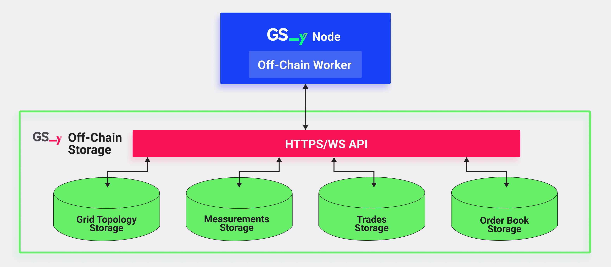
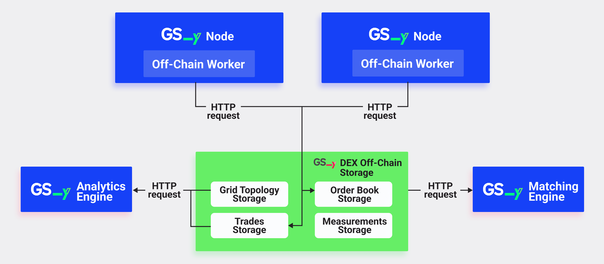

The GSY DEX Off-Chain Storage stores various types of data that are crucial to the platform’s operation but do not need to be recorded on the blockchain. This approach enhances scalability and efficiency, while also facilitating compliance with privacy protection regulation such as the [GDPR](https://eur-lex.europa.eu/eli/reg/2016/679/oj/eng){target=_blank} by reducing the amount of data stored on-chain and facilitating the user’s right to private data deletion. Importantly, final price and energy verification for each trade is performed on-chain.

The off-chain storage can be accessed by both off-chain workers and on-chain logic. Each bid and offer is assigned a hash reference to reduce blockchain transaction throughput, and maximise participant data privacy (e.g. members of a local energy community), while ensuring transparency and verifiability of matching and execution for each trade transacted via the on-chain, [GSY DEX Node Order Book](blockchain-system-components-overview.md#gsy-node){target=_blank}. The GSY DEX Off-Chain Storage implementation is grounded in Grid Singularity’s concept of [Symbiotic Energy Markets](https://gridsingularity.medium.com/discussion-paper-grid-singularitys-implementation-of-symbiotic-energy-markets-bd3954af43c8){target=_blank}, inspired by mycorrhizal networks. Importantly, while intended for the energy sector, the GSY DEX Off-Chain Storage can also support other industry applications, contributing to both the [Energy Web](https://www.energyweb.org/){target=_blank} and the wider [Polkadot](https://polkadot.network/){target=_blank} innovation ecosystem.

Off-chain workers (also termed mycos in the GSY DEX architecture design) are an integral part of the node (in this case the GSY Node), which execute long-running and possibly non-deterministic tasks, such as encryption, decryption, and signing of data, CPU-intensive computations or enumeration or aggregation of on-chain data (for more see the related [Substrate wiki page](https://docs.substrate.io/learn/offchain-operations/){target=_blank}). They are automatically created when a blockchain node is deployed, running operations at the end of each block validated by the node. The difference compared to a smart contract or a pallet is that the off-chain worker has its own runtime, synchronised with the node runtime. Since the code is shared, off-chain workers, unlike the Off-Chain Storage service, can immediately access the blockchain, without requiring any protocol such as HTTP. This is a safer and more efficient way to interact with the blockchain compared to oracles, which is the conventional way of integrating off-chain with on-chain data. Notably, oracles are not part of the blockchain. They are external services that continuously perform actions based on new blocks generated by the blockchain, introducing a potential security vulnerability. As a separate service, oracles also need dedicated scaling if the number of blockchain validators increases which is not the case with off-chain workers.

The GSY DEX Off-Chain Storage comprises four distinct components, named substorages and described below:

- [**GSY DEX Grid Topology Storage**](#gsy-dex-grid-topology-storage)
- [**GSY DEX Measurements Storage**](#gsy-dex-measurements-storage)
- [**GSY DEX Trades Storage**](#gsy-dex-trades-storage)
- [**GSY DEX Order Book Storage**](#gsy-dex-order-book-storage)


Each of the off-chain storage components is associated with proprietary, component-specific  database tables, which are exposed to other [GSY DEX system components](blockchain-system-components-overview.md){target=_blank} via HTTP REST endpoints to facilitate common operations and streamline access to data. This approach ensures that other GSY DEX system components can read, update and save information related to each storage component. Furthermore, separating the data in different components restricts data dependencies and thereby optimises its management, including by enabling efficient database migration and other operations on the database tables’ schema. In addition, data storage segmentation facilitates partial data transfer to other data storages in the future system upgrades. Off-chain storage workers’ role is to ensure that off-chain storage subcomponents, namely the GSY DEX Grid Topology Storage and the GSY DEX Measurements Storage, securely receive the required data such as asset-level production and consumption, and that the GSY DEX Trades Storage and the GSY DEX Order Book Storage can support and improve performance of the matching operation based on a set of preferred energy attributes in communities where such preferences can be facilitated.


<figure markdown>
  {:text-align:center"}
  <figcaption><b>Figure 1</b>: GSY DEX Off-Chain Storage - GSY Node Communication Flow.</figcaption>
</figure>

### GSY DEX Grid Topology Storage
Contains information about the physical grid structure, such as the location and configuration of energy assets and electrical grid components, as well as their interconnections. This data enable the GSY DEX both to verify the eligibility of the assets for trading and to facilitate [performance analytics](results-dashboard.md){target=_blank}. Grid topology, also referred to as ontology, is generally aligned with the [SAREF standards](https://saref.etsi.org/){target=_blank} to facilitate data access management and exchange. The following data is stored in the GSY DEX Grid Topology (Off-Chain) Storage:

1. Energy asset information, consisting of nameplate parameters for each energy asset participating in the energy exchange, which serve to verify that the values of energy offers and bids submitted by each asset do not surpass the energy values that can be physically consumed or produced by the asset. Attributes assigned to energy generation, consumption and storage assets also serve to define preferences with regards to energy use, technically enabling a wider array of user choices (multi-attribute bids and offers) in markets that facilitate a broader framework of market participation.
2. Grid topology description: defining how the assets are structured and grouped, and providing the location and nameplate parameters of electrical devices that form the electrical grid, namely circuit breakers, voltage transformers or entire distribution substations. Its main purpose is to form the rules for asset trading (for example, for intra-community trading, only assets from the same community would be permitted to trade). The topology information is also required for the [GSY DEX Execution Engine](blockchain-execution-engine.md){target=_blank} operation.

### GSY DEX Measurements Storage
Stores the energy consumption and generation data from energy assets. Accurate measurement data is essential for validating and executing energy trades, managing grid stability, and optimising energy consumption and generation patterns. In brief, it is responsible for persisting energy measurements and forecasts for assets defined in GSY DEX Grid Topology in the form of time series data, with predefined time resolution, which is 15-minutes by default.

The main purpose of energy forecasts is to facilitate and enhance the operation of trading agents, facilitating a more accurate and efficient order submission for the assets that they manage based on improved predictions. Importantly, the GSY DEX has been structured to use asset forecasts to set an upper limit to the sum of the energy of all open orders in the exchange, obliging the exchange participants not to post energy orders which sum to a greater volume than the forecasted energy. Measurements are also required for the [GSY DEX Execution Engine](blockchain-execution-engine.md){target=_blank} operation, in order to verify whether the energy produced or consumed by the energy assets is accurately reflected by the energy trades of these assets, and to assign penalties to assets that sold energy that they did not produce.

### GSY DEX Trades Storage
Stores all [energy trades of the GSY DEX](trades.md){target=_blank} for the assets participating in the energy exchange, along with the associated metadata, such as grid costs and any potential penalties. This information is required in order to maintain and update the trade status to facilitate trade execution, as well as for analytics, auditing the trading behaviour of the user’s energy assets, and performing market analysis. In more detail, it streamlines access to the trade information for:

- Asset aggregators or trading agents that are responsible for managing one or multiple assets, enabling them to reconfigure the asset trading strategy based on historical information relating to the past energy trades for these assets
- The GSY DEX Analytics Engine, which needs the information related to the energy trades to generate more elaborate analytics to monitor the performance of the exchange overall and the trading assets individually.
- Payment services, which require access to the energy trades in order to modify the token balances of the seller and the buyer of energy, thereby performing the financial settlement for the energy trades.

### GSY DEX Order Book Storage
This storage component holds all the orders inserted in the respective market operated by the GSY DEX, including bids and offers issued by participants, both open and closed, along with metadata that is automatically generated by the GSY DEX for each order.
The main purposes for persisting the offers and bids are the following:

- Report offers and bids to all exchange participants, along with all the associated information and the final status (open, traded, deleted);
- Enable the operation of the GSY DEX Matching Engine by providing a list of open offers and open bids, which represent the energy demand that is currently requested, and the energy supply that is currently offered in the exchange, respectively.


### GSY DEX Off-Chain Storage Communication Protocol
The [GSY Node](blockchain-installation.md){target=_blank} stores the order and trade information in the GSY DEX Off-Chain Storage by leveraging off-chain workers, which perform HTTP requests on its behalf as described above. Notably, the GSY Node saves the bids and offers in the GSY DEX Order Book Storage and the trades in the GSY DEX Trades Storage in order to make them available for other system services, namely those performed by the GSY DEX Analytics Engine, the GSY DEX Execution Engine and the GSY DEX Matching Engine. These other GSY DEX system components all leverage the same HTTP REST API as the GSY Node to access the GSY DEX Off-Chain Storage. The HTTP REST API uses token-based authentication to grant access to the API, thus ensuring participant data security.

The [GSY DEX Analytics Engine](blockchain-system-components-overview.md#gsy-dex-analytics-engine) requires access specifically to the GSY DEX Grid Topology Storage and the GSY DEX Trades Storage to retrieve data to calculate the [select performance indicators](results-dashboard.md) to monitor individual and aggregate performance of energy assets in the exchange.

The GSY DEX Matching Engine, in turn requires access specifically to the GSY DEX Order Book Storage to retrieve the open offers and bids in order to perform the market supply and demand matching operation.


<figure markdown>
  {:text-align:center"}
  <figcaption><b>Figure 2</b>: GSY DEX Off-Chain Storage Dataflow.</figcaption>
</figure>


### GSY DEX Off-Chain Storage Database
The GSY DEX Off-Chain Storage Database is the off-chain storage component responsible for persisting the off-chain data required for the correct operation of the [GSY DEX](blockchain.md){target=_blank}. This operation presents a consequential challenge due to the volume of required data points and the requirement to persist and report these data for long periods of time. Furthermore, significant computation needs to be performed on this data, which in turn contribute to the computational effort required by the blockchain nodes for data processing. To circumvent these limitations, these data points are not saved in the blockchain, but in the off-chain database, facilitating storage of data of arbitrary size, and the related performance of more computationally intensive operations.

To ensure optimal performance, stability and scalability of the GSY DEX and account for data privacy considerations, such as ability to delete data upon request and perform other operations in alignment with the [GDPR](https://eur-lex.europa.eu/eli/reg/2016/679/oj/eng){target=_blank}, the storage database type of choice for processing off-chain transactions is [MongoDB](https://www.mongodb.com/){target=_blank}, a NoSQL document-oriented database, capable of storing and fetching large data volumes. One of its main advantages is horizontal scaling, enabled by [sharding](https://www.mongodb.com/docs/manual/sharding/){target=_blank}, which is a method of distributing data across multiple servers, with each server containing a subset of the data (shard). That way, the total workload capacity of the database is not limited by the resources of a single server. Whenever the server resources become exhausted, a new server can be added to the sharded cluster to extend the total capacity and balance the database load, ensuring efficient computation of increased data volumes.  Redundancy and high availability (ability of the system to be reliable close to 100% of the time) to ensure data security are facilitated by the use of replica sets, which copy part of the data to different database servers, thus providing a level of fault tolerance against the loss of a single database server.

### GSY DEX Off-Chain Database Schema
Each data type (struct) required for the operation of the GSY DEX is modelled and structured as a [MongoDB Document](https://www.mongodb.com/docs/manual/core/document/){target=_blank}, both to correctly organise the data and to facilitate and accelerate the expected queries that will be executed on the data. The data types persisted in the database for each storage subcomponent are listed below.

Importantly, in any deployment the private data is managed by the entity that has the role of an energy community manager, responsible for data control, while the software provider (GSY) operating the marketplace is processing exclusively anonymised data. Specifically, energy measurements are known but not who they belong to (participants are assigned codes by the data manager pursuant to local regulation). Furthermore, all incoming data is encrypted in transit, rest and in use. The partner collaboration including data processing is usually contractually defined.


#### Grid Topology Storage Database Schema
The Grid Topology Storage stores all assets using the same data type, with optional arguments applied to differentiate the asset type and position, creating and persisting a hierarchical layered representation of the electrical grid. Different topology types support different arguments, accommodating generation, consumption and storage assets (namely PVs, Heat Pumps, Wind Turbines, Loads and Batteries), as well as electrical devices that form the electrical grid (Smart Metres, Voltage Transformers and Circuit Breakers), along with the Area type that is used in order to group different assets. Topology connections are modelled using the “children” argument, which is available only for Area type (also termed Market or Submarket), Voltage Transformer and Circuit Breaker types, and accept a list of asset uuids. Here below are two examples of the JSON representation of the GSY DEX Off-Chain Grid Topology Storage, one for a load and another for a voltage transformer.


<figure markdown>
```json
{
   "type": "Load",
   "nonce": 3,
   "uuid": "load_uuid",
   "name": "Home 1 Consumption",
   "community_uuid": 13,
   "creation_time": 1546300800,
   "max_consumption_kWh": 5,
   "coordinates": [43.2, 45],
   "children": []
 }
```
  <figcaption><b>Figure 3</b>: Example of GSY DEX Off-Chain Grid Topology Storage Load.</figcaption>
</figure>


<figure markdown>
```json
{
   "type": "VoltageTransformer",
   "nonce": 3,
   "uuid": 5,
   "name": "Home 1 Consumption",
   "community_uuid": 13,
   "creation_time": 1546300800,
   "max_power_rating_kW": 20,
   "coordinates": [43.2, 45],
   "children": ["load_uuid"]
 }
```
  <figcaption><b>Figure 4</b>: Example of a voltage transformer in the GSY DEX Off-Chain Grid Topology Storage.</figcaption>
</figure>


#### Measurements Storage Database Schema

The Measurements Storage persists forecasts and measurements, using the same data type. The `type` data entry attribute is used to differentiate between forecasts and measurements, thereby allowing the database to select only forecasts or measurements, depending on the user interest. Furthermore, `type`, `asset_uuid` and `time_slot` data entries are indexed, in order to accelerate queries that select forecasts or measurements for an asset and a period of time. Here below are two examples of the JSON representation of the GSY DEX Off-Chain Measurements Storage, one for a forecast and another for a measurement:


<figure markdown>
```json
{
   "type": "Forecast",
   "nonce": 3,
   "asset_uuid": 5,
   "community_uuid": 13,
   "time_slot": 2,
   "creation_time": 1546300800,
   "energy_consumption_kWh": 1.2,
   "energy_production_kWh": 0,
}
```
  <figcaption><b>Figure 5</b>: Example of a forecast in the GSY DEX Off-Chain Measurements Storage.</figcaption>
</figure>


<figure markdown>
```json
{
   "type": "Measurement",
   "nonce": 2,
   "asset_uuid": 1,
   "community_uuid": 13,
   "time_slot": 2,
   "creation_time": 1546300800,
   "energy_consumption_kWh": 10.2,
   "energy_production_kWh": 0.3,
}
```
  <figcaption><b>Figure 6</b>: Example of a measurement in the GSY DEX Off-Chain Measurements Storage.</figcaption>
</figure>


#### Trades Storage Database Schema
Trades are saved using JSON documents in a similar format as the Order. The fields asset_uuid, market_uuid and time_slot are indexed to facilitate the selection of the trades for an asset per market and time slot. Here below is an example of the JSON representation of a trade in the GSY DEX Off-Chain Trades Storage:


<figure markdown>
```json
{
   "type": "Trade",
   "nonce": 2,
   "asset_uuid": 1,
   "market_uuid": 1,
   "time_slot": 2,
   "creation_time": 1546300800,
   "energy": 10,
   "energy_rate": 1,
   "bid_component": {
       "buyer": "aabc",
       "energy": 10,
       "energy_rate": 1
   },
   "offer_component": {
       "seller": "deca",
       "energy": 10,
       "energy_rate": 1
   },
}
```
  <figcaption><b>Figure 9</b>: Example of a trade in the GSY DEX Off-Chain Order Book Storage.</figcaption>
</figure>


#### Order Book Storage Database Schema
Bids and offers are saved using the same data type. Similar to the other storage subcomponents, `type` data entry attribute in the JSON document is used in order to differentiate between offers and bids, thus allowing the user to filter for either one. Moreover, `type`, `asset_uuid`, `market_uuid` and `time_slot` data entries are indexed, in order to accelerate queries that select bids or offers for a select asset, market and time slot. Here below are two examples of the JSON representation of an offer and a bid in the GSY DEX Off-Chain Order Book Storage:


<figure markdown>
```json
{
   "type": "Bid",
   "nonce": 2,
   "asset_uuid": 1,
   "market_uuid": 1,
   "time_slot": 2,
   "creation_time": 1546300800,
   "bid_component": {
       "buyer": "aabc",
       "energy": 10,
       "energy_rate": 1
   }
}
```
  <figcaption><b>Figure 7</b>: Example of a bid in the GSY DEX Off-Chain Order Book Storage.</figcaption>
</figure>


<figure markdown>
```json
{
   "type": "Offer",
   "nonce": 1,
   "asset_uuid": 1,
   "market_uuid": 1,
   "time_slot": 1,
   "creation_time": 1546300800,
   "offer_component": {
       "seller": "bbcd",
       "energy": 10,
       "energy_rate": 1
   }
}
```
  <figcaption><b>Figure 8</b>: Example of an offer in the GSY DEX Off-Chain Order Book Storage.</figcaption>
</figure>


### HTTP REST API Schema
Each storage subcomponent is exposed via separate REST endpoints for operations that are most commonly required by the users of the GSY DEX Off-Chain Storage API. GET and POST requests are supported to facilitate reading of database entries, as well as the creation of new database entries.

#### Grid Topology Storage API Schema
The Grid Topology Storage uses the dedicated endpoint
```commandline
/grid-topology
```
In order to both fetch and create new entries. The endpoint supports both GET and POST HTTP requests, and the accepted input data format is similar to the database schema. Here below is an example of the HTTP response of the /grid-topology endpoint:


<figure markdown>
```json
POST /grid-topology
[{
   "type": "VoltageTransformer",
   "nonce": 3,
   "uuid": 5,
   "name": "Home 1 Consumption",
   "community_uuid": 13,
   "creation_time": 1546300800,
   "max_power_rating_kW": 20,
   "children": [{
      "type": "Load",
      "nonce": 3,
      "uuid": "load_uuid",
      "name": "Home 1 Consumption",
      "creation_time": 1546300800,
      "max_consumption_kWh": 5,
      "children": []
    }
 }]
```
  <figcaption><b>Figure 10</b>: Example of GSY DEX Off-Chain Grid Topology REST API POST.</figcaption>
</figure>


#### Measurements Storage API Schema
The Measurements Storage uses one dedicated endpoint for forecasts:
```commandline
/forecasts
```
and one for measurements:
```commandline
/measurements
```
Both endpoints support GET and POST HTTP requests, in order to be able to both fetch and create forecasts / measurements. The accepted input data format is similar to the database schema in both cases. Here below are two examples of the HTTP responses of the /forecasts and /measurements endpoints:


<figure markdown>
```json
POST /forecasts
{
   "type": "Forecast",
   "nonce": 3,
   "asset_uuid": 5,
   "community_uuid": 13,
   "time_slot": 2,
   "creation_time": 1546300800,
   "energy": 1.2,
}
POST /measurements
{
   "type": "Measurement",
   "nonce": 2,
   "asset_uuid": 1,
   "community_uuid": 13,
   "time_slot": 2,
   "creation_time": 1546300800,
   "energy": 10.2,
}
```
  <figcaption><b>Figure 11</b>: Example of GSY DEX Off-Chain Measurements Storage REST API POST.</figcaption>
</figure>


#### Trades Storage API Schema
The Trades Storage uses the dedicated endpoint
```commandline
/trades
```
in order to both fetch and create new entries. The endpoint supports both GET and POST HTTP request, and the accepted input data format is similar to the database schema. Here below is an example of the HTTP response of the /trades endpoint:


<figure markdown>
```json
POST /trades
[{
   "type": "Trade",
   "nonce": 2,
   "asset_uuid": 1,
   "market_uuid": 1,
   "time_slot": 2,
   "creation_time": 1546300800,
   "energy": 10,
   "energy_rate": 1,
   "bid_component": {
       "buyer": "aabc",
       "energy": 10,
       "energy_rate": 1
   },
   "offer_component": {
       "seller": "deca",
       "energy": 10,
       "energy_rate": 1
   },
}]
```
  <figcaption><b>Figure 13</b>: Example of the GSY DEX Off-Chain Trades Storage REST API POST.</figcaption>
</figure>


#### Order Book Storage API Schema
The Order Book Storage uses the dedicated endpoint
```commandline
/orders
```
In order to both fetch and create new entries. The endpoint supports both GET and POST HTTP request, and the accepted input data format is similar to the database schema. Here below are two examples of the HTTP responses of the /orders endpoint, for a bid and an offer respectively:


<figure markdown>
```json
POST /orders/
[{
   "type": "Bid",
   "nonce": 2,
   "asset_uuid": 1,
   "market_uuid": 1,
   "time_slot": 2,
   "creation_time": 1546300800,
   "bid_component": {
       "buyer": "aabc",
       "energy": 10,
       "energy_rate": 1
   }
}]
POST /orders/
[{
   "type": "Offer",
   "nonce": 1,
   "asset_uuid": 1,
   "market_uuid": 1,
   "time_slot": 1,
   "creation_time": 1546300800,
   "offer_component": {
       "seller": "bbcd",
       "energy": 10,
       "energy_rate": 1
   }
}]
```
  <figcaption><b>Figure 12</b>: Example of the GSY DEX Off-Chain Order Book REST API POST.</figcaption>
</figure>
