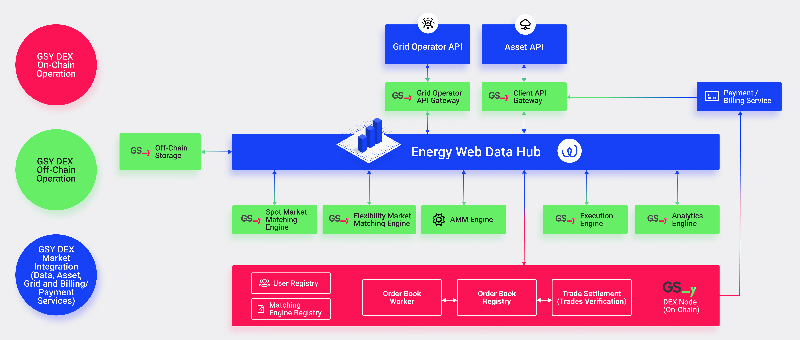

The [GSY DEX](blockchain.md) is composed of several components that work together to provide a secure, scalable, and efficient platform for energy trading. The core of the GSY DEX is built using the [Substrate](https://substrate.io/){target=_blank} framework, which provides the distributed ledger and custom runtime for implementing the state transition functions required for the energy exchange. Additionally, the system includes a set of ancillary services that enable further scalability and security.

### GSY Node
The [Substrate](https://substrate.io/){target=_blank}-based GSY Node, responsible for network activities and executing blockchain state transitions, is the backbone of the exchange, consisting of two main parts:

1. Client with external node services: This component handles network activities such as peer discovery, managing transaction requests, reaching consensus with peers, and responding to remote procedure calls ([RPC](https://docs.substrate.io/build/remote-procedure-calls/){target=_blank}).
2. Custom runtime: This component contains all the business logic for executing the state transition functions of the blockchain. The custom runtime is designed to improve scalability and security, avoiding and mitigating multiple blockchain attack types more  effectively than by using smart contracts or a generalised virtual machine.

For more, please see the section on [GSY Node Installation, Operation and Development](blockchain-installation.md).

<figure markdown>
  {:text-align:center"}
  <figcaption><b>Figure 6.2</b>: GSY DEX On-Chain Operations via GSY Node (Note: Order Book is where bids and offers are stored, to be then matched based on the applicable trading mechanism for price verification and executed based on energy delivery verification).
</figcaption>
</figure>

### GSY DEX Off-Chain Storage

The off-chain storage component of the [GSY DEX](blockchain.md) is designed to store various types of data that are crucial to the platform's operation but do not need to be recorded on the blockchain. This approach enhances scalability and efficiency by reducing the amount of data stored on-chain (importantly, final price and energy verification for each trade is performed on-chain). The off-chain storage comprises four distinct components:

1. GSY DEX Grid Topology Storage: contains information about the physical grid structure, such as the location and configuration of nodes, as well as the interconnections between energy assets, which enable the GSY DEX to both verify the eligibility of the assets for trading, and to facilitate [performance analytics](results-dashboard.md) that involve the topology of the grid.
2. GSY DEX Measurements Storage: stores the energy consumption and generation data from energy assets. Accurate measurement data is essential for validating and executing energy trades, managing grid stability, and optimising energy consumption and generation patterns.
3. GSY DEX Trades Storage: stores all [energy trades](trades.md) of the GSY DEX, which are required in order to maintain and update the trade status to facilitate trade execution, as well as for analytics, auditing the trading behaviour of the user energy assets, and historical market analysis.
4. GSY DEX Order Book Storage: This storage component holds all the orders inserted in the respective market, including bids and offers issued by  participants. The Order Book Storage facilitates the efficient operation of the [GSY DEX Matching Engine](blockchain-matching-engine.md) by providing it with the necessary data to match supply to demand according to participants' preferences and market conditions.

For more, please see the section on the [GSY DEX Off-Chain Storage](blockchain-off-chain-storage.md).

### GSY DEX Matching Engine
The [GSY DEX Matching Engine](blockchain-matching-engine.md) is responsible for identifying suitable matches for energy supply and demand based on participant preferences and market conditions. By efficiently matching bids and offers, the engine facilitates a seamless and optimised exchange clearance.

Multi-attribute auctions, which account for participant preferences and applicable market conditions, require more advanced clearing algorithms than single attribute auctions, such as those based on price alone. The optimal approach is to engage [off-chain workers](blockchain-off-chain-storage.md) to run matching algorithms and then require either the use of trusted execution environments (enclaves) or on-chain verification to determine whether the matching algorithm was correctly executed. To enable this solution, the matching process is decoupled from the settlement verification, and moved to a dedicated component, the Matching Engine. The GSY DEX Matching Engine has been designed to operate as (one or multiple) individual autonomous service(s), responsible for identifying suitable matches for multiple open order books. In order to manage the available GSY Matching Engine services, the GSY Node needs to register each such service and associate it with a user account responsible for operating the respective service. Grid Singularity will facilitate the Matching Engine registration process for the [GSY DEX](blockchain.md).

The GSY DEX Matching Engine reads open bids and offers through the [GSY DEX Matching API](blockchain-matching-engine.md#gsy-dex-matching-api) and submits matches for validation. Since the exchange’s verification function (part of [GSY Node](blockchain-system-components-overview.md#gsy-node)) only checks the validity of each match rather than the result of a specific matching algorithm, there is no longer a need for an agreed matching algorithm, arbitration technique, or redundant off-chain worker computation.

For more, please see the section on the [GSY DEX Matching Engine](blockchain-matching-engine.md).

### GSY DEX Execution Engine
Once a trade has been matched by the [GSY DEX Matching Engine](blockchain-matching-engine.md), the GSY DEX Execution Engine handles the execution or rejection of the trade by processing energy production and consumption measurements from the energy assets. This component ensures that trades are executed securely, transparently and in accordance with the agreed terms, while maintaining the integrity of the exchange platform.

Spot and futures trading requires predictions of energy used at both the asset and network level, often associated with high prediction errors. Thus, although a balancing mechanism addresses the energy imbalances on the physical level, financial exchanges might still not be executed, causing a mismatch between the physical energy delivery and the market accounting. Multiple solutions for mismatch mitigation can be provided by the [GSY DEX](blockchain.md), to be applied pursuant to respective local regulation:

- Allow the grid operator to set prices or enforce penalties for any energy mismatch,
- Implement final gate closure time one day after delivery, allowing post-delivery trading for balance responsible parties to trade imbalances in real-time, and/or
- Allow post-delivery trading for all market participants.

Grid Singularity will serve as the Execution Engine operator for the GSY DEX.

_The GSY DEX Execution Engine system component is in development._

### GSY DEX Analytics Engine
The GSY DEX Analytics Engine collects and processes live trading data (bids, offers, trades) and related energy asset information, providing valuable insights and market intelligence to the exchange platform users and / or operators by generating key performance indicators. This information helps users make informed decisions and identify trends, which can lead to more efficient energy trading strategies and improved market dynamics.

A list of currently supported key performance indicators can be found [here](results-dashboard.md){target=_blank}, with more under development. The [GSY DEX API Gateway](#gsy-dex-api-gateway) provides REST endpoints in order to facilitate access for authenticated customers to the calculated key performance indicators overview. In addition, the full dataset pertaining to the performance indicators can be [downloaded](results-download.md) in JSON format for detailed analysis.

Grid Singularity will serve as the Analytics Engine operator for the GSY DEX.

_The GSY DEX Analytics Engine system component is in development._

### GSY DEX API Gateway

The GSY DEX API Gateway serves as a bridge between user and community clients and the [GSY DEX](blockchain.md). Through this interface, users can access the platform's features, submit energy orders, and retrieve [key performance indicators](results-dashboard.md), including the trade volume, as well as current and historical asset data (e.g. energy consumption / production, traded energy). The GSY DEX API Gateway also fosters community engagement and collaboration by allowing third-party developers to build and integrate complementary applications and services, such as payments.

Clients of the API Gateway vary from user interfaces (that intend to facilitate exchange access to the user) to automated scripts that execute automated trading scripts to optimise trading behaviour for client-owned assets. The API Gateway will also support different client roles, in order to tailor and manage access for Community Managers, Community Members, Grid Operators, Utilities and other customer types.

Secure and privacy-embedded access rights management will be enabled by the [Energy Web](https://energy-web-foundation.gitbook.io/energy-web/solutions-2023/data-exchange/use-cases-and-reference-implementations/digital-spine-for-electricity-markets){target=_blank}’s open-source tool for decentralised identity and access management. The objective is for each participating energy asset to have a decentralised identifier (DID) created by the manufacturer and transferred to the owner upon purchase, allowing the participant to trade in the energy market and perform other operations with a verified energy asset. Utilities, grid operators, aggregators, energy community managers and members, as well as other energy market participants can also be validated through this mechanism, facilitating unhindered onboarding and interoperability of many different asset types and participants at varied technology levels.

_The GSY DEX API Gateway system component is in development._

<u>**Complementary open-source service integration:**</u>

### Energy Web Green Proofs

The [Energy Web Green Proofs](https://energy-web-foundation.gitbook.io/energy-web/solutions-2023/green-proofs){target=_blank} are a customisable, open-source, blockchain-based solution for registering and tracking low-carbon products and their attributes throughout complex supply chains.

GSY DEX will also integrate with other ancillary services, including the [Energy Web Digital Spine](https://energy-web-foundation.gitbook.io/energy-web/solutions-2023/data-exchange/use-cases-and-reference-implementations/digital-spine-for-electricity-markets){target=_blank} toolkit.
