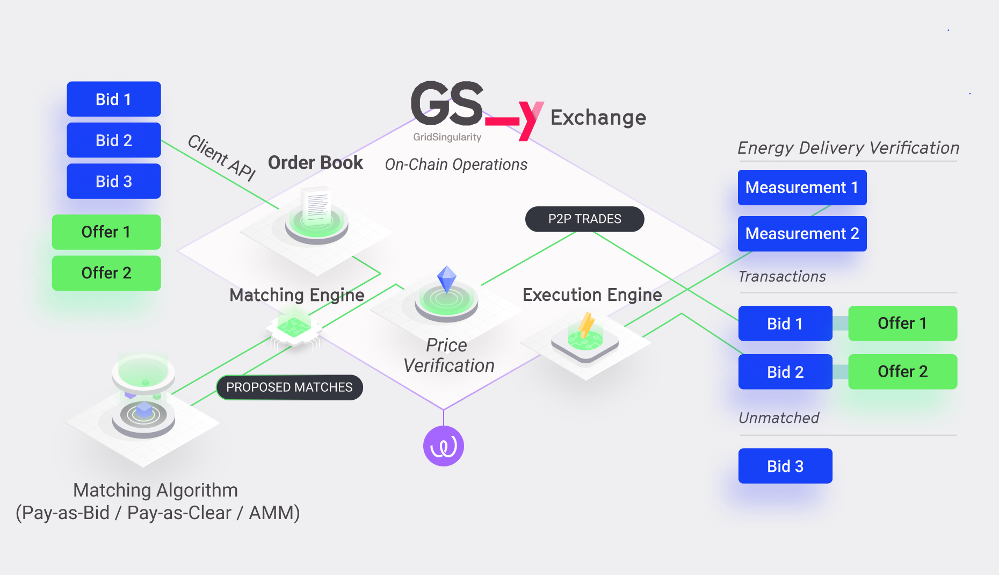

The [Grid Singularity Exchange](technical-approach.md) decentralised implementation (GSy DEX) aims to create a robust, secure, and efficient platform for energy trading in a decentralised environment by leveraging distributed ledger technology, such as blockchain, and advanced distributed runtime functionalities. The GSy DEX is designed to further optimise energy consumption and generation, promote peer-to-peer energy trading, and contribute to a more sustainable and resilient energy infrastructure.

The GSy DEX powers [Symbiotic Energy Markets](https://gridsingularity.medium.com/discussion-paper-grid-singularitys-implementation-of-symbiotic-energy-markets-bd3954af43c8){target=_blank}, combining multi-attribute double-sided auctions, graph representations of the energy grid and the decentralised computation and verification enabled by blockchain. In the envisaged consumer-centric market design, spot, futures, settlement, and balancing markets are intertwined through the use of time slots, allowing market-driven pricing and accurate accounting of delivered energy. Individuals can optimise for their own multi-attribute objectives (e.g. green energy source, reduced energy bill, preferred trading partner) through [Degrees of Freedom](degrees-of-freedom.md) in the multi-attribute double auction with dynamic pricing. The grid is represented as a weighted graph, offering grid operators efficient management tools and allowing energy communities to interconnect and trade. The complexity of the matching algorithm is decoupled from the verification of transactions, with matching facilitated by third party matching algorithm providers, termed “mycos”, enabling the exchange itself to operate on a blockchain. New energy market participants are rewarded for providing valuable services such as data and algorithms, while the roles of established market participants (aggregators, grid operators, utilities, and regulators) converge towards the individual and the community.

The GSy DEX is built on [Substrate](https://substrate.io/){target=_blank}, which allows modular business logic to be built directly in the blockchain and facilitates a high and secure transaction throughput. Substrate has components called pallets, where each pallet can represent different functionality, such as smart contracts, storage, auctions, and more. The first GSy DEX feature developed and published as part of the Grid Singularity Exchange [open-source GPL v.3 licence](licensing.md) code base, is the GSy Node with a storage pallet that provides immutable storage of executed transactions.

The GSy DEX is currently available in the form of simulated transactions, intended for developers interested in contributing and/or building complementary features. Blockchain code can also optionally be enabled on simulations running locally with the backend code base.

Full blockchain deployment will be enabled once the following [GSy DEX System Components](blockchain-system-components-overview.md) are completed, with current development in part supported by the European Union [FEDECOM project](https://fedecom-project.eu/){target=_blank}:

- [GSy Node](blockchain-system-components-overview.md#gsy-node) (completed)
- [GSy DEX Matching Engine](blockchain-system-components-overview.md#gsy-dex-matching-engine) (in development) and GSy Matching API (developed in Python; Rust version to be released with the Engine)
- [GSy DEX Execution Engine](blockchain-system-components-overview.md#gsy-dex-execution-engine) (in development)
- [GSy DEX Analytics Engine](blockchain-system-components-overview.md#gsy-dex-analytics-engine) (in development)
- [GSy DEX API Gateway](blockchain-system-components-overview.md#gsy-dex-api-gateway) (in development)
- [GSy DEX API Off-Chain Storage](blockchain-system-components-overview.md#gsy-dex-off-chain-storage) (in development)
- [Energy Web Green Proofs](blockchain-system-components-overview.md#energy-web-green-proofs) (in development)

The [Energy Web Chain](https://www.energyweb.org/){target=_blank} is the blockchain of choice for the Grid Singularity Exchange decentralised implementation, anchored upon [Polkadot’s](https://polkadot.network/){target=_blank} scaling solution. Grid Singularity, an energy technology startup, and the Rocky Mountain Institute, a nonprofit clean technology organisation, jointly founded the Energy Web Foundation (EWF) in January 2017 as a non-profit entrepreneurial foundation building web3 applications for the energy transition. Having significantly contributed to EWF development and the launch of the Energy Web Chain, Grid Singularity’s role today in the Energy Web is supervisory and advisory via Foundation Council.

***Figure 1***. *Decentralised Peer-to-Peer Energy Exchange (GSY DEX) Architecture (Note: GSY DEX system components, designated in green, interact with the GSy Node for on-chain operations via Energy Web Data Hub that provides a secure and interoperable data exchange service. Grid and asset management services are provided through interoperable API interfaces, as are third party services such as billing and payments).*

**The GSy DEX Design Principles**

The GSy DEX is designed around a set of key principles that guide its development and ensure that it meets the requirements of a modern, efficient, and secure energy trading platform. These design principles are aligned with the use of the Substrate framework for the development of the distributed ledger combined with the definition of a set of complementary ancillary services.

1. Modularity: The GSy DEX is built on a modular structure, enabling each component to be developed, tested, and maintained independently. This modularity simplifies the development process and allows for easy integration of new features, modules, or services in the future.
2. Scalability: The GSy DEX is designed to scale horizontally, accommodating the growing number of participants, transactions, and data. The use of Substrate allows for a highly scalable and efficient distributed ledger, while the ancillary services can also scale independently to handle increased throughput.
3. Interoperability: The GSy DEX promotes the use of open standards, protocols, and APIs to facilitate seamless integration with other systems, platforms, and technologies in the energy sector. This approach enables the GSy DEX to easily interact with other energy management systems, IoT devices, and related infrastructure and applications.
4. Security: Ensuring the security and integrity of the GSy DEX is a top priority. The Substrate framework provides robust security features, including strong cryptographic algorithms and a proven consensus mechanism. In addition, the ancillary services and communication protocols must be designed with security best practices in mind, including encryption, access control, and secure data storage.
5. Decentralisation: The GSy DEX leverages the power of blockchain technology to enable a fully decentralised system. This approach eliminates the need for a central authority, ensuring a transparent, secure, and efficient energy trading platform that is less susceptible to manipulation or control by any single entity.
6. Flexibility: The GSy DEX is designed to be adaptable and capable of incorporating new technologies, innovations, and evolving market requirements. This flexibility is achieved through the use of modular components, extensible APIs, and a development process that encourages innovation and experimentation.
7. Usability: The user experience is an essential aspect of the GSy DEX. The GSy DEX should be easy to use and accessible to a wide range of users, including energy producers, consumers, grid operators, and regulators. The user interfaces and APIs are designed with simplicity, efficiency, and intuitiveness in mind.

In brief, while the Grid Singularity Exchange does not require blockchain technology, its decentralised implementation (GSy DEX) enables a more optimal energy market design, deriving a multitude of benefits, directly or by interacting with complementary blockchain-based solutions, including Energy Web’s decentralised identity access management for energy assets and related open-source tools of the [Energy Web Digital Spine toolkit](https://energy-web-foundation.gitbook.io/energy-web/solutions-2023/data-exchange/use-cases-and-reference-implementations/digital-spine-for-electricity-markets){target=_blank}, as well as  [Energy Web Green Proofs](https://energy-web-foundation.gitbook.io/energy-web/solutions-2023/green-proofs){target=_blank}, a customisable solution for registering and tracking low-carbon products and their attributes throughout complex supply chains. We rely on open source innovation and ecosystem collaboration to develop an inclusive, efficient, accountable and secure energy exchange.
