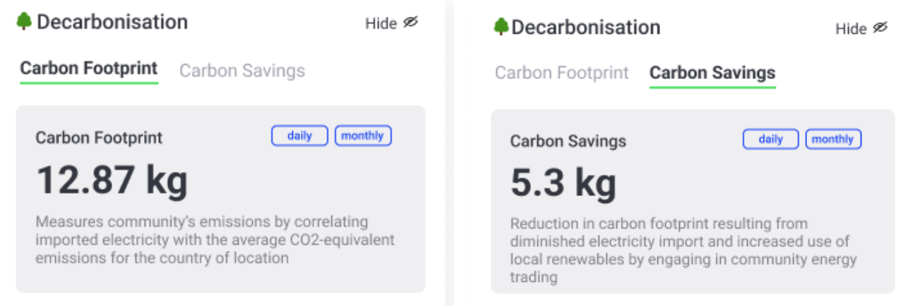

Carbon Footprint measures the total emissions of a community by correlating the imported electricity with the average CO₂-equivalent emissions of the country of location expressed in kilograms (kg) of CO₂ equivalents per kWh.

Carbon Savings represent the reduction in carbon footprint resulting from a decrease in electricity imports realised by engaging in community energy trading.

The carbon footprint value is calculated as follows:
```
Carbon Footprint (kg CO₂-equivalent) = Imported Electricity (kWh) × Country’s CO₂-equivalent Emissions (kg CO₂-equivalent/kWh) / 1000
```
The carbon savings value is calculated as follows:
```
Carbon Savings (kg CO₂-equivalent) = Baseline Carbon Footprint − Reduced Carbon Footprint
```


<figure markdown>
  {:text-align:center"}
  <figcaption><b>Figure 3.7</b>: Example of Carbon Footprint and Carbon Savings Results in Grid Singularity’s simulation tool interface (Singularity Map)
</figcaption>
</figure>


The two decarbonisation metrics are calculated over a defined time frame (daily or monthly) and exclusively at a community level, considering that the imported electricity composition is not readily available for each community participant but approximated based on country-level electricity consumption emissions as explained above.

The emissions data for most European countries is calculated based on real-time values retrieved from the European Network of Transmission System Operators for Electricity (ENTSO-E) [Transparency Platform API](https://transparency.entsoe.eu/content/static_content/Static%20content/web%20api/Guide.html){target=_blank}. The platform provides the actual generation per production type on an hourly basis. The carbon intensity for each country is obtained by multiplying the energy generated by every plant each hour by the appropriate  electricity supply technology emission factor (EF) from [Climate Change 2014: Mitigation of Climate Change](https://www.ipcc.ch/site/assets/uploads/2018/02/ipcc_wg3_ar5_annex-iii.pdf#page=7){target=_blank}. The sum of these products gives the hour’s total CO₂-equivalent emissions, and dividing by total electricity generated yields the carbon intensity, based on the following formula:

```
Country Carbon Intensity (kg CO₂-equivalent/kWh) = [(Energy Fossil Gas (kWh) × EF Gas (kgCO₂-equivalent/kWh)) + (Energy Biomass × EF Biomass) + … + (Energy Solar × EF Solar)] / (Energy Fossil Gas + … + Energy Solar)
```

Additionally, two open-source database sources are used for retrieving country-specific CO₂-equivalent emission data for other regions, namely [Electricity Maps](http://www.electricitymaps.com){target=_blank} (licenced under the [Open Database License](https://opendatacommons.org/licenses/odbl/){target=_blank} - ODbL), which provides historical data on carbon intensity of electricity generation based on a country’s energy mix, and [Our World in Data](http://www.ourworldindata.org){target=_blank} (licensed under the [Creative Commons Attribution 4.0 International License](https://creativecommons.org/licenses/by/4.0/legalcode){target=_blank} - CC-BY), an open-source, nonprofit organisation offering comprehensive global datasets, including carbon intensity of electricity generation. For countries or region****s where direct CO₂-equivalent emissions data was not available (such as Andorra, Palau, etc.), values from neighbouring countries or regions are selected.

The world carbon footprint value is calculated as follows:

`World Carbon Footprint (g CO₂-equivalent / kWh) = 540 (14.6 (total emissions) / 27000 (global electricity production))` ([IEA](https://iea.blob.core.windows.net/assets/c3086240-732b-4f6a-89d7-db01be018f5e/GlobalEnergyReviewCO2Emissionsin2021.pdf){target=_blank})

A list of CO₂-equivalent emission data sources is provided in the table below. <i>Note: In case you have a suggestion on how to improve a select data source, please write to us at contact at gridsingularity.com</i>

### CO₂-Equivalent Emission Data Sources


<table>
  <tr>
   <th>Country
   </th>
   <th>Data Source
   </th>
  </tr>
  <tr>
   <td>Republic of the Congo
   </td>
    <td><a href="https://ourworldindata.org/grapher/carbon-intensity-electricity" target="_blank">Congo Yearly Data</a></td>
  </tr>
  <tr>
   <td>Monaco
   </td>
   <td><a href="https://www.electricitymaps.com/data-portal" target="_blank">France Monthly 2023</a></td>
  </tr>
  <tr>
   <td>Netherlands
   </td>
   <td><a href="https://transparency.entsoe.eu/" target="_blank">Hourly from ENTSO-E Transparency Platform</a></td>
  </tr>
  <tr>
   <td>North Macedonia
   </td>
   <td><a href="https://transparency.entsoe.eu/" target="_blank">Hourly from ENTSO-E Transparency Platform</a></td>
  </tr>
  <tr>
   <td>Poland
   </td>
   <td><a href="https://transparency.entsoe.eu/" target="_blank">Hourly from ENTSO-E Transparency Platform</a>
   </td>
  </tr>
  <tr>
   <td>Portugal
   </td>
   <td><a href="https://transparency.entsoe.eu/" target="_blank">Hourly from ENTSO-E Transparency Platform</a>
   </td>
  </tr>
  <tr>
   <td>Romania
   </td>
   <td><a href="https://transparency.entsoe.eu/" target="_blank">Hourly from ENTSO-E Transparency Platform</a>
   </td>
  </tr>
  <tr>
   <td>Serbia
   </td>
   <td><a href="https://transparency.entsoe.eu/" target="_blank">Hourly from ENTSO-E Transparency Platform</a>
   </td>
  </tr>
  <tr>
   <td>Slovakia
   </td>
   <td><a href="https://transparency.entsoe.eu/" target="_blank">Hourly from ENTSO-E Transparency Platform</a>
   </td>
  </tr>
  <tr>
   <td>Slovenia
   </td>
   <td><a href="https://transparency.entsoe.eu/" target="_blank">Hourly from ENTSO-E Transparency Platform</a>
   </td>
  </tr>
  <tr>
   <td>Spain
   </td>
   <td><a href="https://transparency.entsoe.eu/" target="_blank">Hourly from ENTSO-E Transparency Platform</a>
   </td>
  </tr>
  <tr>
   <td>Sweden
   </td>
   <td><a href="https://transparency.entsoe.eu/" target="_blank">Hourly from ENTSO-E Transparency Platform</a>
   </td>
  </tr>
  <tr>
   <td>Switzerland
   </td>
   <td><a href="https://transparency.entsoe.eu/" target="_blank">Hourly from ENTSO-E Transparency Platform</a>
   </td>
  </tr>
  <tr>
   <td>Turkey
   </td>
   <td><a href="https://transparency.entsoe.eu/" target="_blank">Hourly from ENTSO-E Transparency Platform</a>
   </td>
  </tr>
  <tr>
   <td>Ukraine
   </td>
   <td><a href="https://transparency.entsoe.eu/" target="_blank">Hourly from ENTSO-E Transparency Platform</a>
   </td>
  </tr>
  <tr>
   <td>United Kingdom
   </td>
   <td><a href="https://transparency.entsoe.eu/" target="_blank">Hourly from ENTSO-E Transparency Platform</a>
   </td>
  </tr>
  <tr>
   <td>Albania
   </td>
   <td><a href="https://transparency.entsoe.eu/" target="_blank">Hourly from ENTSO-E Transparency Platform</a>
   </td>
  </tr>
  <tr>
   <td>Austria
   </td>
   <td><a href="https://transparency.entsoe.eu/" target="_blank">Hourly from ENTSO-E Transparency Platform</a>
   </td>
  </tr>
  <tr>
   <td>Belgium
   </td>
   <td><a href="https://transparency.entsoe.eu/" target="_blank">Hourly from ENTSO-E Transparency Platform</a>
   </td>
  </tr>
  <tr>
   <td>Bosnia and Herzegovina
   </td>
   <td><a href="https://transparency.entsoe.eu/" target="_blank">Hourly from ENTSO-E Transparency Platform</a>
   </td>
  </tr>
  <tr>
   <td>Bulgaria
   </td>
   <td><a href="https://transparency.entsoe.eu/" target="_blank">Hourly from ENTSO-E Transparency Platform</a>
   </td>
  </tr>
  <tr>
   <td>Croatia
   </td>
   <td><a href="https://transparency.entsoe.eu/" target="_blank">Hourly from ENTSO-E Transparency Platform</a>
   </td>
  </tr>
  <tr>
   <td>Cyprus
   </td>
   <td><a href="https://transparency.entsoe.eu/" target="_blank">Hourly from ENTSO-E Transparency Platform</a>
   </td>
  </tr>
  <tr>
   <td>Czechia
   </td>
   <td><a href="https://transparency.entsoe.eu/" target="_blank">Hourly from ENTSO-E Transparency Platform</a>
   </td>
  </tr>
  <tr>
   <td>Denmark
   </td>
   <td><a href="https://transparency.entsoe.eu/" target="_blank">Hourly from ENTSO-E Transparency Platform</a>
   </td>
  </tr>
  <tr>
   <td>Estonia
   </td>
   <td><a href="https://transparency.entsoe.eu/" target="_blank">Hourly from ENTSO-E Transparency Platform</a>
   </td>
  </tr>
  <tr>
   <td>Finland
   </td>
   <td><a href="https://transparency.entsoe.eu/" target="_blank">Hourly from ENTSO-E Transparency Platform</a>
   </td>
  </tr>
  <tr>
   <td>France
   </td>
   <td><a href="https://transparency.entsoe.eu/" target="_blank">Hourly from ENTSO-E Transparency Platform</a>
   </td>
  </tr>
  <tr>
   <td>Georgia
   </td>
   <td><a href="https://transparency.entsoe.eu/" target="_blank">Hourly from ENTSO-E Transparency Platform</a>
   </td>
  </tr>
  <tr>
   <td>Germany
   </td>
   <td><a href="https://transparency.entsoe.eu/" target="_blank">Hourly from ENTSO-E Transparency Platform</a>
   </td>
  </tr>
  <tr>
   <td>Greece
   </td>
   <td><a href="https://transparency.entsoe.eu/" target="_blank">Hourly from ENTSO-E Transparency Platform</a>
   </td>
  </tr>
  <tr>
   <td>Hungary
   </td>
   <td><a href="https://transparency.entsoe.eu/" target="_blank">Hourly from ENTSO-E Transparency Platform</a>
   </td>
  </tr>
  <tr>
   <td>Iceland
   </td>
   <td><a href="https://transparency.entsoe.eu/" target="_blank">Hourly from ENTSO-E Transparency Platform</a>
   </td>
  </tr>
  <tr>
   <td>Ireland
   </td>
   <td><a href="https://transparency.entsoe.eu/" target="_blank">Hourly from ENTSO-E Transparency Platform</a>
   </td>
  </tr>
  <tr>
   <td>Italy
   </td>
   <td><a href="https://transparency.entsoe.eu/" target="_blank">Hourly from ENTSO-E Transparency Platform</a>
   </td>
  </tr>
  <tr>
   <td>Kosovo
   </td>
   <td><a href="https://transparency.entsoe.eu/" target="_blank">Hourly from ENTSO-E Transparency Platform</a>
   </td>
  </tr>
  <tr>
   <td>Latvia
   </td>
   <td><a href="https://transparency.entsoe.eu/" target="_blank">Hourly from ENTSO-E Transparency Platform</a>
   </td>
  </tr>
  <tr>
   <td>Lithuania
   </td>
   <td><a href="https://transparency.entsoe.eu/" target="_blank">Hourly from ENTSO-E Transparency Platform</a>
   </td>
  </tr>
  <tr>
   <td>Luxembourg
   </td>
   <td><a href="https://transparency.entsoe.eu/" target="_blank">Hourly from ENTSO-E Transparency Platform</a>
   </td>
  </tr>
  <tr>
   <td>Malta
   </td>
   <td><a href="https://transparency.entsoe.eu/" target="_blank">Hourly from ENTSO-E Transparency Platform</a>
   </td>
  </tr>
  <tr>
   <td>Moldova
   </td>
   <td><a href="https://transparency.entsoe.eu/" target="_blank">Hourly from ENTSO-E Transparency Platform</a>
   </td>
  </tr>
  <tr>
   <td>Montenegro
   </td>
   <td><a href="https://transparency.entsoe.eu/" target="_blank">Hourly from ENTSO-E Transparency Platform</a>
   </td>
  </tr>
  <tr>
   <td>Norway
   </td>
   <td><a href="https://transparency.entsoe.eu/" target="_blank">Hourly from ENTSO-E Transparency Platform</a>
   </td>
  </tr>
  <tr>
   <td>Iran
   </td>
   <td><a href="https://ourworldindata.org/grapher/carbon-intensity-electricity" target="_blank">Iran Yearly Data</a>
   </td>
  </tr>
  <tr>
   <td>San Marino
   </td>
   <td><a href="https://www.electricitymaps.com/data-portal" target="_blank">Italy Monthly 2023</a>
   </td>
  </tr>
  <tr>
   <td>Australia
   </td>
   <td><a href="https://www.electricitymaps.com/data-portal" target="_blank">Monthly 2023</a>
   </td>
  </tr>
  <tr>
   <td>Brazil
   </td>
   <td><a href="https://www.electricitymaps.com/data-portal" target="_blank">Monthly 2023</a>
   </td>
  </tr>
  <tr>
   <td>Canada
   </td>
   <td><a href="https://www.electricitymaps.com/data-portal" target="_blank">Monthly 2023</a>
   </td>
  </tr>
  <tr>
   <td>Chile
   </td>
   <td><a href="https://www.electricitymaps.com/data-portal" target="_blank">Monthly 2023</a>
   </td>
  </tr>
  <tr>
   <td>Costa Rica
   </td>
   <td><a href="https://www.electricitymaps.com/data-portal" target="_blank">Monthly 2023</a>
   </td>
  </tr>
  <tr>
   <td>Great Britain
   </td>
   <td><a href="https://www.electricitymaps.com/data-portal" target="_blank">Monthly 2023</a>
   </td>
  </tr>
  <tr>
   <td>Hong Kong
   </td>
   <td><a href="https://www.electricitymaps.com/data-portal" target="_blank">Monthly 2023</a>
   </td>
  </tr>
  <tr>
   <td>India
   </td>
   <td><a href="https://www.electricitymaps.com/data-portal" target="_blank">Monthly 2023</a>
   </td>
  </tr>
  <tr>
   <td>Indonesia
   </td>
   <td><a href="https://www.electricitymaps.com/data-portal" target="_blank">Monthly 2023</a>
   </td>
  </tr>
  <tr>
   <td>Israel
   </td>
   <td><a href="https://www.electricitymaps.com/data-portal" target="_blank">Monthly 2023</a>
   </td>
  </tr>
  <tr>
   <td>Japan
   </td>
   <td><a href="https://www.electricitymaps.com/data-portal" target="_blank">Monthly 2023</a>
   </td>
  </tr>
  <tr>
   <td>New Zealand
   </td>
   <td><a href="https://www.electricitymaps.com/data-portal" target="_blank">Monthly 2023</a>
   </td>
  </tr>
  <tr>
   <td>Nicaragua
   </td>
   <td><a href="https://www.electricitymaps.com/data-portal" target="_blank">Monthly 2023</a>
   </td>
  </tr>
  <tr>
   <td>Northern Ireland
   </td>
   <td><a href="https://www.electricitymaps.com/data-portal" target="_blank">Monthly 2023</a>
   </td>
  </tr>
  <tr>
   <td>Panama
   </td>
   <td><a href="https://www.electricitymaps.com/data-portal" target="_blank">Monthly 2023</a>
   </td>
  </tr>
  <tr>
   <td>Singapore
   </td>
   <td><a href="https://www.electricitymaps.com/data-portal" target="_blank">Monthly 2023</a>
   </td>
  </tr>
  <tr>
   <td>South Africa
   </td>
   <td><a href="https://www.electricitymaps.com/data-portal" target="_blank">Monthly 2023</a>
   </td>
  </tr>
  <tr>
   <td>South Korea
   </td>
   <td><a href="https://www.electricitymaps.com/data-portal" target="_blank">Monthly 2023</a>
   </td>
  </tr>
  <tr>
   <td>Taiwan
   </td>
   <td><a href="https://www.electricitymaps.com/data-portal" target="_blank">Monthly 2023</a>
   </td>
  </tr>
  <tr>
   <td>United States of America
   </td>
   <td><a href="https://www.electricitymaps.com/data-portal" target="_blank">Monthly 2023</a>
   </td>
  </tr>
  <tr>
   <td>Uruguay
   </td>
   <td><a href="https://www.electricitymaps.com/data-portal" target="_blank">Monthly 2023</a>
   </td>
  </tr>
  <tr>
   <td>Marshall Islands
   </td>
   <td><a href="https://ourworldindata.org/grapher/carbon-intensity-electricity" target="_blank">Papua New Guinea Yearly</a>
   </td>
  </tr>
  <tr>
   <td>Micronesia
   </td>
   <td><a href="https://ourworldindata.org/grapher/carbon-intensity-electricity" target="_blank">Papua New Guinea Yearly</a>
   </td>
  </tr>
  <tr>
   <td>Palau
   </td>
   <td><a href="https://ourworldindata.org/grapher/carbon-intensity-electricity" target="_blank">Philippines Yearly</a>
   </td>
  </tr>
  <tr>
   <td>Andorra
   </td>
   <td><a href="https://www.electricitymaps.com/data-portal" target="_blank">Spain Monthly 2023</a>
   </td>
  </tr>
  <tr>
   <td>Afghanistan
   </td>
   <td><a href="https://ourworldindata.org/grapher/carbon-intensity-electricity" target="_blank">Yearly</a>
   </td>
  </tr>
  <tr>
   <td>Algeria
   </td>
   <td><a href="https://ourworldindata.org/grapher/carbon-intensity-electricity" target="_blank">Yearly</a>
   </td>
  </tr>
  <tr>
   <td>Angola
   </td>
   <td><a href="https://ourworldindata.org/grapher/carbon-intensity-electricity" target="_blank">Yearly</a>
   </td>
  </tr>
  <tr>
   <td>Antigua and Barbuda
   </td>
   <td><a href="https://ourworldindata.org/grapher/carbon-intensity-electricity" target="_blank">Yearly</a>
   </td>
  </tr>
  <tr>
   <td>Argentina
   </td>
   <td><a href="https://ourworldindata.org/grapher/carbon-intensity-electricity" target="_blank">Yearly</a>
   </td>
  </tr>
  <tr>
   <td>Armenia
   </td>
   <td><a href="https://ourworldindata.org/grapher/carbon-intensity-electricity" target="_blank">Yearly</a>
   </td>
  </tr>
  <tr>
   <td>Azerbaijan
   </td>
   <td><a href="https://ourworldindata.org/grapher/carbon-intensity-electricity" target="_blank">Yearly</a>
   </td>
  </tr>
  <tr>
   <td>Bahamas
   </td>
   <td><a href="https://ourworldindata.org/grapher/carbon-intensity-electricity" target="_blank">Yearly</a>
   </td>
  </tr>
  <tr>
   <td>Bahrain
   </td>
   <td><a href="https://ourworldindata.org/grapher/carbon-intensity-electricity" target="_blank">Yearly</a>
   </td>
  </tr>
  <tr>
   <td>Bangladesh
   </td>
   <td><a href="https://ourworldindata.org/grapher/carbon-intensity-electricity" target="_blank">Yearly</a>
   </td>
  </tr>
  <tr>
   <td>Barbados
   </td>
   <td><a href="https://ourworldindata.org/grapher/carbon-intensity-electricity" target="_blank">Yearly</a>
   </td>
  </tr>
  <tr>
   <td>Belarus
   </td>
   <td><a href="https://ourworldindata.org/grapher/carbon-intensity-electricity" target="_blank">Yearly</a>
   </td>
  </tr>
  <tr>
   <td>Belize
   </td>
   <td><a href="https://ourworldindata.org/grapher/carbon-intensity-electricity" target="_blank">Yearly</a>
   </td>
  </tr>
  <tr>
   <td>Benin
   </td>
   <td><a href="https://ourworldindata.org/grapher/carbon-intensity-electricity" target="_blank">Yearly</a>
   </td>
  </tr>
  <tr>
   <td>Bhutan
   </td>
   <td><a href="https://ourworldindata.org/grapher/carbon-intensity-electricity" target="_blank">Yearly</a>
   </td>
  </tr>
  <tr>
   <td>Bolivia
   </td>
   <td><a href="https://ourworldindata.org/grapher/carbon-intensity-electricity" target="_blank">Yearly</a>
   </td>
  </tr>
  <tr>
   <td>Botswana
   </td>
   <td><a href="https://ourworldindata.org/grapher/carbon-intensity-electricity" target="_blank">Yearly</a>
   </td>
  </tr>
  <tr>
   <td>Brunei
   </td>
   <td><a href="https://ourworldindata.org/grapher/carbon-intensity-electricity" target="_blank">Yearly</a>
   </td>
  </tr>
  <tr>
   <td>Burkina Faso
   </td>
   <td><a href="https://ourworldindata.org/grapher/carbon-intensity-electricity" target="_blank">Yearly</a>
   </td>
  </tr>
  <tr>
   <td>Burundi
   </td>
   <td><a href="https://ourworldindata.org/grapher/carbon-intensity-electricity" target="_blank">Yearly</a>
   </td>
  </tr>
  <tr>
   <td>Cabo Verde
   </td>
   <td><a href="https://ourworldindata.org/grapher/carbon-intensity-electricity" target="_blank">Yearly</a>
   </td>
  </tr>
  <tr>
   <td>Cambodia
   </td>
   <td><a href="https://ourworldindata.org/grapher/carbon-intensity-electricity" target="_blank">Yearly</a>
   </td>
  </tr>
  <tr>
   <td>Cameroon
   </td>
   <td><a href="https://ourworldindata.org/grapher/carbon-intensity-electricity" target="_blank">Yearly</a>
   </td>
  </tr>
  <tr>
   <td>Central African Republic
   </td>
   <td><a href="https://ourworldindata.org/grapher/carbon-intensity-electricity" target="_blank">Yearly</a>
   </td>
  </tr>
  <tr>
   <td>Chad
   </td>
   <td><a href="https://ourworldindata.org/grapher/carbon-intensity-electricity" target="_blank">Yearly</a>
   </td>
  </tr>
  <tr>
   <td>Comoros
   </td>
   <td><a href="https://ourworldindata.org/grapher/carbon-intensity-electricity" target="_blank">Yearly</a>
   </td>
  </tr>
  <tr>
   <td>Côte d'Ivoire
   </td>
   <td><a href="https://ourworldindata.org/grapher/carbon-intensity-electricity" target="_blank">Yearly</a>
   </td>
  </tr>
  <tr>
   <td>Cuba
   </td>
   <td><a href="https://ourworldindata.org/grapher/carbon-intensity-electricity" target="_blank">Yearly</a>
   </td>
  </tr>
  <tr>
   <td>Democratic Republic of the Congo
   </td>
   <td><a href="https://ourworldindata.org/grapher/carbon-intensity-electricity" target="_blank">Yearly</a>
   </td>
  </tr>
  <tr>
   <td>Djibouti
   </td>
   <td><a href="https://ourworldindata.org/grapher/carbon-intensity-electricity" target="_blank">Yearly</a>
   </td>
  </tr>
  <tr>
   <td>Dominica
   </td>
   <td><a href="https://ourworldindata.org/grapher/carbon-intensity-electricity" target="_blank">Yearly</a>
   </td>
  </tr>
  <tr>
   <td>Dominican Republic
   </td>
   <td><a href="https://ourworldindata.org/grapher/carbon-intensity-electricity" target="_blank">Yearly</a>
   </td>
  </tr>
  <tr>
   <td>East Timor
   </td>
   <td><a href="https://ourworldindata.org/grapher/carbon-intensity-electricity" target="_blank">Yearly</a>
   </td>
  </tr>
  <tr>
   <td>Ecuador
   </td>
   <td><a href="https://ourworldindata.org/grapher/carbon-intensity-electricity" target="_blank">Yearly</a>
   </td>
  </tr>
  <tr>
   <td>Egypt
   </td>
   <td><a href="https://ourworldindata.org/grapher/carbon-intensity-electricity" target="_blank">Yearly</a>
   </td>
  </tr>
  <tr>
   <td>El Salvador
   </td>
   <td><a href="https://ourworldindata.org/grapher/carbon-intensity-electricity" target="_blank">Yearly</a>
   </td>
  </tr>
  <tr>
   <td>Equatorial Guinea
   </td>
   <td><a href="https://ourworldindata.org/grapher/carbon-intensity-electricity" target="_blank">Yearly</a>
   </td>
  </tr>
  <tr>
   <td>Eritrea
   </td>
   <td><a href="https://ourworldindata.org/grapher/carbon-intensity-electricity" target="_blank">Yearly</a>
   </td>
  </tr>
  <tr>
   <td>Eswatini (Swaziland)
   </td>
   <td><a href="https://ourworldindata.org/grapher/carbon-intensity-electricity" target="_blank">Yearly</a>
   </td>
  </tr>
  <tr>
   <td>Ethiopia
   </td>
   <td><a href="https://ourworldindata.org/grapher/carbon-intensity-electricity" target="_blank">Yearly</a>
   </td>
  </tr>
  <tr>
   <td>Fiji
   </td>
   <td><a href="https://ourworldindata.org/grapher/carbon-intensity-electricity" target="_blank">Yearly</a>
   </td>
  </tr>
  <tr>
   <td>Gabon
   </td>
   <td><a href="https://ourworldindata.org/grapher/carbon-intensity-electricity" target="_blank">Yearly</a>
   </td>
  </tr>
  <tr>
   <td>Gambia
   </td>
   <td><a href="https://ourworldindata.org/grapher/carbon-intensity-electricity" target="_blank">Yearly</a>
   </td>
  </tr>
  <tr>
   <td>Ghana
   </td>
   <td><a href="https://ourworldindata.org/grapher/carbon-intensity-electricity" target="_blank">Yearly</a>
   </td>
  </tr>
  <tr>
   <td>Grenada
   </td>
   <td><a href="https://ourworldindata.org/grapher/carbon-intensity-electricity" target="_blank">Yearly</a>
   </td>
  </tr>
  <tr>
   <td>Guatemala
   </td>
   <td><a href="https://ourworldindata.org/grapher/carbon-intensity-electricity" target="_blank">Yearly</a>
   </td>
  </tr>
  <tr>
   <td>Guinea
   </td>
   <td><a href="https://ourworldindata.org/grapher/carbon-intensity-electricity" target="_blank">Yearly</a>
   </td>
  </tr>
  <tr>
   <td>Guinea-Bissau
   </td>
   <td><a href="https://ourworldindata.org/grapher/carbon-intensity-electricity" target="_blank">Yearly</a>
   </td>
  </tr>
  <tr>
   <td>Guyana
   </td>
   <td><a href="https://ourworldindata.org/grapher/carbon-intensity-electricity" target="_blank">Yearly</a>
   </td>
  </tr>
  <tr>
   <td>Haiti
   </td>
   <td><a href="https://ourworldindata.org/grapher/carbon-intensity-electricity" target="_blank">Yearly</a>
   </td>
  </tr>
  <tr>
   <td>Honduras
   </td>
   <td><a href="https://ourworldindata.org/grapher/carbon-intensity-electricity" target="_blank">Yearly</a>
   </td>
  </tr>
  <tr>
   <td>Iraq
   </td>
   <td><a href="https://ourworldindata.org/grapher/carbon-intensity-electricity" target="_blank">Yearly</a>
   </td>
  </tr>
  <tr>
   <td>Jamaica
   </td>
   <td><a href="https://ourworldindata.org/grapher/carbon-intensity-electricity" target="_blank">Yearly</a>
   </td>
  </tr>
  <tr>
   <td>Jordan
   </td>
   <td><a href="https://ourworldindata.org/grapher/carbon-intensity-electricity" target="_blank">Yearly</a>
   </td>
  </tr>
  <tr>
   <td>Kazakhstan
   </td>
   <td><a href="https://ourworldindata.org/grapher/carbon-intensity-electricity" target="_blank">Yearly</a>
   </td>
  </tr>
  <tr>
   <td>Kenya
   </td>
   <td><a href="https://ourworldindata.org/grapher/carbon-intensity-electricity" target="_blank">Yearly</a>
   </td>
  </tr>
  <tr>
   <td>Kiribati
   </td>
   <td><a href="https://ourworldindata.org/grapher/carbon-intensity-electricity" target="_blank">Yearly</a>
   </td>
  </tr>
  <tr>
   <td>Kuwait
   </td>
   <td><a href="https://ourworldindata.org/grapher/carbon-intensity-electricity" target="_blank">Yearly</a>
   </td>
  </tr>
  <tr>
   <td>Kyrgyzstan
   </td>
   <td><a href="https://ourworldindata.org/grapher/carbon-intensity-electricity" target="_blank">Yearly</a>
   </td>
  </tr>
  <tr>
   <td>Laos
   </td>
   <td><a href="https://ourworldindata.org/grapher/carbon-intensity-electricity" target="_blank">Yearly</a>
   </td>
  </tr>
  <tr>
   <td>Lebanon
   </td>
   <td><a href="https://ourworldindata.org/grapher/carbon-intensity-electricity" target="_blank">Yearly</a>
   </td>
  </tr>
  <tr>
   <td>Lesotho
   </td>
   <td><a href="https://ourworldindata.org/grapher/carbon-intensity-electricity" target="_blank">Yearly</a>
   </td>
  </tr>
  <tr>
   <td>Liberia
   </td>
   <td><a href="https://ourworldindata.org/grapher/carbon-intensity-electricity" target="_blank">Yearly</a>
   </td>
  </tr>
  <tr>
   <td>Libya
   </td>
   <td><a href="https://ourworldindata.org/grapher/carbon-intensity-electricity" target="_blank">Yearly</a>
   </td>
  </tr>
  <tr>
   <td>Madagascar
   </td>
   <td><a href="https://ourworldindata.org/grapher/carbon-intensity-electricity" target="_blank">Yearly</a>
   </td>
  </tr>
  <tr>
   <td>Malawi
   </td>
   <td><a href="https://ourworldindata.org/grapher/carbon-intensity-electricity" target="_blank">Yearly</a>
   </td>
  </tr>
  <tr>
   <td>Malaysia
   </td>
   <td><a href="https://ourworldindata.org/grapher/carbon-intensity-electricity" target="_blank">Yearly</a>
   </td>
  </tr>
  <tr>
   <td>Maldives
   </td>
   <td><a href="https://ourworldindata.org/grapher/carbon-intensity-electricity" target="_blank">Yearly</a>
   </td>
  </tr>
  <tr>
   <td>Mali
   </td>
   <td><a href="https://ourworldindata.org/grapher/carbon-intensity-electricity" target="_blank">Yearly</a>
   </td>
  </tr>
  <tr>
   <td>Mauritania
   </td>
   <td><a href="https://ourworldindata.org/grapher/carbon-intensity-electricity" target="_blank">Yearly</a>
   </td>
  </tr>
  <tr>
   <td>Mauritius
   </td>
   <td><a href="https://ourworldindata.org/grapher/carbon-intensity-electricity" target="_blank">Yearly</a>
   </td>
  </tr>
  <tr>
   <td>Mexico
   </td>
   <td><a href="https://ourworldindata.org/grapher/carbon-intensity-electricity" target="_blank">Yearly</a>
   </td>
  </tr>
  <tr>
   <td>Mongolia
   </td>
   <td><a href="https://ourworldindata.org/grapher/carbon-intensity-electricity" target="_blank">Yearly</a>
   </td>
  </tr>
  <tr>
   <td>Morocco
   </td>
   <td><a href="https://ourworldindata.org/grapher/carbon-intensity-electricity" target="_blank">Yearly</a>
   </td>
  </tr>
  <tr>
   <td>Mozambique
   </td>
   <td><a href="https://ourworldindata.org/grapher/carbon-intensity-electricity" target="_blank">Yearly</a>
   </td>
  </tr>
  <tr>
   <td>Myanmar
   </td>
   <td><a href="https://ourworldindata.org/grapher/carbon-intensity-electricity" target="_blank">Yearly</a>
   </td>
  </tr>
  <tr>
   <td>Namimbia
   </td>
   <td><a href="https://ourworldindata.org/grapher/carbon-intensity-electricity" target="_blank">Yearly</a>
   </td>
  </tr>
  <tr>
   <td>Nauru
   </td>
   <td><a href="https://ourworldindata.org/grapher/carbon-intensity-electricity" target="_blank">Yearly</a>
   </td>
  </tr>
  <tr>
   <td>Nepal
   </td>
   <td><a href="https://ourworldindata.org/grapher/carbon-intensity-electricity" target="_blank">Yearly</a>
   </td>
  </tr>
  <tr>
   <td>Niger
   </td>
   <td><a href="https://ourworldindata.org/grapher/carbon-intensity-electricity" target="_blank">Yearly</a>
   </td>
  </tr>
  <tr>
   <td>Nigeria
   </td>
   <td><a href="https://ourworldindata.org/grapher/carbon-intensity-electricity" target="_blank">Yearly</a>
   </td>
  </tr>
  <tr>
   <td>North Korea
   </td>
   <td><a href="https://ourworldindata.org/grapher/carbon-intensity-electricity" target="_blank">Yearly</a>
   </td>
  </tr>
  <tr>
   <td>Oman
   </td>
   <td><a href="https://ourworldindata.org/grapher/carbon-intensity-electricity" target="_blank">Yearly</a>
   </td>
  </tr>
  <tr>
   <td>Pakistan
   </td>
   <td><a href="https://ourworldindata.org/grapher/carbon-intensity-electricity" target="_blank">Yearly</a>
   </td>
  </tr>
  <tr>
   <td>Papua New Guinea
   </td>
   <td><a href="https://ourworldindata.org/grapher/carbon-intensity-electricity" target="_blank">Yearly</a>
   </td>
  </tr>
  <tr>
   <td>Paraguay
   </td>
   <td><a href="https://ourworldindata.org/grapher/carbon-intensity-electricity" target="_blank">Yearly</a>
   </td>
  </tr>
  <tr>
   <td>Peru
   </td>
   <td><a href="https://ourworldindata.org/grapher/carbon-intensity-electricity" target="_blank">Yearly</a>
   </td>
  </tr>
  <tr>
   <td>Philippines
   </td>
   <td><a href="https://ourworldindata.org/grapher/carbon-intensity-electricity" target="_blank">Yearly</a>
   </td>
  </tr>
  <tr>
   <td>Qatar
   </td>
   <td><a href="https://ourworldindata.org/grapher/carbon-intensity-electricity" target="_blank">Yearly</a>
   </td>
  </tr>
  <tr>
   <td>Russia
   </td>
   <td><a href="https://ourworldindata.org/grapher/carbon-intensity-electricity" target="_blank">Yearly</a>
   </td>
  </tr>
  <tr>
   <td>Rwanda
   </td>
   <td><a href="https://ourworldindata.org/grapher/carbon-intensity-electricity" target="_blank">Yearly</a>
   </td>
  </tr>
  <tr>
   <td>Saint Kitts and Nevis
   </td>
   <td><a href="https://ourworldindata.org/grapher/carbon-intensity-electricity" target="_blank">Yearly</a>
   </td>
  </tr>
  <tr>
   <td>Saint Lucia
   </td>
   <td><a href="https://ourworldindata.org/grapher/carbon-intensity-electricity" target="_blank">Yearly</a>
   </td>
  </tr>
  <tr>
   <td>Saint Vincent and the Grenadines
   </td>
   <td><a href="https://ourworldindata.org/grapher/carbon-intensity-electricity" target="_blank">Yearly</a>
   </td>
  </tr>
  <tr>
   <td>Samoa
   </td>
   <td><a href="https://ourworldindata.org/grapher/carbon-intensity-electricity" target="_blank">Yearly</a>
   </td>
  </tr>
  <tr>
   <td>São Tomé and Príncipe
   </td>
   <td><a href="https://ourworldindata.org/grapher/carbon-intensity-electricity" target="_blank">Yearly</a>
   </td>
  </tr>
  <tr>
   <td>Saudi Arabia
   </td>
   <td><a href="https://ourworldindata.org/grapher/carbon-intensity-electricity" target="_blank">Yearly</a>
   </td>
  </tr>
  <tr>
   <td>Senegal
   </td>
   <td><a href="https://ourworldindata.org/grapher/carbon-intensity-electricity" target="_blank">Yearly</a>
   </td>
  </tr>
  <tr>
   <td>Seychelles
   </td>
   <td><a href="https://ourworldindata.org/grapher/carbon-intensity-electricity" target="_blank">Yearly</a>
   </td>
  </tr>
  <tr>
   <td>Sierra Leone
   </td>
   <td><a href="https://ourworldindata.org/grapher/carbon-intensity-electricity" target="_blank">Yearly</a>
   </td>
  </tr>
  <tr>
   <td>Solomon Islands
   </td>
   <td><a href="https://ourworldindata.org/grapher/carbon-intensity-electricity" target="_blank">Yearly</a>
   </td>
  </tr>
  <tr>
   <td>Somalia
   </td>
   <td><a href="https://ourworldindata.org/grapher/carbon-intensity-electricity" target="_blank">Yearly</a>
   </td>
  </tr>
  <tr>
   <td>South Sudan
   </td>
   <td><a href="https://ourworldindata.org/grapher/carbon-intensity-electricity" target="_blank">Yearly</a>
   </td>
  </tr>
  <tr>
   <td>Sri Lanka
   </td>
   <td><a href="https://ourworldindata.org/grapher/carbon-intensity-electricity" target="_blank">Yearly</a>
   </td>
  </tr>
  <tr>
   <td>Sudan
   </td>
   <td><a href="https://ourworldindata.org/grapher/carbon-intensity-electricity" target="_blank">Yearly</a>
   </td>
  </tr>
  <tr>
   <td>Suriname
   </td>
   <td><a href="https://ourworldindata.org/grapher/carbon-intensity-electricity" target="_blank">Yearly</a>
   </td>
  </tr>
  <tr>
   <td>Suria
   </td>
   <td><a href="https://ourworldindata.org/grapher/carbon-intensity-electricity" target="_blank">Yearly</a>
   </td>
  </tr>
  <tr>
   <td>Tajikistan
   </td>
   <td><a href="https://ourworldindata.org/grapher/carbon-intensity-electricity" target="_blank">Yearly</a>
   </td>
  </tr>
  <tr>
   <td>Tanzania
   </td>
   <td><a href="https://ourworldindata.org/grapher/carbon-intensity-electricity" target="_blank">Yearly</a>
   </td>
  </tr>
  <tr>
   <td>Thailand
   </td>
   <td><a href="https://ourworldindata.org/grapher/carbon-intensity-electricity" target="_blank">Yearly</a>
   </td>
  </tr>
  <tr>
   <td>Togo
   </td>
   <td><a href="https://ourworldindata.org/grapher/carbon-intensity-electricity" target="_blank">Yearly</a>
   </td>
  </tr>
  <tr>
   <td>Tonga
   </td>
   <td><a href="https://ourworldindata.org/grapher/carbon-intensity-electricity" target="_blank">Yearly</a>
   </td>
  </tr>
  <tr>
   <td>Trinidad and Tobago
   </td>
   <td><a href="https://ourworldindata.org/grapher/carbon-intensity-electricity" target="_blank">Yearly</a>
   </td>
  </tr>
  <tr>
   <td>Tunisia
   </td>
   <td><a href="https://ourworldindata.org/grapher/carbon-intensity-electricity" target="_blank">Yearly</a>
   </td>
  </tr>
  <tr>
   <td>Turkmenistan
   </td>
   <td><a href="https://ourworldindata.org/grapher/carbon-intensity-electricity" target="_blank">Yearly</a>
   </td>
  </tr>
  <tr>
   <td>Tuvalu
   </td>
   <td><a href="https://ourworldindata.org/grapher/carbon-intensity-electricity" target="_blank">Yearly</a>
   </td>
  </tr>
  <tr>
   <td>Uganda
   </td>
   <td><a href="https://ourworldindata.org/grapher/carbon-intensity-electricity" target="_blank">Yearly</a>
   </td>
  </tr>
  <tr>
   <td>United Arab Emirates
   </td>
   <td><a href="https://ourworldindata.org/grapher/carbon-intensity-electricity" target="_blank">Yearly</a>
   </td>
  </tr>
  <tr>
   <td>Uzbekistan
   </td>
   <td><a href="https://ourworldindata.org/grapher/carbon-intensity-electricity" target="_blank">Yearly</a>
   </td>
  </tr>
  <tr>
   <td>Vanuatu
   </td>
   <td><a href="https://ourworldindata.org/grapher/carbon-intensity-electricity" target="_blank">Yearly</a>
   </td>
  </tr>
  <tr>
   <td>Venezuela
   </td>
   <td><a href="https://ourworldindata.org/grapher/carbon-intensity-electricity" target="_blank">Yearly</a>
   </td>
  </tr>
  <tr>
   <td>Vietnam
   </td>
   <td><a href="https://ourworldindata.org/grapher/carbon-intensity-electricity" target="_blank">Yearly</a>
   </td>
  </tr>
  <tr>
   <td>Yemen
   </td>
   <td><a href="https://ourworldindata.org/grapher/carbon-intensity-electricity" target="_blank">Yearly</a>
   </td>
  </tr>
  <tr>
   <td>Zambia
   </td>
   <td><a href="https://ourworldindata.org/grapher/carbon-intensity-electricity" target="_blank">Yearly</a>
   </td>
  </tr>
  <tr>
   <td>Zimbabwe
   </td>
   <td><a href="https://ourworldindata.org/grapher/carbon-intensity-electricity" target="_blank">Yearly</a>
   </td>
  </tr>
</table>
