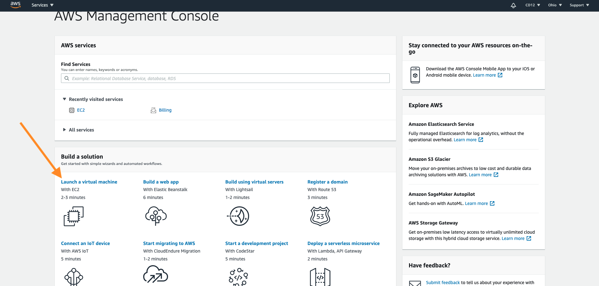
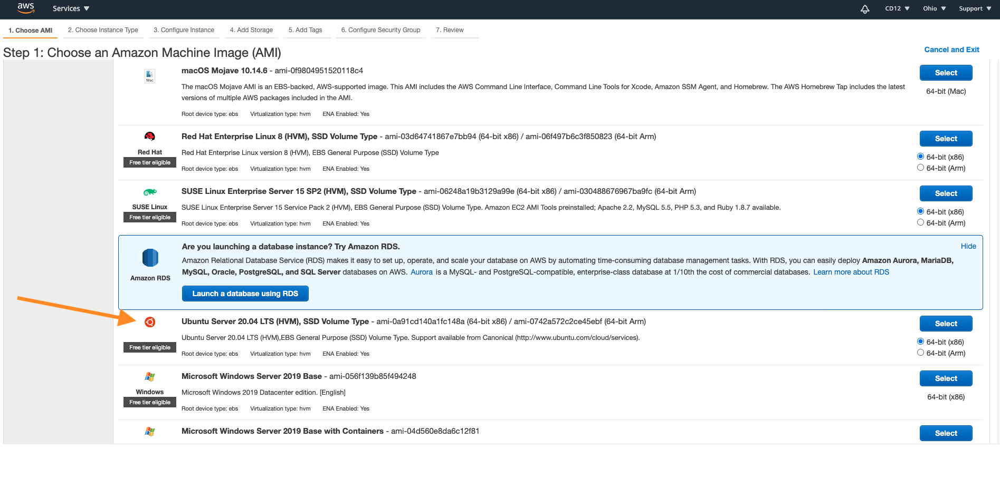
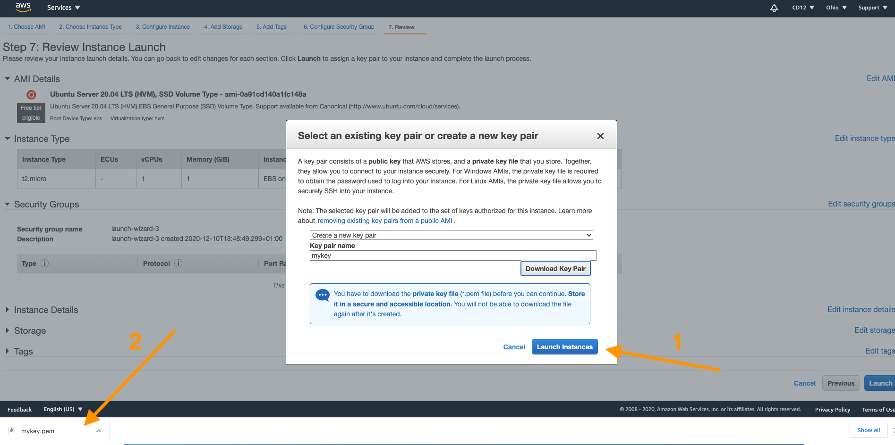
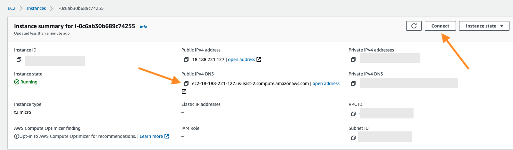

#Guide to setup and run an API agent from a cloud based service

##Amazon Web Services (AWS)

###Step 1: Set up an instance
Login to your AWS account. If you don’t have one, you can create one, the free plan is sufficient.

Create a virtual machine.



Select an **AMI**. We strongly recommend using **Ubuntu Server 20.04 LTS (HVM), SSD Volume Type**



Choose instance type **t2.micro 1vcpus and 1GiB** and click on review and launch

Create a new ssh key and download it on your local machine. The key file’s format is `.pem`



Now you need to copy your scripts/files from your local computer onto your AWS instance. To do that you need to connect to your instance by using the ssh key and your public DNS. You can find the DNS of your instance by selecting your instance and looking at the summary



First you need to make sure your key is not publicly available on your machine. Run the following command

```
chmod 400 path_to/mykey.pem
```


### Step 2: Upload relevant files onto the instance
To copy a file into your AWS instance please run the equivalent command (with your own information)

```
scp -i path_to_ssh_key.pem path_to_file   username@public_DNS:/path_to_copy
```

The username can be found after clicking on connect. The default username will depend on the instance platform you are using. If you are using Linux, “ubuntu” will be the default username.

Additionally we recommend copying your files into the home directory of your instance `/home/ubuntu`.

Here is an example of command

```
scp -i Desktop/mykey.pem myscript.py   ubuntu@ec2-18-188-221-121.us-east-2.compute.amazonaws.com:/home/ubuntu/
```

### Step 3: Connect to the instance
Once you have copied all necessary files onto you AWS instance you can connect to your instance with 2 ways

1.   Directly with the AWS terminal cli that you can access by clicking on connect on your `EC2 instance connect`
2.   With your local terminal cli (recommended)

To connect to your instance from your local terminal you just need to run the following command with your equivalent information

```
ssh -i path_to/mykey.pem username@public_DNS
```

Example

```
ssh -i Desktop/mykey.pem ubuntu@ec2-18-188-221-121.us-east-2.compute.amazonaws.com
```


Once connected, go into the directory you have previously sent your files. If you have copied them in `/home/ubuntu`, just run the following command

```
cd /home/ubuntu
```

You can list all the files in the directory, to confirm that your files are correctly copied onto the instance by running

```
ls
```

### Step 4: Initialize the instance's environment and install Grid Singularity Client
Update and install all required package on your AWS instance

Update your sudo

```
sudo apt update
```

Install python3 pip

```
sudo apt install python3-pip
```

Add `deadnakes` to your system source

```
sudo add-apt-repository ppa:deadsnakes/ppa
```

Install python 3.6

```
sudo apt-get install python3.6
```

Install virtual environment

```
sudo apt install python3-virtualenv
```

Create a virtual environment with python 3.6

```
virtualenv /tmp/d3a --python=/usr/bin/python3.6
```

Activate your virtual environment

```
source /tmp/d3a/bin/activate
```

Install d3a api client

```
pip3 install git+https://github.com/gridsingularity/d3a-api-client.git
```


###Step 5: Install screen and run the API agent

To be able to run the script indefinitely on your AWS instance you need to install Linux [Screen](https://kapeli.com/cheat_sheets/screen.docset/Contents/Resources/Documents/index){target=_blank} (that allows to have multiple screen within your terminal) with the following command

```
sudo apt-get install screen
```

Create a new screen

```
screen -S screen_name
```

Run your python script

```
python3 assets.py
```

To detach from the current screen session

```
Ctr+a+d
```

If you want to log back in the relevant screen run

```
screen -r screen_name
```

Once you are detached for the running screen you are able to close your terminal and your script will continue to run indefinitely on your AWS instance
