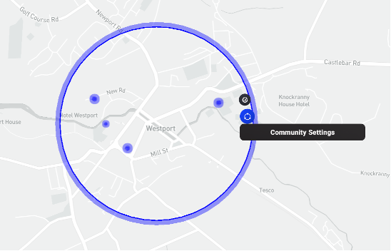
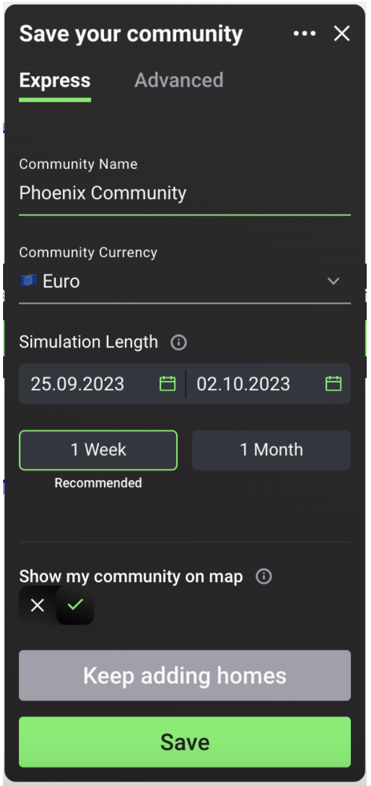
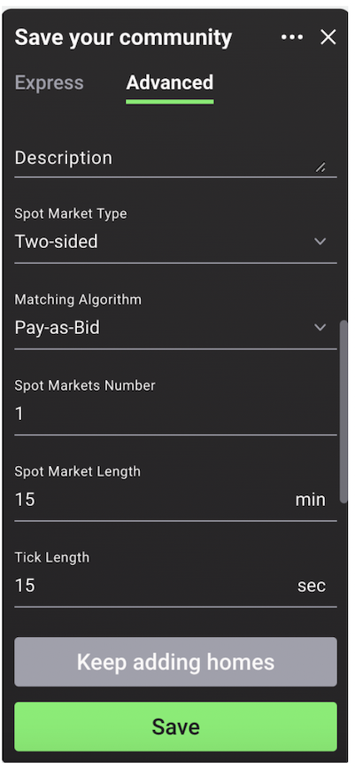

Users can configure the overall settings for their communities by selecting the blue dot on the circle surrounding their energy community on the Singularity Map.

<figure markdown>
  {:text-align:center"}
  <figcaption><b>Figure 2.14</b>: Map view of community settings.
</figcaption>
</figure>

##Community Configuration Options

### Express Mode
The express tab includes basic settings of the simulated local energy community: name, currency and simulation length, as shown in the figure and explained in more detail below.

<figure markdown>
  {:style="height:600px;width:300px";text-align:center"}
  <figcaption><b>Figure 2.15</b>: Community market express mode settings in the Grid Singularity Exchange web-based interface (Singularity Map)
</figcaption>
</figure>

1. Name: select a unique name for the community
2. Currency: select the currency used by the community
3. Simulation Length: select the length of time for the simulation, as well as corresponding dates; by default, simulations are set to run for one week starting from the current date. If uploading own data, set the simulation length, start date and end date according to the used profile
4. Show community on the Grid Singularity web-based interface (Singularity Map): choose whether the simulated community will be publicly visible. If visible, the name, approximate location (circle outline) and simulation results will be available for anyone to see. This information will be kept private to the user if the user selects otherwise

### Advanced Mode
In the advanced tab, there are settings referring to the market type information as shown in the figure and explained in more detail below.

<figure markdown>
  {:style="height:600px;width:300px";text-align:center"}
  <figcaption><b>Figure 2.15</b>: Community market advanced mode settings in the Grid Singularity Exchange web-based interface (Singularity Map)
</figcaption>
</figure>

1. Description: add an optional description of the simulated community
2. Spot market type: select either the one-sided or the two-sided market type
      - In the [One-Sided Pay-as-Offer spot market](one-sided-pay-as-offer.md), agents representing energy producers, including prosumers (sellers), post offers in the market with an energy price determined by the assets' [trading strategy](trading-agents-and-strategies)
      - In the two-sided spot market, where buyers are able to place bids in the market alongside the offers placed by sellers, users can choose the [Two-Sided Pay-as-Bid Market](two-sided-pay-as-bid.md) or the [Two-Sided Pay-as-Clear Market](two-sided-pay-as-clear.md)
3. Matching algorithm: select pay-as-bid, pay-as-clear or an external [trading algorithm](trading-agents-and-strategies)
4. Spot markets number: set the number of active spot markets where the energy assets represented by trading agents can trade
5. Spot market length: set the [length of the spot market](market-types.md#market-slots) in minutes
6. Tick length: set the [length of ticks](market-types.md#market-ticks) in seconds
7. Grid fees: if switched on, select one of two grid fee types: [Constant grid fee](constant-fees.md) or [Percentage grid fee](percentage-fees.md) and enter a value in cents/kWh or % depending on the selected option
8. Market slot real time duration: set the desired market slot duration (default is 0s)
