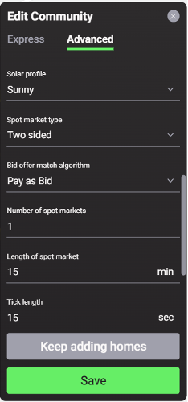

Users can configure the overall settings for their communities by selecting the blue dot on the circle surrounding their energy community on the Singularity Map.

***Figure 2.13***. *Map view of community settings.*

##Community Configuration Options

1. Name: Must be unique.
2. Currency: Choose the currency used by the community.
3. Simulation Length: Users can choose the length of time of their simulation, as well as corresponding dates. By default, simulations are set to run for one week starting from the current date. If users upload their own data, they should set the simulation length, start date and end date according to the used profile.
4. Show community on the Map: Users can choose whether or not their community will be publicly visible on the Singularity Map. If visible, the name, approximate location (circle outline) and simulation results will be available for anyone to see. This information will be kept private to the user if the user selects otherwise.
5. Description: Users can add an optional description of their community.
6. Solar profile: Users can choose between the template solar profiles of either sunny, partially cloudy, cloudy, Gaussian (each profile generated with a 250W panel), or upload their own custom generation profile ([see format required](data-requirements.md)).
7. Spot market type - Users can select either the one-sided or two-sided market type.
      - In the [One-Sided Pay-as-Offer spot market](one-sided-pay-as-offer.md), agents representing energy producers, including prosumers (sellers), post offers in the market with an energy price determined by the assets' [trading strategy](default-trading-strategy.md).
      - In the Two-Sided spot market, where buyers are able to place bids in the market alongside the offers placed by sellers, users can choose between the [Two-Sided Pay-as-Bid Market](two-sided-pay-as-bid.md) or the [Two-Sided Pay-as-Clear Market](two-sided-pay-as-clear.md).
8.	Bid offer match algorithm - Users can choose if they would like to have a Pay as Bid, Pay as Clear or External Matching [trading algorithm](default-trading-strategy.md).
9.	Number of spot markets - Number of future spot markets where the energy assets and agents can trade.
10.	Length of spot market - Users can choose the [length of the spot market](market-types.md#market-slots) in minutes.
11.	Tick Length - Users can choose the [length of ticks](market-types.md#market-ticks) in seconds.
12.	Grid Fees -  If switched on, users can select one of two types: [Constant grid fee](constant-fees.md) or [Percentage grid fee](percentage-fees.md). Constant grid fee allows users to enter a value in cents/kWh that will represent a fee applied to each trade that occurs in this market, while percentage grid fee allows users to enter a value in %.
13.	Market slot real time duration - Desired duration of a market slot in real time (default is 0s)

***Figure 2.14***. *Community Settings Configuration Options*
