The Singularity Map is an interactive Grid Singularity Exchange simulation platform where users can model and simulate digital twins (digital representations) of local energy markets (LEM or energy communities). Modelling is performed by adding homes, representing households or other LEM participants, and the respective energy assets, such as consumption load profiles, solar panels (PVs), heat pumps and / or storages (batteries), which are digitally represented by trading agents. For more, see [Grid Singularity’s Technical Approach] (https://gridsingularity.github.io/gsy-e/technical-approach/).

<figure markdown>
  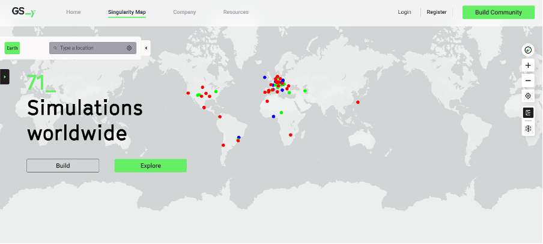{:text-align:center"}
  <figcaption><b>Figure 2.1</b>: The Singularity Map - Grid Singularity Exchange web-based interface at https://map.gridsingularity.com/singularity-map.
</figcaption>
</figure>

The map includes a search bar in the top left corner, a list of simulations in the extendable panel below the search bar, user icons on the right hand side of the screen (explained below) and coloured dots representing different simulations on the map.
**Icons**

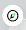 This icon allows the user to reorient their view of the map to the standard north-facing direction.

 These icons allow users to zoom in and out of the map.

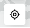 This icon allows access to the user's location.

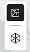 These icons allow users a change of view between birds eye view (straight down/2D) and 3D.

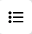 This icon allows the user to see their assets in a list view and to click on the items in the list in order to navigate the map and results views

 This icon allows the user to request upgrading their simulation to Grid Singularity’s [Canary Test Network](canary-network.md), which is a paid service.

**Legend**

<figure markdown>
  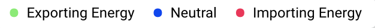{:text-align:center"}
  <figcaption><b>Figure 2.2</b>: Legend explaining colouring indicating net energy import / export of simulated energy communities in the Singularity Map, Grid Singularity Exchange simulation interface.
</figcaption>
</figure>

The coloured dots on the map represent energy community simulations. The legend is found in the top right corner of the page.

🟢 Green dots are communities that have a net export of energy;

🔴 Red dots are communities that have a net import of energy;

🔵 Blue dots are communities that have a neutral energy balance (neither net import/export) or communities that have been configured but not yet simulated.

**User Profile Configuration**

By clicking on the icon in the top right corner next to “Run Simulation”, users can see their profile, edit their password, and change their profile picture by clicking on the image and uploading a file from their computer (as shown in the picture below).

<figure markdown>
  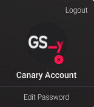{:text-align:center"}
  <figcaption><b>Figure 2.3</b>: User profile in the Singularity Map, Grid Singularity Exchange simulation interface
</figcaption>
</figure>

***Configuring an Energy Community***

To configure an energy community to perform a simulation, the user should take the following steps:

1. elect location for the simulated community, either by manually navigating the map or by typing the location in the search bar;
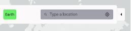

2. Add homes (representing households or other community members) and the relevant information relating to their energy assets (described in more detail below under [Community Assets Configuration](configuration.md)).

3. Register or log in to your account, making sure that you understand and accept the [Terms of Service](https://gridsingularity.com/terms-of-service).

4. Name the community, set the currency and the simulation period, as well as relevant market settings, such as pricing, the trading mechanism and grid market settings (described in more detail below under [Community Market Settings](community-settings.md)) and save the configured information.

5. Run the simulation for each selected period and analyse the results (note: a community must have at least two homes before it can be saved and local energy trading simulated).

A guided onboarding of the community configuration process launches automatically in the top right-hand side of the screen when the user clicks on the Build Community icon in the top right corner.

<figure markdown>
  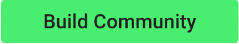{:text-align:center"}
  <figcaption><b>Figure 2.4</b>: Build Community icon in the Grid Singularity Exchange web-based interface (Singularity Map).
</figcaption>
</figure>

<figure markdown>
  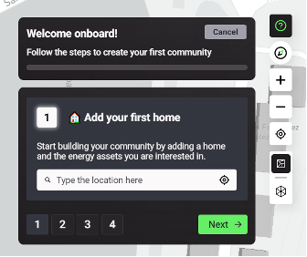{:text-align:center"}
  <figcaption><b>Figure 2.5</b>: Guided onboarding feature in the Grid Singularity Exchange web-based interface (Singularity Map).
</figcaption>
</figure>

This feature can be shown/hidden by clicking on the interrogation green icon at the top of the icon list on the right-hand side of the screen: 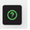 This icon and feature only appear after a user has selected the community location and clicked on the first button to start building a community.

<figure markdown>
  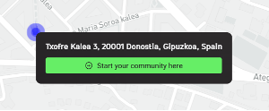{:text-align:center"}
  <figcaption><b>Figure 2.6</b>: The first button a user selects to start building a community in the Grid Singularity Exchange web-based interface (Singularity Map)
</figcaption>
</figure>
