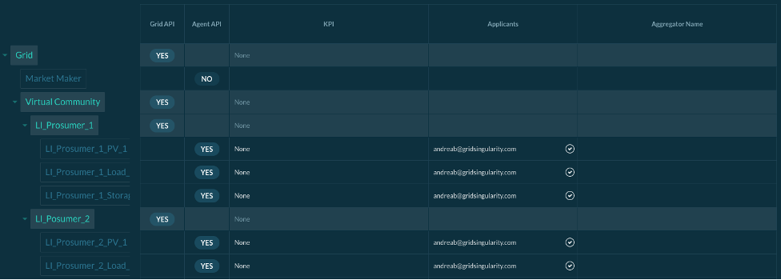

The Grid Singularity Asset API is designed for aggregators (energy service providers) who wish to provide their customers (individuals and communities) with benefits of peer-to-peer and community trading facilitated by the Grid Singularity Exchange. They can create agents that follow custom trading strategies to buy and sell energy in the energy market on behalf of managed energy assets. The agent can request and receive information through the Asset API, feed that information into an algorithm, and post bids or offers on the exchange.

To actively place bids and offers on behalf of energy assets, please follow these steps:

- Install the Grid Singularity Exchange SDK on your computer by launching the following commands on your terminal window:

**Install gsy-e-sdk**

```
mkvirtualenv gsy-e-sdk
pip install https://github.com/gridsingularity/gsy-e-sdk.git
```
**Update gsy-e-sdk (needed when an update is deployed)**
```
pip uninstall -y gsy-e-sdk
pip install git+https://github.com/gridsingularity/gsy-e-sdk.git
```


- Go to the *Registry* section of the Collaboration of your interest and apply for each *asset* you wish to connect to manage their trading strategies by clicking on the asset or home. Then click on the green *Apply* button. If you have not already created a Collaboration / Canary Test Network or users are not yet registered for their assets, please follow instructions respectively [here](collaboration.md) or [here](connect-ctn.md) first.

<figure markdown>
  {:style="height:500px;width:300px";text-align:center"}
  <figcaption><b>Figure 5.2</b>: View of the connection overview.
</figcaption>
</figure>


- Notify Grid Singularity administration by sending an email to [contact@gridsingularity.com](mailto:contact@gridsingularity.com) to accept your applications (note: this action will be automated in the future).

<figure markdown>
  {:style="height:400px;width:370px";text-align:center"}
  <figcaption><b>Figure 5.3</b>: View of the connection overview for the admin
</figcaption>
</figure>

- Edit the [Asset SDK Script template](asset-api-template-script.md) developed by Grid Singularity to customize the trading strategies.
- [Launch the Asset SDK Script](registration-grid-operator-api-user-interface.md) to connect with the Grid Singularity Collaboration / Canary Test Network. A video tutorial is also available [here](https://www.youtube.com/watch?v=oCcQ6pYFd5w&feature=youtu.be){target=_blank}.
- Run the Collaboration or notify Grid Singularity that you are ready.
