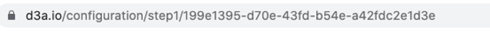

The Grid Singularity Canary Test Network, inspired by the “canary in a coal mine”, is designed to test new ideas while operating in conditions as close as possible to reality. Energy assets, managed by aggregators, send their actual energy usage through the [Asset API](asset-api-template-script.md) every 15 minutes (or another specified timeframe depending on the determined spot market length) and the exchange operates in real-time to facilitate local energy markets. Nevertheless, the assets’ virtual representations (digital twins) are decoupled in state from their physical (e.g. a battery’s digital twin might have a different state of charge in simulation vs. reality), and hence the network does not entail actual energy and financial transactions.

*Note: Grid Singularity Canary Test Networks are only available at Grid Singularity’s previous interface ([D3A.io](https://www.d3a.io/)) at the moment, and we will update this document as soon as the tool is migrated to the new interface.*

To create a Grid Singularity Canary Test Network, follow these steps (a video tutorial is also available [here](https://www.youtube.com/watch?v=kHacTJvTRwM&feature=youtu.be)):

* Select the Collaboration or Simulation that you want to set up as a Canary Test Network by clicking on _Edit → Create Canary Network_. If you have not yet created a Collaboration or wish to create a new one, please follow the instructions [here](collaboration.md).

*Currently, this step requires manual Grid Singularity intervention. A personal account of an external user does not have the admin rights to create a Canary Test Network. Please contact us at [contact@gridsingularity.com](mailto:contact@gridsingularity.com) for technical support and provide us with the following:*

- *Your Name*
- *Grid Singularity account email address*
- *Company name*
- *Location of the community*
- *Size of the community (number of participants, assets)*
- *Energy Supplier / grid operator*
- *Purpose of the canary network*
- *Simulation URL*

The simulation URL should look like this at the moment:

* Go to the modeling page of the test network and make sure that the connection with the [Asset API](asset-api-template-script.md) and [Grid Operator API](grid-operator-api-template-script.md) is open (it should be happening automatically, and if so a small symbol that says “API” appears near each node of the community). Make also sure that the live data option for each asset is open by looking at their *API/KPI*~~~~~~~~ settings.
* Connect to the Grid Singularity SDKs by following instructions [here](APIs-introduction.md).
* Connect live data streams to the energy exchange (see section [below](connection-energy-assets.md)).
