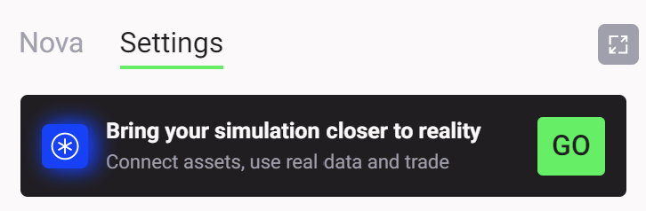
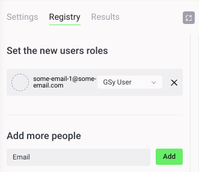
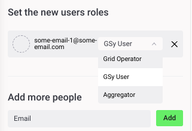
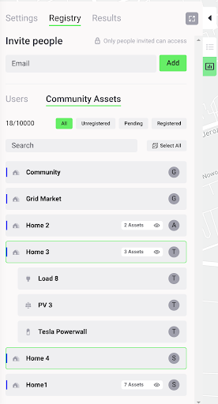
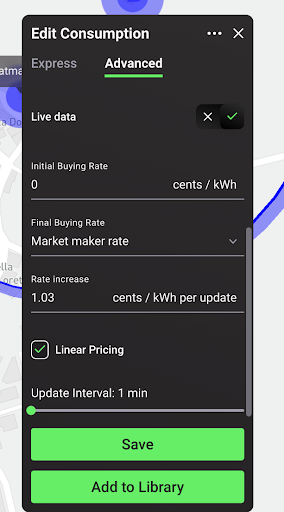
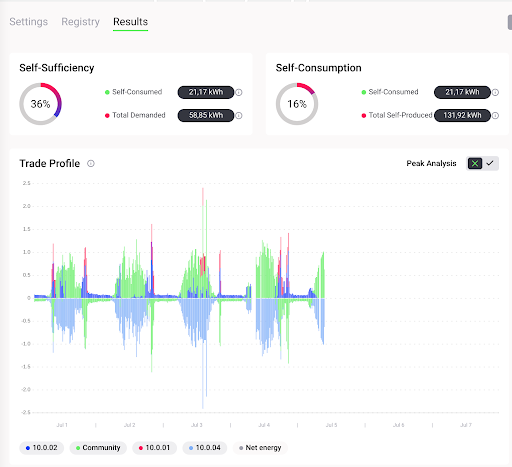

## Grid Singularity Test Network Overview

The Grid Singularity Canary Test Network, inspired by the “canary in a coal mine”, is designed to test new ideas while operating in conditions as close as possible to reality. Energy assets, managed by aggregators (companies managing other people’s energy assets and/or energy community managers or researchers acting as aggregators), send their actual energy usage through the [Asset API](configure-trading-strategies-walkthrough.md) each 15 minutes (or another specified timeframe depending on the determined spot market length) and the exchange operates in real-time to facilitate local energy markets. However, the network does not represent actual energy and financial transactions because the assets’ virtual representations (digital twins) are decoupled in state from their physical (e.g. a battery’s digital twin might have a different state of charge in simulation vs. reality). CTN can be used to assess market performance and investigate different aspects such as tariff models or trading mechanisms and algorithms (see, for example, [here](https://gridsingularity.medium.com/energy-singularity-challenge-2020-testing-novel-grid-fee-models-and-intelligent-peer-to-peer-6a0d715a9063){target=_blank}).


Connecting and operating a live simulation on Grid Singularity Canary Test Network (GSy CTN) is provided by Grid Singularity as a paid service for those interested to simulate a live peer-to-peer energy trading, and it entails the following activities:

A. [Preparatory Activities](connect-ctn.md#initiate-a-grid-singularity-canary-test-network) *(detailed instructions below)*

  - The local energy market (LEM) manager (or researcher acting as LEM manager, later also termed the designated CTN owner) to configure a digital twin of all the local energy market participants and their energy assets via the [Grid Singularity web-based simulation tool](https://gridsingularity.com/singularity-map){target=_blank} and run the simulation;
  - Once the simulation is completed, the LEM manager to take steps to request a connection to a live GSy CTN;
  - Grid Singularity team to share a commercial and a data processing agreement with the acting LEM manager to review and execute;
  - Grid Singularity team and the acting LEM manager to conduct a  technical workshop to review data and connection requirements and any additional steps to enable data integration;
  - The GSy Admin then reviews and approves the request and initiates the CTN LEM configuration.

B. [Connecting to Grid Singularity Canary Test Network / Data Integration](connect-ctn.md#grid-singularity-canary-test-network-operation) *(detailed instructions below)*

  - The GSy Admin to add the acting LEM manager as “a user” of the select LEM CTN simulation (based on provided email address) and assign them the CTN owner role, responsible for trading on behalf of all the participants (assets) in the network;
  - The acting LEM manager to receive a link via email to access the created GSy LEM CTN and log in to view the simulated community under the GSy CTN tab;
  - The next step involves the LEM manager reviewing the configuration and sending a request for live data connection of each asset in their community. GSy Admin will review and approve each connection and the LEM manager will receive an email with all the UUIDs of the community and its assets.
  - [Live datastream connection](connection-energy-assets.md) via GSy Asset API for all energy assets in the simulated LEM will be completed by the LEM manager through the CLI terminal using the provided UUIDs of the assets.

C. Results Monitoring & Analysis

  - The GSy Admin will monitor the live simulation to ensure that the datastream and derived performance indicators are running without any interruptions.
  - The LEM manager can view the results in real time through the UI. The community manager will also be able to [download the results](results-download.md) for a deeper analysis.  The results will be available for 90 days. Any support of GSy for analysis will be limited to 2 hours.


## Initiate a Grid Singularity Canary Test Network
To initiate a Grid Singularity Canary Test Network (GSy CTN) for a live peer-to-peer trading simulation of a select local energy market, please follow these steps (a video tutorial is also available [here](https://www.youtube.com/watch?v=8tAl8Td2XsU&list=PLdIkfx9NcrQeD8kLBvASosLce9qJ4gQIH&index=2){target=_blank}):

&nbsp;1. Configure a digital twin of all the local energy market participants and their energy assets via the [Grid Singularity web-based simulation tool](https://gridsingularity.com/singularity-map){target=_blank} and run the simulation, ensuring the relevant [data requirements](data-requirements.md).  Once it is completed, click on the Settings tab, and click “Go” in the box that says, “Bring your simulation closer to reality” as shown in the image below:


<figure markdown>
  {:text-align:center"}
  <figcaption><b>Figure 1</b>: Grid Singularity user interface (Singularity Map) Settings Tab</figcaption>
</figure>


&nbsp;2. A Grid Singularity representative will be in touch with you shortly to discuss your needs and share a commercial and a data processing agreement to review and execute. As an initial step, you will be required to provide the following information:


  - *Your Name*
  - *Grid Singularity account email address*
  - *Company name*
  - *Location of the community*
  - *Size of the community (number of participants, assets)*
  - *Energy Supplier / grid operator*
  - *Purpose of the canary network*
  - *Simulation name*

Once your request is defined contractually and approved,  your user account will acquire elevated permissions that will allow the creation of a GSy CTN by following the data integration steps defined in the section below.

## Grid Singularity Canary Test Network Operation

### Grid Singularity Test Network User Roles

With the creation of a Grid Singularity Test Network (GSy CTN), a Registry tab is added to settings in the sidebar to allow for different user role allocation (see image below). Each home/LEM member or asset owner can be assigned to a home digital twin. The grid operator and the aggregator (asset manager) can also be assigned a role as further described below. In case the designated CTN owner does not intend to invite additional CTN users, steps in this section can be skipped.

<figure markdown>
  {:text-align:center"}
  <figcaption><b>Figure 2</b>: Grid Singularity User Interface (Singularity Map) Canary Test Network Registry Tab - “Set new user roles” section
</figcaption>
</figure>


  - Each community member or asset owner is invited by the designated CTN owner (acting LEM manager) to participate in the created test network through the Add More People invitation tool. To do this, the CTN owner would assign them a GSy User role and automatically trigger an invitation email to be sent. Upon joining, they would be able to view and analyse results for the assets they own.

<figure markdown>
  {:text-align:center"}
  <figcaption><b>Figure 3</b>: Grid Singularity User Interface (Singularity Map) Canary Test Network Registry Tab - “Add more people” section
</figcaption>
</figure>

  - Aggregators (companies managing other people’s energy assets and/or energy community managers) are invited in the same way. The CTN owner assigns them the Aggregator role and automatically triggers an invitation email. The aggregator then logs in to the platform by following the link in the email and registers their user account, to trade on behalf of each asset assigned to them on the Community Assets tab. Once their registration is accepted by the CTN owner, they can trade on behalf of the assigned assets using the [Asset API](asset-api-commands.md).

<figure markdown>
  {:text-align:center"}
  <figcaption><b>Figure 4</b>: Grid Singularity User Interface (Singularity Map) Canary Test Network Registry Tab - “Community Assets” Section
</figcaption>
</figure>


  - The Grid Operator, similar to the Aggregator, must act upon the invitation email instructions (issued by CTN owner by assigning them that role using the “Add more people” tool), in order to be granted access to manage grid fees and network congestion through the [Grid Operator API](grid-operator-api-commands.md).


### Grid Singularity Canary Test Network Data Integration

Once the Grid Singularity Canary Test Network is fully configured, the final step is to enable a live data stream from the simulated community’s energy assets to the Grid Singularity Exchange ([Asset API](configure-trading-strategies-walkthrough.md)) by establishing a connection with the hardware’s data service, or directly with the asset smart metres/measurement devices if such a service is unavailable.

On the map, the designated GSy CTN owner (acting LEM manager) can click on the relevant LEM participant (home) and the asset to initiate the live data stream input for the Grid Singularity Exchange. In the Advanced Settings tab, the live data switch can be toggled to be enabled or disabled. In case the live data switch is enabled, the selected asset will be configured to accept live forecast / measurement data, sent via the Asset API. If the live data is turned off, data will be read through the uploaded historical profiles instead of reading data sent through the Asset API. The latter is a way to simulate a live test network using historical data for research purposes when a live data connection is unavailable.


<figure markdown>
  {:text-align:center"}
  <figcaption><b>Figure 5</b>: Grid Singularity User Interface (Singularity Map) Canary Test Network Advanced Settings Tab
</figcaption>
</figure>


Upon completing this step, the energy live asset data will be displayed in the Grid Singularity User Interface as part of the Canary Test Network Results Dashboard, as shown in the image below:


<figure markdown>
  {:text-align:center"}
  <figcaption><b>Figure 6</b>: Grid Singularity User Interface (Singularity Map) Canary Test Network Results Dashboard Example
</figcaption>
</figure>


### Grid Singularity Canary Test Network Data Transmission Options
There are two options to connect the community live data stream to the Grid Singularity Exchange.

- Send live data streams via the Grid Singularity Exchange SDK
[Grid Singularity Exchange SDK](https://github.com/gridsingularity/gsy-e-sdk){target=_blank} (recommended, compatible with Python-based aggregator or smart metre software). This option is a pure Python library that can be integrated with existing aggregator or smart metre software, automating the process of setting up a data stream from the energy assets to the Grid Singularity Exchange. After installing the library and with minimal configuration (by setting up credentials and asset ids), the aggregator (community manager) can transmit the community assets’ forecasts and measurements.  To send live data streams through the Exchange SDK, please follow these steps:

    1. Install the SDK Client by following the steps described [here](APIs-introduction.md). Since the client is written in Python, the data stream pipeline needs to be written in Python as well.
    2. Add the following command in the [Grid Singularity Asset SDK Script](https://github.com/gridsingularity/gsy-e-sdk/blob/master/gsy_e_sdk/setups/asset_api_scripts/canary_network_live_data.py){target=_blank} to set the energy consumption and generation for Load, PV and other assets for the next market slot:

    ```asset_client.set_energy_forecast(<energy_forecast_Wh>)```

    An example of how sending forecasts through the SDK Client could be added into the Asset API script can be found [here](https://github.com/gridsingularity/gsy-e-sdk/blob/master/gsy_e_sdk/setups/test_sending_energy_forecast.py){target=_blank}.

- Send live data streams via the REST API
REST API (for non-Python aggregator or smart metre software). This option is a language-agnostic API that can be used to stream live energy asset data to the Grid Singularity Exchange. Unlike the Grid Singularity Exchange SDK, it does not need installation of a GSy library. A RESTful API is used instead, which enables correct transmission of forecasts and measurements of assets to the Exchange. Authentication and asset id assignment are part of the API definition, allowing the aggregator (energy community manager) to send different forecasts and measurements per asset.

    To send asset data without using the SDK Client or to set up a data pipeline in another programming language than the SDK Client, the raw REST API can be used. An additional authentication step has to be performed first, and then a post sent, as described below:

    a. Authentication is done via JSON Web Token (JWT). In order to retrieve the JWT, the following POST request has to be performed:

      ```POST https://gsyweb.gridsingularity.com/api-token-auth/```

    The body of the request needs to contain the following information (JSON string):

      ```{"username": "<your_username>", "password": "<your_password>"}```

    The returned JWT needs to be sent via the Authorization HTTP header when sending the forecast data. For that the user needs to add the following key value pair to the header of each POST command: Authorization: JWT <your_token>

    b. The POST to send the energy value is (please fill in `<Canary Network UUID>` and `<Asset UUID>`):

      ```
      POST https://gsyweb.gridsingularity.com/external-connection/api/
      <Canary Network UUID>/<Asset UUID>/set_energy_forecast/
      ```

    The body of the request needs to contain the following information (JSON string):

      ```{"energy_Wh": <energy_value_for_asset>}```


Once the connection with the Grid Singularity Canary Test Network is established, we recommend that you verify that the data are sent successfully to the Grid Singularity Exchange,  by comparing the data visualised on the Grid Singularity user interface with the data in your local database and iterate this process until each asset is sending the correct data.

<span style="color:red">Alert: Ensure that your Internet connection/server is stable and the script persists. Any connection issue/loss on your side will result in inaccurate data reporting and representation in the Grid Singularity Exchange.</span>
