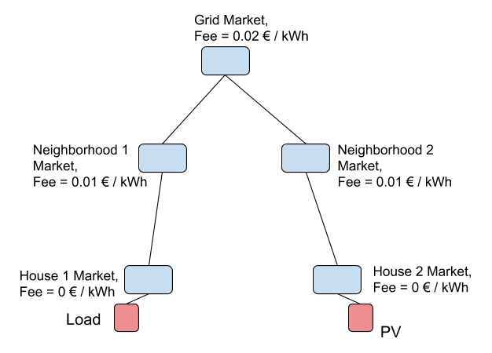
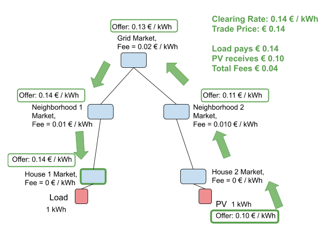
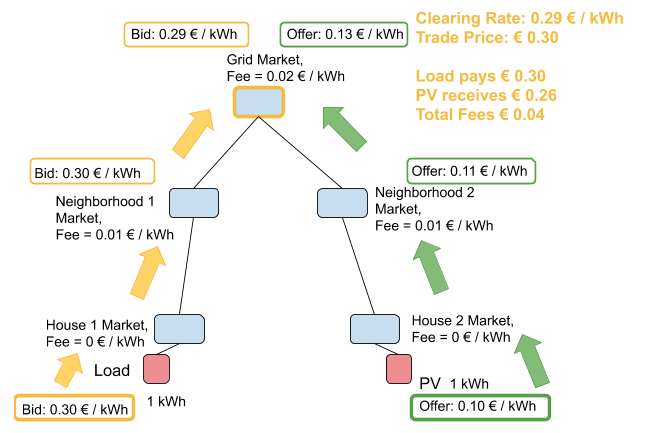

###Configuration Model

{:style="display: block;margin-left: auto;margin-right: auto;"}

###Introduction and definitions
We have agreed that the buyer should pay all of the fees, at least for this implementation. Any fee that a seller has to pay is ultimately the burden of the buyer. A seller with additional operational costs or taxes will have to raise their prices in a competitive market.

When running D3A simulations, we consider the current grid fees and propose which fees need to be added at which layers in the D3A. Configuring separate grid fees in separate markets or areas helps to accomplish this. The grid fee is a part of the energy trade price and is cumulative so that the fees in each market a trade passes through can be added cumulatively together to get the entire grid fee, often as a percentage of the clearing price. 

The **Clearing Rate** is the rate that the market clears at

The **Trade Price** is the price the buyer pays (revenue to the seller plus the grid fees)

As seen in the examples below, the rate of a bid or offer changes as it is propagated into different markets. The rate of an offer increases to account for the added fees of the market. This helps an agent submitting an offer to receive equal or greater revenue than the value of the offer. The rate of a bid decreases for the same reason. This helps an agent submitting a bid to pay equal or less than the value of the bid. This way, an agent making an offer will never receive less than their offer and an agent making a bid will never pay more than the bid.

###One Sided Pay as Offer
{:style="display: block;margin-left: auto;margin-right: auto;"}

In the One Sided Pay as Offer market, there are no bids and only offers exist. The offers are propagated throughout the markets in the hierarchy. The grid fees are taken into account when an offer is forwarded to the higher market, by the higher market itself. Therefore the agent is not responsible for adapting the offer rate to include the grid fees. The grid fees' unit is a constant value per energy volume **€/kWh**, therefore the formula to calculate the new offer rate when placing an offer to a market is the following: 
```
offer_rate_after_fees (€/kWh) = offer_rate (€/kWh) + grid_fee (€/kWh)
```

If the offer is not purchased after one tick, it is moved into the next market. When entering a new market, the offer's rate is increased according that that market's grid fee. The PV offer of 0.10 €/kWh is first placed into the House 2 Market where it gains zero fees. Then it moves into the Neighborhood 2 Market, gaining a fee of 0.01 €/kWh to become 0.11 €/kWh. Then if not purchased it moves into the Grid Market, gaining a fee of 0.02 €/kWh to become 0.13 €/kWh. Continuing into the Neighborhood 1 Market, the offer gains a fee of 0.01 €/kWh to become 0.14 €/kWh. Continuing into the House 1 Market, the offer gains zero fees. The Load buys the offer in the House 1 Market at the Clearing Rate of 0.14 €/kWh.

Using the initial offer rate, the trade price is calculated from the total fees and energy. The total fees are `(0.01+0.02+0.01) = 0.04 €/kWh` and are added to the original offer (0.10 €/kWh) and multiplied by 1 kWh to yield the Trade Price of € 0.14.

**The Load pays the Trade Price of € 0.14, which includes € 0.10 revenue to the PV, € 0.01 fees to Neighborhood Market 1, € 0.02 fees to Grid Market, and € 0.01 fees to Neighborhood Market 2.**


Since the market is pay-as-offer, the offer rate is used as the clearing rate. The grid fees are added to the offer rate to determine the trade rate and therefore the trade price in each market. The following formula is used: 
```
supply_side_tax (€/kWh) = forwarded_offer_rate (€/kWh) - original_offer_rate (€/kWh)
trade_rate (€/kWh) = clearing rate (€/kWh)
trade_price (€) = energy (kWh) * trade_rate (€/kWh)
```
For our example, the trade price for each market is:

```
Market_trade_price (€) = (original_offer_rate (€/kWh) + supply_side_tax (€/kWh)) * energy (kWh)
 
Grid Market = (0.10 + 0.03)*1 = 0.13,
Neighborhood 2 Market = (0.10 + 0.01)*1 = 0.11,
Neighborhood 1 Market = (0.10 + 0.04)*1 = 0.14,
House 1 Market = (0.10 + 0.04)*1 = 0.14,
House 2 Market = (0.10 + 0)*1 = 0.10.
```

###Two Sided Pay as Bid
{:style="display: block;margin-left: auto;margin-right: auto;"}

In the Two Sided Pay as Bid market, there are both bids and offers, which are both propagated throughout the markets in the hierarchy. If a bid or offer is not purchased after one tick, it is moved into the next market. In order to prevent the double accounting of a market's grid fee when a bid and an offer are matched in that market, market fees are added to offers when they enter that market (target market) and market fees are subtracted from bids when they leave that market and enter the another one (source market). The formula for propagating the offers is exactly the same as on the one-sided market :
```
offer_rate_after_fees (€/kWh) = offer_rate (€/kWh) + grid_fee (€/kWh)
```
The bids are not adapted by the market itself, but the area/IAA is responsible to subtract the fees from the bid before propagating the bid to the higher market. As mentioned above, the difference in behavior compared to offers is to avoid double accounting of the grid fee on one market. The formula for an area to update the bid to include grid fees is the following:
```
bid_rate_after_fees (€/kWh) = bid_rate (€/kWh) - grid_fee (€/kWh)
```

In the case of the Two Sided Pay as Bid market, the offer has moved into the Grid Market by the same mechanism as explained in the One Sided Pay as Offer market. The bid of 0.30 €/kWh follows a similar mechanism and is placed into the House 1 Market where there are zero fees. If the bid is not purchased after one tick, it is moved into the Neighborhood 1 Market. As explained above, only the fees from the source market are added, which are zero in this case. So the bid remains at 0.30 €/kWh. Next the bid moves into the Grid Market, where it its value is lowered according to the fees of its source market, the Neighborhood 1 Market at 0.01 €/kWh. With the Neighborhood 1 Market fee, the bid is lowered to 0.29 €/kWh as it enters the Grid Market.

In the example above, the bid and offer are matched in the Grid Market. However, when the offer entered the Grid Market, its rate was immediately updated to account for the Grid Market's fees (`0.11 + 0.02`). The bid on the other hand did not add the 0.02 €/kWh fee. In the case that the bid was not matched in the Grid Market and moved into the Neighborhood 2 Market, the 0.02 €/kWh fee from the Grid Market would be added. In this case the bid would become (`0.29 - 0.02`) 0.27 €/kWh. The fees from the Neighborhood 2 Market would not be added to the bid unless it entered the House 2 Market (fees added according to the source market).

In the Grid Market, the Load bid is listed as 0.29 €/kWh and the PV offer is listed as 0.13 €/kWh. As the bid is greater than the offer a trade can be scheduled. The trade clears at the bid rate, giving a Clearing Rate of 0.29 €/kWh.

There is a separate algorithm that calculates the grid fee according to the clearing rate. This allows the markets to act more independently and in a decentralized manner, without having to share information regarding their fees with other markets. In order to calculate the fee correctly based on the original rate, the algorithm needs to be able to calculate the supply side and demand side tax. It is easy to calculate this, since the original bid/offer prices are available:
```
demand_side_tax (€/kWh) = original_bid_rate (€/kWh) - forwarded_bid_rate (€/kWh)
supply_side_tax (€/kWh) = forwarded_offer_rate (€/kWh) - original_offer_rate (€/kWh)
```
For the example, we have the following values: `supply_side_tax = 0.13 - 0.10 = 0.03`, `demand_side_tax = 0.30 - 0.29 = 0.01`.

After calculating the supply and demand side tax, we can calculate the revenue of the trade. Note the original_trade_rate is the amount that the original buyer (in our case the Load) will need to pay, therefore for pay as bid this is the original bid price. The calculation is the following: 
```
total_tax (€/kWh) = supply_side_tax (€/kWh) + demand_side_tax (€/kWh)
revenue_rate (€/kWh) = original_trade_rate (€/kWh) - total_tax (€/kWh)
```
For the example, the revenue will be: `revenue = 0.30 - 0.04 = 0.26`

Finally, the trade rate is adapted according to the supply side tax, in order to include the fees of the current market: 
```
trade_rate (€/kWh) = revenue_rate (€/kWh) + supply_side_tax (€/kWh)
trade_price (€) = energy (kWh) * trade_rate (€/kWh)
```
For our example, the trade price for each market is:
```
Market_trade_price (€) = (revenue_rate (€/kWh) + supply_side_tax (€/kWh)) * energy (kWh)
 
Grid Market = (0.26 + 0.03)*1 = 0.29,
Neighborhood 2 Market = (0.26 + 0.01)*1 = 0.27,
Neighborhood 1 Market = (0.26 + 0.04)*1 = 0.30,
House 1 Market = (0.26 + 0.04)*1 = 0.30,
House 2 Market = (0.26 + 0)*1 = 0.26.
```

**The Load pays the Trade Price of € 0.30, which includes € 0.26 revenue to the PV, € 0.01 fees to Neighborhood Market 1, € 0.02 fees to Grid Market, and € 0.01 fees to Neighborhood Market 2.**

###Two Sided Pay as Clear

In construction...


