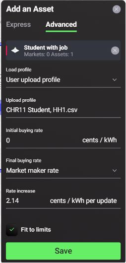

The load is an energy asset that consumes energy over time which is represented by a consumption profile. It is possible to use a single load digital twin to represent an entire building’s consumption, as well as to configure multiple loads to represent different assets within a building (e.g. washing machine, air-conditioner, etc.). Singularity Map express mode users are provided with a selection of template (synthetic) consumption load profiles, modelled using data from [Load Profile Generator](https://www.loadprofilegenerator.de/){target=_blank}. Users who want to upload their own consumption profile data can do so in the ‘upload profile’ section in the Custom Load advanced settings.
##Load Configuration Options:

###Express Mode
In the express load configuration mode, the user is provided with a template (synthetic) custom load to include as an asset at a select location in the simulated local energy market by naming the asset and setting its location:

1. Name: select a unique name for the load;
2. Location: the location selected by the user is automatically uploaded;

###Advanced Mode
In the advanced load configuration mode, the following settings are available as shown in the figure and explained below:
<figure markdown>
  {:style="height:600px;width:300px";text-align:center"}
  <figcaption><b>Figure 2.12</b>: Consumption Load Profile Advanced Configuration Options in the Grid Singularity Exchange web-based interface (Singularity Map)
</figcaption>
</figure>

1. Load profile type: select the user upload profile or the user configure profile: User upload profile allows users to upload data from their own consumption profile in the form of a [csv file](data-requirements.md). User configure profile allows users to manually create a consumption profile by setting the load average consuming power in Watts, the number of hours the load operates per day and the time range in which the load operates (hours of day). The latter is used to model disaggregated consuming devices such as a TV, washing machine, boiler etc.
2. Initial buying rate: set the initial energy buying rate for the beginning of each market slot in cents/kWh
3. Final buying rate: set the final energy buying rate at the end of each market slot in cents/kWh by entering a custom value or the Market Maker rate
4. Rate increase: enter a value for the explicit rate increase increment per update interval in cents/kWh
5. Linear price increase: If activated, the rate increase per amount of time (update interval) is calculated automatically in a way that the price increases linearly over the market slot time. The rate is calculated starting at the Initial buying rate at the start of the market slot and ending at the Final buying rate at the end of the market slot, while updating the rate at each Update Interval: `energy rate_increase = (final_buying_rate - initial_buying_rate) / max(int((slot_length / update_interval) -1), 1)`
6. Update interval: set the frequency at which the rate is updated.
