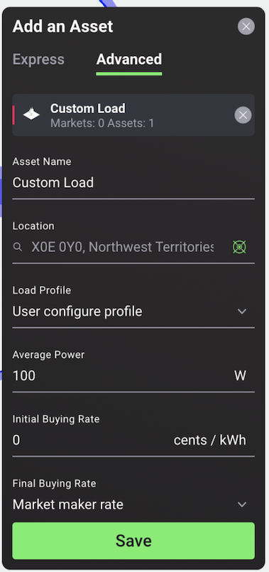

The load is an energy asset that consumes energy over time. It is possible to use a single load to represent an entire building’s consumption, as well as to configure multiple loads to represent different assets within a building (e.g. washing machine, air-conditioner, etc.).. Users are provided with template consumption load profiles from which they can choose those that are most suitable for the homes in their communities. The template consumption profiles are modelled using data from [Load Profile Generator](https://www.loadprofilegenerator.de/){target=_blank}. Users who want to upload their own consumption profile data can do so in the ‘upload profile’ section in the PV advanced settings, after initially selecting a template consumption profile.

##Asset Configuration Options

***Express Mode***

1. Name - Must be unique
2. Geo-tag - This automatically uploads the location a user selects

***Advanced Mode***

1. Load profile - Users can choose between user upload profile and user configure profile. User upload profile automatically loads as the template consumption profile selected, however this option also allows users to upload the data from their own consumption profile. User configure profile allows users to manually create a consumption profile by editing the load average power (W), the hours per day and the hours of day. The last option notably allows users to model disaggregated consuming devices such as a TV, Washing Machine, Boiler etc.
2. a) Upload Profile - This option appears if a user selects ‘user upload profile’. The template consumption profile selected automatically loads, or users can upload their own consumption load profile data here in a csv file (respecting the [required format](data-requirements.md).

   b) Average Power, Hours per day, Hours of day - These options appear if a user selects ‘user configure profile’.
      - Average power: Users can select the average consuming power of the load profile in Watts.
      - Hours per day: Users can select the  number of hours the load operates per day.
      - Hours of day: The time range in which the load operates.
3. Initial buying rate - Users can choose the initial energy buying rate for the beginning of each market slot in cents/kWh.
4. Final buying rate: Users can choose the final energy buying rate at the end of each market slot in cents/kWh. Users can enter a custom value or choose the Market Maker rate.
5. Rate increase - Explicit rate increase increment per update interval in cents/kWh
6. Fit to limits: If activated, a rate decrease per time is calculated, starting at initial buying rate and ending at final buying rate while updating the rate at each Update Interval. The bidding behaviour is derived from a linear fitted curve of a buying rate between initial_buying_rate and final_buying_rate within the bidding interval. If activated, energy rate_increase = (final_buying_rate - initial_buying_rate) / max(int((slot_length / update_interval) -1), 1)
7.Update interval - Users can choose the frequency at which the rate is updated.

***Figure 2.11***. *Consumption Load Profile Advanced Configuration Options*
