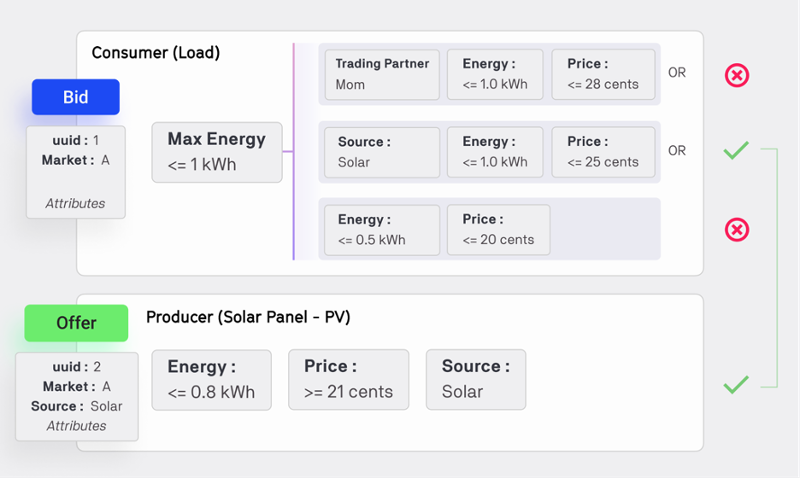

Through the Grid Singularity Exchange, and as permitted by local legislation, users can enjoy enhanced degrees of freedom, or choices to trade or share energy based on a set of preferences, such as energy quantity, price, source or preferred trading partner. The degrees of freedom are a key functionality of the [Symbiotic Energy Market](https://gridsingularity.medium.com/discussion-paper-grid-singularitys-implementation-of-symbiotic-energy-markets-bd3954af43c8){target=_blank}, a future decentralised market design we aim to enable to the extent that legislation in relevant markets allows people to have more energy choices. The implementation of a decentralised version of the Grid Singularity Exchange (GSy DEX) is described [here](blockchain.md).

A user might be interested to set trading preferences in order to prioritise consumption of green energy (i.e. solar, wind) over grey energy (i.e. coal) or in order to buy or sell energy directly to a friend or family member, for example.The [bids and offers](market-agent.md) for an energy asset include a set of attributes and requirements that reflect its owner’s trading preferences. Attributes are parameters currently supported only for offers, that describe the energy type of the offer posted, which is commonly associated with the energy source (e.g. PV, Wind, Hydro, Biomass, etc…). On the other hand, requirements are parameters associated with both bids and offers, and represent the trading preferences of the users. The currently supported requirements are the following:

- Offers:
     - Preferred trading partners: community participants the users wish to sell energy to;
- Bids:
     - Preferred trading partners: community participants the users wish to buy energy from;
     - Energy type: the energy source that the user prefers to consume (e.g. PV, Wind, Hydro, Biomass, etc.)
     - Energy: the maximum amount of energy that the user is willing to consume;
     - Price: the maximum price for energy that the user is willing to pay.

Naturally, attributes and requirements can be aggregated/grouped in different combinations to express customised trading preferences. The figure below displays an example of a bid and offer with attributes and requirements. The bid submits three sets of conditions that must be interpreted as OR statements, i.e. each condition must be assessed individually and each requirement of the condition must be fulfilled. In this example, the Consumer desires to buy up to 1.0 kWh from their Mom for a maximum of 28 cents OR up to 1.0 kWh of solar energy for a maximum of 25 cents OR up to 0.5 kWh of energy from any source for a maximum of 20 cents. The Producer has 0.8 kWh of solar energy to sell for no less than 21 cents.

In this case, the second condition is fulfilled by the offer, thus the two orders are successfully matched:

- The energy source (solar) is the same in the bid and the offer;
- The energy to be traded results in 0.8 kWh;
- The trading price can range between 21 and 25 cents and will be determined by the matching algorithm in place.

<figure markdown>
  {:text-align:center"}
  <figcaption><b>Figure 4.21</b>: Example of a bid and offer with attributes and requirements.
</figcaption>
</figure>

The [GSy Matching Engine](blockchain-system-components-overview.md) parses the order book and submits proposed bids and offers matches to the Grid Singularity Exchange via the Matching API. A verification function, integrated into the [exchange](blockchain.md), confirms that the attributes of the proposed bid and offer match satisfies each other’s respective requirements. The verification function accepts a bid / offer pair as input and, if the requirements are met, a trade is created. Otherwise, the trade is rejected.

Multi-attributed bids and offers are submitted through Grid Singularity’s existing [Asset API](configure-trading-strategies-walkthrough.md). For more information on how to add attributes and requirements to bids and offers by using the Asset API, please follow [this link](matching-api-template-script.md).
