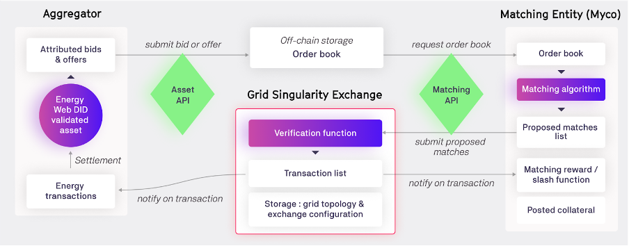

Grid Singularity Exchange is built as an [open source GPL v.3 codebase](https://github.com/gridsingularity/gsy-e){target=_blank} with [an interactive interface](https://map.gridsingularity.com/singularity-map){target=_blank} to simulate and operate interconnected, grid-aware energy marketplaces. The future market design implementation, termed Symbiotic Energy Markets, combines multi-attribute double-sided auctions, graph representations of the energy grid and the decentralised computation and verification enabled by blockchain. In the envisaged consumer-centric market design, spot, futures, settlement, and balancing markets are intertwined through the use of time slots, allowing market-driven pricing and accurate accounting of delivered energy. Individuals can optimise for their own multi-attribute objectives (e.g. green energy source, reduced energy bill, preferred trading partner) through degrees of freedom in the multi-attribute double auction with dynamic pricing. The grid is represented as a weighted graph, offering grid operators efficient management tools and allowing energy communities to interconnect and trade. The complexity of the matching algorithm is decoupled from the verification of transactions, with matching facilitated by third party matching algorithm providers, termed “matching engines”, enabling the exchange itself to operate on a blockchain. New energy market participants are rewarded for providing valuable services such as data and algorithms, while the roles of established market participants (aggregators, grid operators, utilities, and regulators) converge towards the individual and the community.

***Figure 1.1***: *Information flow between aggregator, Grid Singularity exchange and matching algorithm provider (to be sourced through Data and Algorithm Marketplace). IPFS or RDBMS will likely be used for off-chain storage of the order book. The matching algorithms will be run off-chain or in an instance of SubstraTEE. The Grid Singularity Exchange will operate as a pallet on a Substrate-based parachain or another network that provides the best security and privacy combined with execution efficiency.*

Grid Singularity is implementing Symbiotic Energy Markets in stages, adding or adapting modules to its codebase to take advantage of advancements in blockchain technology, [increasing regulatory interest to enable bottom-up markets](https://gridsingularity.medium.com/energy-communities-a-game-changer-for-the-european-electricity-grid-fd588a3063b0){target=_blank} and the proliferation of connected energy resources. We rely on open source innovation and ecosystem collaboration to develop an inclusive, efficient, accountable and secure energy exchange:

1. Inclusive

      - to all stakeholders, providing [barrier-free access](https://arxiv.org/pdf/2003.07940.pdf){target=_blank} for all market actors (established and new) including individuals and their communities, grid operators and utilities, trading algorithm providers, aggregators/energy management service providers, regulators, as well as diverse energy assets;

      - to any individual choice, allowing participants to trade and interact with energy based on their [personal preferences](https://arxiv.org/pdf/2003.07940.pdf){target=_blank} on a wide choice of attributes.

2. Efficient

      - physically, that the system accurately represents the grid topology and meets its [feasibility requirements](https://www.researchgate.net/publication/336868492_Safe_and_Private_Forward-Trading_Platform_for_Transactive_Microgrids){target=_blank}, ensuring supply-demand equilibrium to manage critical infrastructure including balancing services;

      - environmentally, prioritising local trading and sustainable energy sources, and enables market transformation to meet the UN Sustainable Development Goals of [affordable and clean energy and responsible production and consumption](https://sdgs.un.org/goals){target=_blank};

      - economically, [striving for advantageous market prices], a high rate of self-consumption, [individual rationality](https://www.academia.edu/34175250/A_systematic_study_of_double_auction_mechanisms_in_cloud_computing){target=_blank}, incentive compatibility and a large amount of energy traded yielding high self-sufficiency and liquidity.

3. Accountable

      - for settlement of energy usage (consumption and generation) and financial responsibility, providing confidentiality of personal data while delivering [transparency](https://arxiv.org/abs/1905.07940){target=_blank} of the auction process;

      - for audit of [transaction records](https://arxiv.org/pdf/2001.06882.pdf){target=_blank} by regulators without relying on a trusted third party and [nudge consumers to become more active players](https://www.beuc.eu/publications/beuc-x-2017-062_mst_energy_markets_of_the_future_-_how_the_eus_energy_transition_should_work_for_consumers.pdf){target=_blank};

4. Scalable

      - technically, structured modularly and without matching and arbitration turning into a [computational burden](https://www.sciencedirect.com/science/article/pii/S1364032119300462){target=_blank} for scenarios with many participants;

      - organisationally, allowing democratic deliberation and decisions on system upgrades;

5. Secure

      - to enable privacy, preserving the confidentiality of [personal data](https://arxiv.org/abs/1905.07940){target=_blank} and [authorising its access](https://aioti.eu/wp-content/uploads/2021/03/Open-Energy-Marketplaces-Evolution-Published.pdf){target=_blank} on demand;

      - against malicious activity, protecting the integrity of the market while enhancing [communication security](https://arxiv.org/pdf/1809.02609.pdf){target=_blank} in the network.

Our market design discussion paper explores how defined market requirements translate to the following functional capabilities, outlining the path forward to the deployment of the Symbiotic Energy Markets concept:

1. Validated market participation and asset ownership,

2. Degrees of freedom (choice of energy source, trading partner, etc.) with multi-attribute bids and offers,

3. Matching and arbitration by third party algorithm providers that can be fully decentralised,

4. A time-slot mechanism that allows for spot, futures, settlement (post-delivery) and balancing trading,

5. An accurate grid topology representation that takes into account physical constraints and is scalable,

6. Dynamic grid fees that allow grid operators to manage physical grid constraints,

7. A blockchain implementation for verification and storage of transactions and the grid topology in a deployed network, with decentralised blockchain architecture to allow deliberation and decisions on system changes,

8. Privacy and security considerations for the protection of sensitive user data,

9. A data and algorithm marketplace to inform and optimise market participation, and

10. Interoperable architecture to integrate existing and new business models, leading to a transformation of energy market roles.
