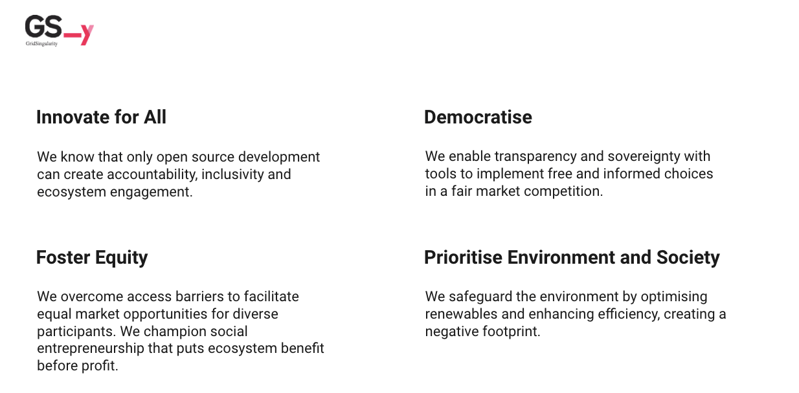

Grid Singularity is an [awarded](https://www.weforum.org/organizations/grid-singularity-gmbh-gsy-gmbh){target=_blank}, [open source](licensing.md){target=_blank} energy technology startup, placing the individual and the environment at the centre of the energy market by developing the [Grid Singularity Exchange](https://map.gridsingularity.com/singularity-map){target=_blank} and co-founding the [Energy Web Foundation (EWF)](https://www.energyweb.org/){target=_blank}. Grid Singularity simulates and operates interconnected grid-aware energy marketplaces enabling the utmost degrees of freedom in trading for any market participant. Our co-founders are seasoned energy market professionals and blockchain pioneers, who engaged a talented and diverse [team](https://gridsingularity.com/company/our-team){target=_blank} of energy design thinkers and developers, guided by the following principles:

***Grid Singularity’s mission is to build a sustainable, inclusive and democratic energy market that facilitates the ultimate degrees of freedom for the individual and the energy communities, allowing you to consume, trade or share energy based on your preferences of an energy type, location source, price or trading partner. You are energy.***

[The European Union](https://gridsingularity.medium.com/energy-communities-a-game-changer-for-the-european-electricity-grid-fd588a3063b0){target=_blank} and [other regulators](https://www.ferc.gov/media/ferc-order-no-2222-fact-sheet){target=_blank} are also supporting a bottom-up, user-centric market design, recognizing its diverse benefits:

Grid Singularity facilitates a bottom-up market design by connecting aggregators, which in turn connect households and distributed energy assets digitally represented by trading agents, and grid operators through an application interface ([Grid Operator API](implement-grid-fees-walkthrough.md) and [Asset API](configure-trading-strategies-walkthrough.md)).

- Economic, by incentivising prosumership and local production and consumption which is cheaper than buying/selling energy directly from the grid while taking into account a wider range of individual preferences;
- Environmental, optimising the use of green energy supply by fostering collective
self-consumption and increased investment in local renewable production;
- Social, promoting the creation of social energy networks by enabling energy exchange within a community and/or to support local initiatives, advancing community engagement and social inclusion.

Modelling simulation studies carried out by Grid Singularity and [German](https://gridsingularity.medium.com/modelling-study-to-assess-the-potential-benefits-of-trading-in-and-between-local-energy-d721395ddd4b){target=_blank} and [Dutch](https://gridsingularity.medium.com/an-energy-exchange-engine-for-local-energy-marketplaces-28d5be23705e){target=_blank} energy communities and utilities using real-world data have revealed that the activation of local energy markets via Grid Singularity Exchange can increase community self-sufficiency and self-consumption by [7.7% and 5.7%, respectively, and reduce energy bills by around 21%](https://gridsingularity.medium.com/modelling-study-to-assess-the-potential-benefits-of-trading-in-and-between-local-energy-d721395ddd4b){target=_blank}, which could be reinvested in additional storage or other distributed energy assets (DERs).

Grid operators can benefit from Grid Singularity Exchange to [reduce peak loading and congestion by purchasing grid balancing services and levying flexible grid fees](https://gridsingularity.medium.com/energy-singularity-challenge-2020-testing-novel-grid-fee-models-and-intelligent-peer-to-peer-6a0d715a9063){target=_blank}. The initial simulation experiments undertaken by Grid Singularity and German and Dutch energy grid operators revealed 10% reductions in peak loading and congestion, expected to improve with innovation in trading algorithms and grid tariff models.
