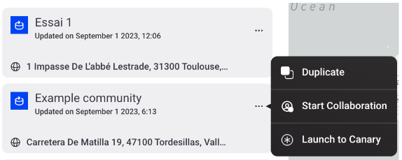

Any user can duplicate public simulations, in order to run different scenarios and compare or make changes to an existing simulation without losing the original configuration.

To duplicate a simulation, click the three dots on the ‘my communities’ list and select ‘Duplicate’. This will open the duplicate version of the simulation for editing.

<figure markdown>
  {:text-align:center"}
  <figcaption><b>Figure 3.16</b>: Duplicating simulations in the Grid Singularity’s simulation interface (Singularity Map)</figcaption>
</figure>
