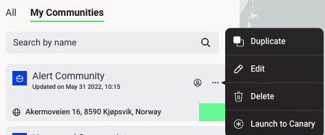

Any user can duplicate public simulations, in order to run different scenarios and compare or make changes to an existing simulation without losing the original configuration.

To duplicate a simulation, click the three dots and select ‘Duplicate’. This will open the duplicate version of the simulation for editing.

***Figure 2.30***. *Duplicate a simulation.*
