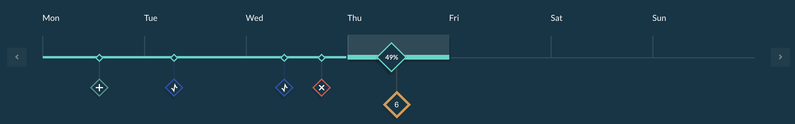

The user has the ability to make changes in the modelling page while the simulation is running. These changes are called **events**. To create an event the user can either go to the modelling page and make a change while the simulation is running or can pause the simulation beforehand and resume it when the change is done.

The possible events are : 

* Add & delete [areas](areas.md) and energy resources

* Change parameters of energy resources to the exception of their names and the [Market Maker](market-maker.md)

* Change parameters of areas to the exception of their names

* Add a library component (next deploy 0.7.0)

Once an event is set the user can track it on the timeline of the simulation. If the user click on the event while being on the modelling page she/he can view the grid setup at that specific time. If the user click on an event in the result page she/he will get the results of the specific areas / energy resources. 

{:style="height:50px;width:50px"} whenever an area or energy resource was **added**

{:style="height:50px;width:50px"} whenever an area or energy resource parameter was **modified**

{:style="height:50px;width:50px"} whenever an area or energy resource was **removed**

{:style="height:50px;width:50px"} whenever **multiple events** have been executed at the same time

