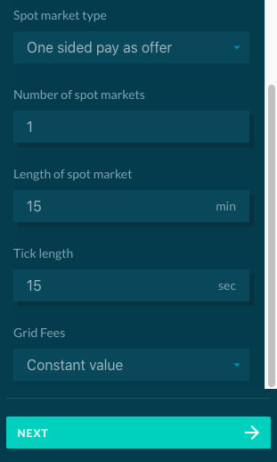

General Settings is where the general simulation parameters are set. The configuration will influence all markets and all devices in the simulation The following general settings can be set when creating a simulation:

- **Simulation name:** Please provide an unique name.

- **Description:** Description of the simulation (optional).

- **Project:** The user can select a project folder in which this simulation is saved.

- **Start date:** Simulation start date (please make sure that the date-stamp of any uploaded data coincides with the start date → end date).

- **End date:** Simulation end date. The user can simulate up to 7 days. 

- **Solar profile**:  Sets the production curve for all PVs in the configuration that don't have individual production curves. Select one the following possible configurations:
    - Sunny (generation profile with 250W panel) 
    - Cloudy (generation profile with 250W panel)
    - Partially Cloudy (generation profile with 250W panel)
    - Gaussian (the user can define the power output of the panel)
    - Upload a profile (a custom default PV production curve can be uploaded as described in [Upload File Formats](upload-file-formats.md))

- **Spot market type:** The user can select one of 3 types of market: [One sided pay as offer](one-sided-pay-as-offer.md), [Two sided pay as bid](two-sided-pay-as-bid.md) and [Two sided pay as clear](two-sided-pay-as-clear.md).

- **Number of spot markets:** Number of future spot markets in which the devices and agents can trade.

- **Length of market slot:** Duration of each spot market. Should be between 2 and 60 minutes.

- **Tick length:** Amount of time between two "heartbeats" of the simulation, influences e.g. the number of price updates.

The interface for selecting general settings is shown below:

