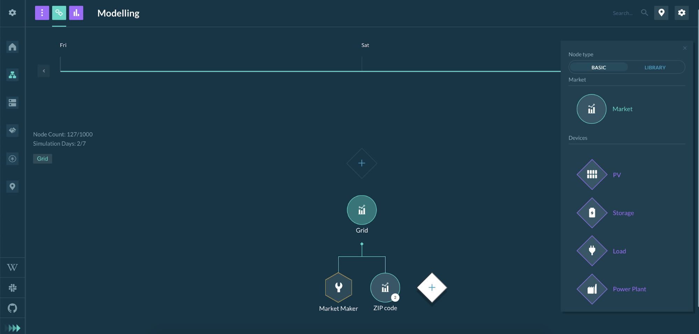

Grid Singularity exchange engine can be used to simulate, collaborate and optimize grid-aware local energy markets (LEMs). The simulation tool is freely available through our User Interface (UI) at [map.gridsingularity](https://map.gridsingularity.com/singularity-map){target=_blank} and our [backend codebase](https://github.com/gridsingularity/gsy-e){target=_blank} is open source under [GNU general public license](https://www.gnu.org/licenses/gpl-3.0.en.html){target=_blank}.

This section will focus on a step-by-step guide to create and simulate LEMs using our software, starting with an explanation and guide for the UI, followed by a more technical tutorial to reproduce in the backend.

## User-Interface Simulation Configuration

When creating a new simulation, simulation collaboration or a simulation in the Canary Test Network, the user needs to define the following general settings:

*   **Simulation name**: Please provide a unique name.
*   **Description**: Description of the simulation (optional but encouraged to clarify the intent of the simulation).
*   **Project**: The user can select a project folder where the simulation is saved.
*   **Start date**: Simulation start date (please make sure that the date-stamp of any uploaded data coincides with the defined start and end date).
*   **End date**: Simulation end date. The user can simulate up to 7 days of LEM trading.
*   **Solar profile**: Sets a template production curve for all photovoltaics (PVs) without custom production curves. Select one the following possible configurations:
    *   Sunny (generation profile with 250W panel)
    *   Cloudy (generation profile with 250W panel)
    *   Partially Cloudy (generation profile with 250W panel)
    *   Gaussian (the user can define the panel power output)
    *   Upload a profile (a custom default PV production curve can be uploaded as described in [Upload File Formats](upload-file-formats.md))
*   **Spot market type**: The user can select one of three market types: [One-sided pay-as-offer](market-types.md#one-sided-pay-as-offer-market), [Two-sided pay-as-bid](market-types.md#two-sided-pay-as-bid-market) and [Two-sided pay-as-clear](market-types.md#two-sided-pay-as-clear-market).
*   **Number of spot markets**: Number of future spot markets where the energy assets and agents can trade.
*   **Duration of market slot**: Duration of each spot market,between 2 and 60 minutes. Default is set to 15 minutes.
*   **Tick duration**: Amount of time between two increments of each market slot when trades are cleared or agent trading rates are updated. Default duration is 15 simulated seconds, yielding 60 ticks per market slot.
*   **Grid Fees**: The user can select one of two types: [Constant grid fee](grid-fee-accounting.md#constant-grid-fee-calculation) or [Percentage grid fee](grid-fee-accounting.md#percentage-grid-fee-calculation)

The interface for selecting general settings is shown below:

{:style="height:550px;width:275px"}
{:style="height:450px;width:275px"}

Once the general settings of the simulation are defined, the user can move to the modelling page and set up the grid architecture by adding Markets and Energy Assets. Each market or energy asset is considered as **1 node**. At the moment, up to 1000 nodes can be configured.




Markets contain a [spot market](markets.md) where all connected energy assets, submarkets and parent markets trade energy. Markets can potentially house multiple submarkets of different market types, and this feature will be available in the future version of our software.

After adding the first market the user has to select a [Market Maker](model-market-maker.md) rate. Subsequently, the user can model the simulation by configuring multiple submarkets and energy assets in a hierarchical electrical grid.

Once the modelling is completed, the user goes to the [Results page](results.md) to initiate the simulation and view results.

## Backend Simulation Configuration

In the backend, the simulation process is slightly different. There is no need to login to set up a simulation. The user first needs to download the code from our Github Repository (Installation Instructions for [Linux](linux-installation-instructions.md), [Mac](ios-installation-instructions.md) and [Windows](vm-installation-instructions.md)). In the setup-file (in Python programming language), general and [trading strategy](trading-agents-and-strategies) settings can be defined. Examples can be found in the relevant [Grid Singularity GitHub](https://github.com/gridsingularity/gsy-e/tree/master/src/gsy_e/setup){target=_blank} folder.

This is the most basic skeleton for a setup-file:

```python
```python
from gsy_e.models.area import Area
def get_setup(config):
    area = Area('Grid', [])
    return area
```

The user can add more nested submarkets recursively by adding more instances of `Area` to the second parameter (list) of the `Area` class. If the strategy parameter is set in the `Area` class, the area is converted to a leaf node, e.g. a load. The following grid architecture is given:

*   Grid
    *   House 1
        *   H1 General Load
        *   H1 Storage 1
        *   H1 Storage 2
    *   House 2
        *   H2 General Load

Bold instances in the outline above are markets (`Area` component). For each of these markets, a [market agent](trading-agents-and-strategies.md) is created in the background to execute offer/bid forwarding and matching.

In the following, the corresponding setup-file is shown.

```python
```python
from gsy_e.models.area import Area
from d3a.models.strategy.storage import StorageStrategy
from gsy_e.models.strategy.load_hours import LoadHoursStrategy
from d3a.models.strategy.pv import PVStrategy


def get_setup(config):
    area = Area(
        'Grid',
        [
            Area(
                'House 1',
                [
                    Area('H1 General Load', strategy=LoadHoursStrategy(avg_power_W=200,
                                                                       hrs_per_day=6,
                                                                       hrs_of_day=list(
                                                                           range(12, 18)),
                                                                       final_buying_rate=35)
                         ),
                    Area('H1 Storage1', strategy=StorageStrategy(initial_soc=50)
                         ),
                    Area('H1 Storage2', strategy=StorageStrategy(initial_soc=50)
                         ),
                ],
                grid_fee_pct=0, grid_fee_const=0,
            ),
            Area(
                'House 2',
                [
                    Area('H2 General Load', strategy=LoadHoursStrategy(avg_power_W=200,
                                                                       hrs_per_day=4,
                                                                       hrs_of_day=list(
                                                                           range(12, 16)),
                                                                       final_buying_rate=35)
                         ),
                    Area('H2 PV', strategy=PVStrategy(panel_count=4, initial_selling_rate=30,
                                                      final_selling_rate=5)
                         ),

                ],
                grid_fee_pct=0, grid_fee_const=0,

            ),

        ],
        config=config
    )
    return area
```

Additionally the user has the possibility to change the default general settings in two different ways:

1. Setup file (best option)
2. d3a-setting.json

### setup-file (best option):

For a description of each grid component please see the **Modelling** section.

The user can overwrite the configuration settings by changing variables of the [ConstSettings](https://github.com/gridsingularity/d3a-interface/blob/master/d3a_interface/constants_limits.py){target=_blank} class in the setup-file. This class defines the default values for various parameters (general simulation settings, market settings and energy asset configuration). For instance, the user can define multiple configuration parameters in the get_setup function by overwriting the[ ConstSettings](https://github.com/gridsingularity/d3a-interface/blob/master/d3a_interface/constants_limits.py){target=_blank} default values. For example, the following parameters can be set :

* Market_type (if equal to 1: [One-Sided Pay-as-Offer](market-types.md#one-sided-pay-as-offer-market), if equal to 2 : [Two-Sided Pay-as-Bid](market-types.md#two-sided-pay-as-bid-market), if equal to 3 : [Two-Sided Pay-as-Clear](market-types.md#two-sided-pay-as-clear-market))
* Grid_fee_type (if equal to 1: [Constant grid fee](grid-fee-accounting.md#constant-grid-fee-calculation), if equal to 2 : [Percentage grid fee](grid-fee-accounting.md#percentage-grid-fee-calculation))

Here is an example to setup a simulation with the Two-Sided Pay-as-Bid market type, constant grid fee and default min (0cts/kWh) and max to (35cts/kWh) energy rate for all [loads](consumption.md):

```python
from gsy_framework.constants_limits import ConstSettings
def get_setup(config):
    ConstSettings.MASettings.MARKET_TYPE = 2
    ConstSettings.LoadSettings.MIN_ENERGY_RATE = 0
    ConstSettings.LoadSettings.MAX_ENERGY_RATE = 35
    ConstSettings.MASettings.GRID_FEE_TYPE = 1
```

### d3a-settings.json

These general settings can also be parsed via a settings file in JSON format, which contains all constants in the advanced_settings branch. An example can be found here: src/d3a/setup/d3a-settings.json The settings JSON file can be parsed via the --settings-file keyword

#### Setting General Configuration Parameters

The following parameters are part of [Simulation Config](https://github.com/gridsingularity/gsy-e/blob/master/src/gsy_e/models/config.py#L32){target=_blank} and are initialised before updating any [ConstSettings](https://github.com/gridsingularity/gsy-framework/blob/master/gsy_framework/constants_limits.py){target=_blank}:

*   sim_duration
*   slot_length
*   tick_length
*   cloud_coverage*
*   market_maker_rate*
*   grid_fee_pct*
*   grid_fee_const*
*   pv_user_profile*
*   max_panel_power_W

In order to update some of these parameters (starred in list above), please use `update_config_parameters` method to update the general configuration parameters in the setup file:

```python
def get_setup(config):
    config.update_config_parameters(grid_fee_pct=5,
                                    grid_fee_const=35,
                                    cloud_coverage=2,
                                    pv_user_profile="<path>/<profile_name>",
                                    market_maker_rate=30)
   area = Area(
        'Grid',
        [
            Area('General Load', strategy=LoadHoursStrategy(avg_power_W=200,
                                                            hrs_per_day=4,
                                                            hrs_of_day=list(range(12, 16)),
                                                            final_buying_rate=35)
                 ),
            Area('PV', strategy=PVStrategy(4, 80)
                 ),
        ],
        config=config
    )
    return area
```

#### Simulation launch

Once the entire grid architecture is modelled, including energy assets, the user can launch the trading simulation by running a command line including desired setup features:

*   -d, --duration: simulated duration of simulation [default: 1d]
*   -t, --tick-length: simulated duration of a tick [default: 1s]
*   -s, --slot-length: simulated duration of a market slot [default: 15m]
*   -c, --cloud-coverage: Cloud coverage, 0 for sunny, 1 for partial coverage, 2 for clouds. [default: 0]
*   --slot-length-realtime: Desired duration of slot in realtime [default: 0s]

Example simulation call:
```commandline
d3a -l ERROR run --duration=1d --tick-length=1s --slot-length=15m --cloud-coverage=0 --setup default_2a
```

Getting help in the command line:

```commandline
d3a --help returns:
```

```
Usage: d3a [OPTIONS] COMMAND [ARGS]...


Options:

  -l, --log-level [CRITICAL|FATAL|ERROR|WARN|WARNING|INFO|DEBUG|NOTSET|TRACE]

                                  Log level  [default: INFO]

  --help                          Show this message and exit.

Commands:

  run*

  resume

d3a run --help returns:

Usage: d3a run [OPTIONS]

Options:

  -d, --duration INTERVAL       Duration of simulation  [default: 1d]

  -t, --tick-length INTERVAL    Length of a tick  [default: 1s]

  -s, --slot-length INTERVAL    Length of a market slot  [default: 15m]

--slot-length-realtime INTERVAL

                                  Desired duration of slot in realtime  [default: 0s]

  -c, --cloud-coverage INTEGER  Cloud coverage, 0 for sunny, 1 for partial coverage, 2 for clouds.  [default: 0]

  --setup TEXT                  Simulation setup module use. Available modules: [1000_houses,

                                market_events.cloud_coverage_event, market_events.disable_interval_event,

                                market_events.disconnect_interval_event, market_events.isolated_connect_event,

                                market_events.isolated_disable_event, market_events.isolated_disconnect_event,

                                market_events.isolated_enable_event, market_events.load_event, market_events.pv_event,

                                market_events.storage_event, balancing_market.default_2a,

                                balancing_market.one_load_one_pv, balancing_market.one_load_one_storage,

                                balancing_market.one_storage_one_pv, balancing_market.test_asset_registry,

                                balancing_market.two_sided_one_load_one_pv, config_parameter_test, default_2,

                                default_2a, default_2b, default_3, default_3_pv_only, default_3a, default_3b,

                                default_4, default_5, default_addcurve, default_addcurve2, default_csv,

                                graphs_testing, jira.d3asim_1024, jira.d3asim_1139, jira.d3asim_638_custom_load,

                                jira.d3asim_639_custom_storage, jira.d3asim_640_custom_pv, jira.d3asim_778,

                                jira.d3asim_780, jira.d3asim_869, jira.d3asim_871, jira.d3asim_895,

                                jira.d3asim_895_pr1, jira.d3asim_895_pr2, jira.d3asim_895_pr3, jira.d3asim_962,

                                jira.default_2off_d3asim_1475, jira.default_595, jira.default_611, jira.default_613,

                                jira.default_623, jira.default_645, jira.default_737, jira.test_strategy_custom_load,

                                jira.test_strategy_custom_pv, jira.test_strategy_custom_storage, json_arg, json_file,

                                non_compounded_grid_fees, redis_communication_default_2a, sam_config,

                                sam_config_const_load, sam_config_small,

                                strategy_tests.commercial_producer_market_maker_rate,

                                strategy_tests.ess_capacity_based_sell_offer,

                                strategy_tests.ess_sell_offer_decrease_based_on_risk_or_rate,

                                strategy_tests.finite_power_plant, strategy_tests.finite_power_plant_profile,

                                strategy_tests.home_cp_ess_load, strategy_tests.home_hybrid_pv_ess_load,

                                strategy_tests.infinite_bus, strategy_tests.predefined_pv_test,

                                strategy_tests.pv_const_price_decrease, strategy_tests.pv_final_selling_rate,

                                strategy_tests.pv_initial_pv_rate_option, strategy_tests.pv_max_panel_output,

                                strategy_tests.pv_max_panel_power_global, strategy_tests.pv_risk_based_price_decrease,

                                strategy_tests.storage_buys_and_offers,

                                strategy_tests.storage_strategy_break_even_hourly,

                                strategy_tests.user_profile_load_csv, strategy_tests.user_profile_load_csv_multiday,

                                strategy_tests.user_profile_load_dict, strategy_tests.user_profile_pv_csv,

                                strategy_tests.user_profile_pv_dict, strategy_tests.user_profile_wind_csv,

                                strategy_tests.user_rate_profile_load_dict, tobalaba.one_producer_load,

                                two_sided_market.default_2a, two_sided_market.infinite_bus,

                                two_sided_market.offer_reposted_at_old_offer_rate, two_sided_market.one_cep_one_load,

                                two_sided_market.one_load_5_pv_partial, two_sided_market.one_load_one_storage,

                                two_sided_market.one_pv_one_load, two_sided_market.one_pv_one_storage,

                                two_sided_market.one_storage_5_pv_partial,

                                two_sided_market.user_min_rate_profile_load_dict,

                                two_sided_market.with_balancing_market, two_sided_pay_as_clear.default_2a,

                                two_sided_pay_as_clear.test_clearing_energy]

  -g, --settings-file TEXT      Settings file path

  --seed TEXT                   Manually specify random seed

  --paused                      Start simulation in paused state  [default: False]

  --pause-at TEXT               Automatically pause at a certain time. Accepted Input formats: (YYYY-MM-DD, HH:mm)

                                [default: disabled]

  --repl / --no-repl            Start REPL after simulation run.  [default: False]

  --no-export                   Skip export of simulation data

  --export-path TEXT            Specify a path for the csv export files (default: ~/d3a-simulation)

  --enable-bc                   Run simulation on Blockchain

  --start-date DATE             Start date of the Simulation (YYYY-MM-DD)  [default: 2019-09-27]

  --help                        Show this message and exit.
```
