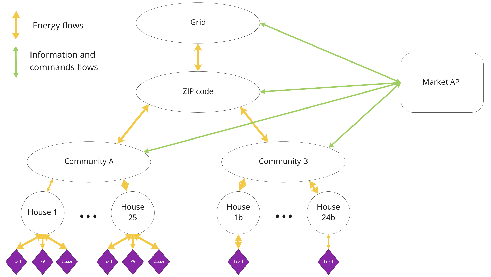
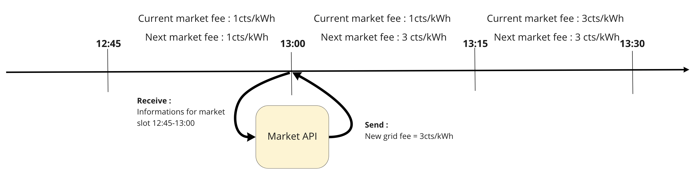

# Market API documentation
The D3A API client allows you to create agents that manage different markets. The agent can request and receive information through the API, feed that information into a tariff model, and change grid fees on a live simulated exchange. The grid API is designed for grid operators to manage a specific market. The structure is designed so that multiple markets can be managed with a single script. Notably this allows markets to share information in order to have a better overall grid management. This document covers installation and descriptions of the functions available.




### API Client Installation

#### Install Redis server. Open a new terminal and type
``` 
brew install redis
```

#### Install d3a-client
```
mkvirtualenv d3a-api-env
pip install git+https://github.com/gridsingularity/d3a-api-client.git
```

#### Update d3a-client (as needed when an update is deployed)

```
pip uninstall d3a-api-client
pip install git+https://github.com/gridsingularity/d3a-api-client.git
```


### API command
The grid api can function once at the end of every market slots. When a the current market is finished the client will get notified via an event. It is possible to capture this event and perform operations after it by overriding the on_market_cycle method.

Ex: `def on_market_cycle(self, market_info):`

The market API can send batch command, grouping different command, for different markets. 3 different commands are available : 


#### market stats
This command is used to request information from different market for the last market slot. 

A batch_command dictionary structure is used and the response is stored in a variable :

```python
batch_commands[area_uuid].append({"type": "market_stats","data": {"market_slots": market_slot}})

self.market_stats = self.batch_command(batch_commands_stats)
```


#### dso market stats
This command is used to request information from different market for the last market slot. With this command the client receive additional information (e.g. import and export of the market)

A batch_command dictionary structure is used and the response is stored in a variable :

```python
batch_commands_stats[area_uuid].append({"type": "dso_market_stats", "data": {"market_slots": market_slot}})

self.dso_stats = self.batch_command(batch_commands_stats)["responses"]
```


#### grid fee
This command is used to send the new grid fee for a specific market. The grid fee needs to be sent as an integer and the unit is cents/kWh.

A batch_command dictionary structure is used :

```python
batch_commands[area_uuid].append({"type": "grid_fees", "data": {"fee_const": self.next_fee}})

self.batch_command(batch_commands)
```

### Information
The market api receives information concerning the markets that it manages. Different metrics are shared through the API :

* Minimum, median, average and maximum trade price [€/kWh]
* Total energy volume traded [kWh]
* Self sufficiency [%]
* Import / Export [kWh]
* Current market fee [cents/kWh]
* Next market fee [cents/kWh]


### Interaction with the running exchange

As explained above the Market API function at the end of each market slot. Let's take the following example and operations' order:



1. At the end of the market slot 12:45, the Market API function `on_market_cycle` is triggered.
2. In results Client will request and receive information of the last market slot (12:45-13:00).
3. Based on these information the Client script set new grid fee for the markets it manages.
4. Since the new grid fees are sent at 13:00 they will be actually applied at 13:15 (15min delay)