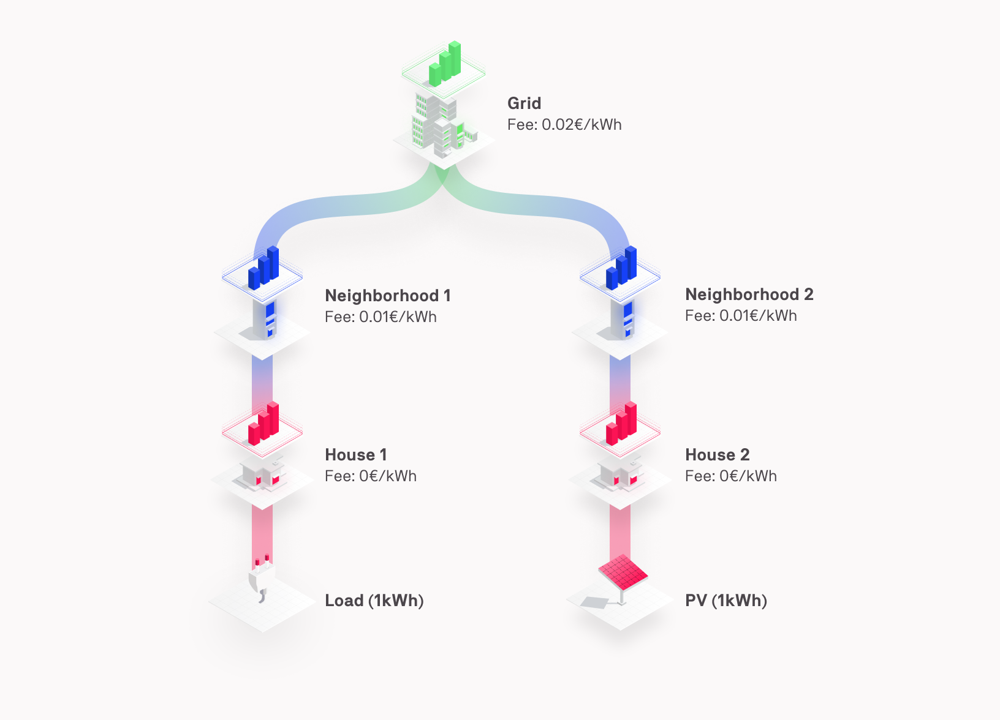
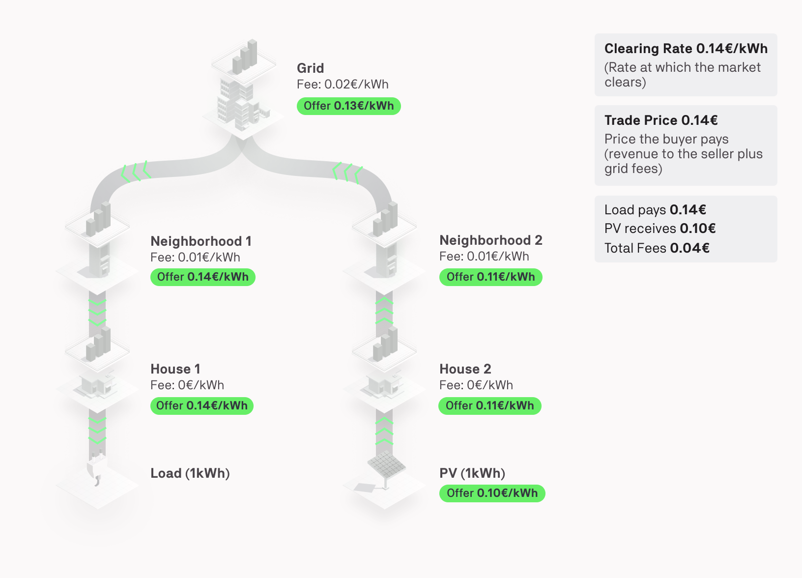
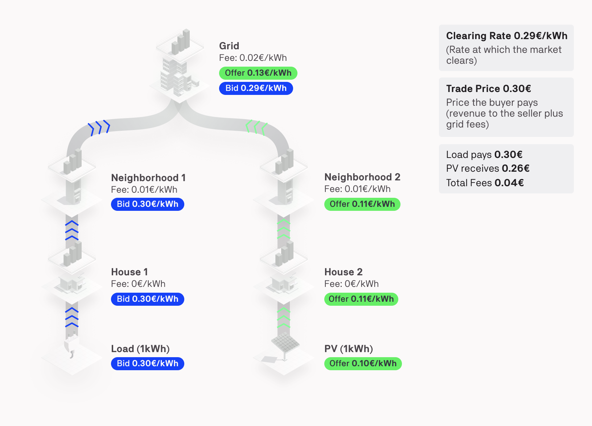
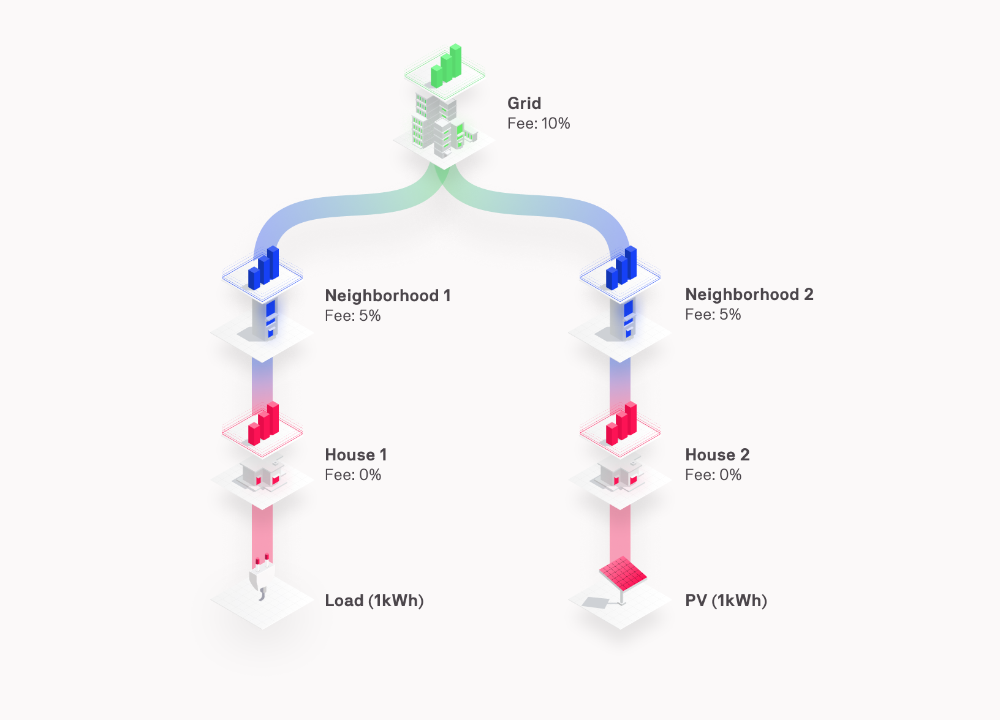
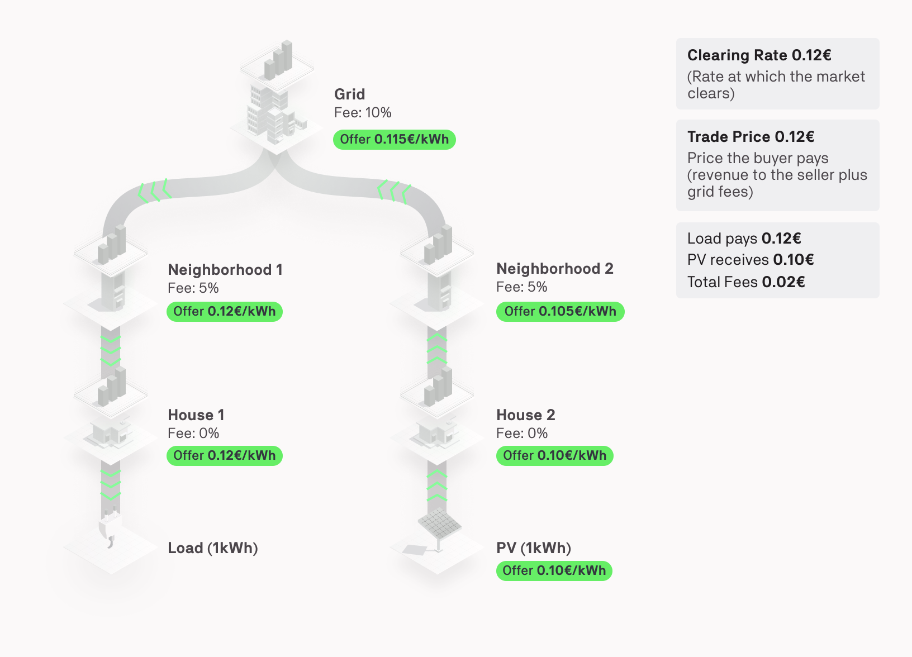
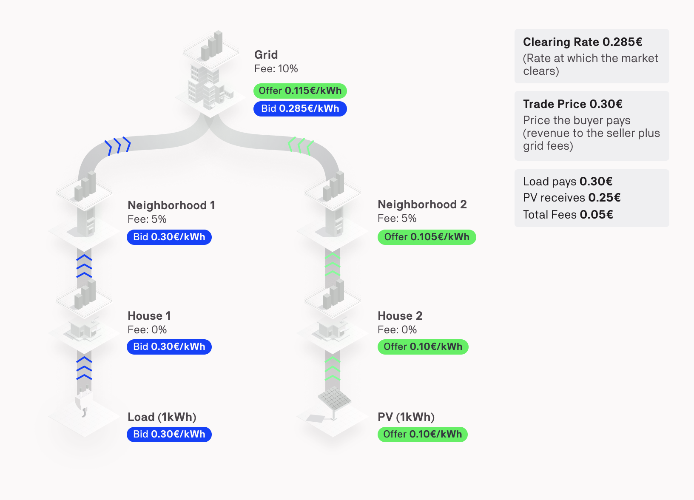

## Grid Fee Objectives

Grid operators (Distribution and Transmission System Operators - DSOs and TSOs - or Independent System Operators - ISOs in the USA) are tasked to monitor and manage the electrical grid. It is their responsibility to ensure a connection for end-users on the distribution network along with energy transport security. Grid operators use grid fees to cover the cost of managing their grid infrastructure. Lately, due to the heightened pace of innovation, increased demand and investment in distributed energy resources (DERs), grid operators face many challenges, such as lines and transformers congestion at specific times of the day. One solution is to use grid fees as a tool to actively manage grid congestion by increasing and reducing the fee during the day, week or year. Increasing the fee at peak transmission and reducing the price during off-peak periods makes it financially attractive for end-users to use flexible energy assets (e.g. batteries, EVs, heat-pumps) to provide [demand response services](https://gridsingularity.medium.com/a-case-for-flexibility-markets-enabled-by-local-peer-to-peer-exchanges-43300b625cb5){target=_blank} and reduce reliance on the grid.

Grid Singularity offers an environment to simulate, test and optimise grid fee incentives for local energy markets (LEMs) At the moment a grid fee can be set as a market fee, namely a fee that is added to each trade that is cleared. The buyer of energy is responsible for paying all the grid fees: bid’s price >= offer’s price + grid fee. Two types of market fees can be implemented:

* [Constant grid fee](grid-fee-accounting.md#constant-grid-fee-calculation): constant value in cents/kWh that is added to each trade;
* [Percentage grid fee](grid-fee-accounting.md#percentage-grid-fee-calculation): percentage value determined by the clearing price that is added to each trade.

The following [article](https://gridsingularity.medium.com/energy-singularity-challenge-2020-testing-novel-grid-fee-models-and-intelligent-peer-to-peer-6a0d715a9063){target=_blank} explains how flexible grid fees may be implemented towards peak reduction.

For a video tutorial on how to set grid fees in the Grid Singularity exchange, please follow this [link](https://youtu.be/WhT3eJ9RdSk){target=_blank}.


## Constant Grid Fee Calculation

The constant grid fee is a market based fee, defined in €/kWh and added to each trade that is cleared, as shown in the figure below.


<figure markdown>
  {:text-align:center"}
  <figcaption><b>Figure 3.15</b>: Constant grid fee calculation in the Grid Singularity Exchange
</figcaption>
</figure>


The rate of a bid or offer changes as that bid or offer is propagated into different markets. The offer rate increases to account for the added fees for the relevant market, ensuring that the seller receives a revenue equal or greater than the original offer. The bid rate decreases for the same reason.


<figure markdown>
  {:text-align:center"}
  <figcaption><b>Figure 3.16</b>: Constant Grid Fee Example Calculation in One-Sided Pay-as-Offer Market
</figcaption>
</figure>


In an [One-Sided Pay-as-Offer market](market-types.md#one-sided-pay-as-offer-market), there are no bids, only offers. Offers are propagated throughout the markets in the hierarchy shown in the figure above. Grid fees are accounted for when an offer is forwarded to the higher market, adding that market’s grid fees to any previously accumulated fees. The formula to calculate the new offer rate when placing an offer to a higher market is the following:

```offer_rate_after_fees (€/kWh) = offer_rate (€/kWh) + grid_fee (€/kWh)```

If the offer is not purchased after two ticks, it is moved into the next market, with the total rate incremented by the amount of that market's grid fee. In the example above, the PV offer of 0.10 €/kWh is first placed into the House 2 Market where it gains zero fees. Then it moves into the Neighbourhood 2 Market, gaining a fee of 0.01 €/kWh to become 0.11 €/kWh. Then, if not purchased, it moves into the [Grid Market](grid-market-settings.md), gaining a fee of 0.02 €/kWh to become 0.13 €/kWh. Continuing into the Neighbourhood 1 Market, the offer gains a fee of 0.01 €/kWh to become 0.14 €/kWh. Continuing into the House 1 Market, the offer gains zero fees. The Load ultimately buys the offer in the House 1 Market at the Clearing Rate of 0.14 €/kWh.

The trade price is calculated by adding the original offer rate (`0.10 €/kWh`) and the total fees (`(0.01+0.02+0.01) = 0.04 €/kWh`), then multiplying by the amount of energy traded (`1 kWh`) to yield the Trade Price of 0.14€.

The Load pays the Trade Price of 0.14€, which includes 0.10€ revenue for the PV, 0.01€ fees for the Neighbourhood Market 1, 0.02€ fees for the [Grid Market](grid-market-settings.md), and 0.01€ fees for the Neighbourhood Market 2.


Since the market type is pay-as-offer, the offer rate is used as the clearing rate. The grid fees are added to the offer rate to determine the trade rate and therefore the trade price in each market. The following formula is used:

```
supply_side_fee (€/kWh) = forwarded_offer_rate (€/kWh) - original_offer_rate (€/kWh)
trade_rate (€/kWh) = clearing rate (€/kWh)
trade_price (€) = energy (kWh) * trade_rate (€/kWh)
```
For the provided example, the trade price for each market is:
```
Market_trade_price (€) = (original_offer_rate (€/kWh) + supply_side_fee (€/kWh)) * energy (kWh)

Grid Market = (0.10 + 0.03)*1 = 0.13,
Neighbourhood 2 Market = (0.10 + 0.01)*1 = 0.11,
Neighbourhood 1 Market = (0.10 + 0.04)*1 = 0.14,
Home 1 Market = (0.10 + 0.04)*1 = 0.14,
Home 2 Market = (0.10 + 0)*1 = 0.10.
```


<figure markdown>
  {:text-align:center"}
  <figcaption><b>Figure 3.17</b>: Constant Grid Fee Example Calculation in Two-Sided Pay-as-Bid Market
</figcaption>
</figure>

In the [Two-Sided Pay-as-Bid](market-types.md#two-sided-pay-as-bid-market) market, there are both bids and offers, and both are propagated through the markets in the hierarchy. If a bid or offer is not matched after two ticks, it is moved into the next market. In order to prevent the double accounting of a market's grid fee when a bid and an offer are matched in that market, market fees are added to offers when they enter a new market (target market), and they are subtracted from bids when they leave a market (source market) and enter another one. The formula for propagating the offers is the same as for the one-sided market:

```offer_rate_after_fees (€/kWh) = offer_rate (€/kWh) + grid_fee (€/kWh)```

The MarketAgent subtracts the fees from the bid before propagating the bid to the higher market, based on the following formula:

```bid_rate_after_fees (€/kWh) = bid_rate (€/kWh) - grid_fee (€/kWh)```

In the case of a Two-Sided Pay-as-Bid market, the offer is moved into the [Grid Market](grid-market-settings.md) by the same mechanism as in the [One-Sided Pay-as-Offer](market-types.md#one-sided-pay-as-offer-market) market. The bid of 0.30 €/kWh is placed into the House 1 Market where there are zero fees. If it is not purchased after two ticks, it is moved into the Neighbourhood 1 Market. As explained above, only the fees from the source market are added, which are zero in this case. Hence the bid rate remains 0.30 €/kWh. Next, the bid is moved into the Grid Market, where its value is reduced by the amount of the fees of its source market, the Neighbourhood 1 Market at 0.01 €/kWh, resulting in a rate of 0.29 €/kWh as it enters the Grid Market.

In the example above, the bid and offer are matched in the Grid Market. When the offer entered the Grid Market, its rate was immediately updated to account for the Grid Market fees (0.11 + 0.02). The bid was not updated, and if it  was not matched in the Grid Market and moved to the Neighbourhood 2 Market, the 0.02 €/kWh fee from the Grid Market would be subtracted to become (0.29 - 0.02) 0.27 €/kWh. The fees from the Neighbourhood 2 Market would not be added to the bid unless it entered the House 2 Market (fees added according to the source market).

In the Grid Market, the Load bid rate is listed as 0.29 €/kWh and the PV offer as 0.13 €/kWh. As the bid’s rate is greater than the offer’s rate, a trade can be scheduled. The trade clears at the bid’s rate, resulting in a Clearing Rate of 0.29 €/kWh.

The Grid Singularity exchange includes an algorithm that calculates the grid fee according to the clearing rate, basing the calculation on the original bid and offer rates. This allows the markets to act more independently and in a decentralised manner, without having to share information regarding their fees with other markets. The algorithm formula is as follows:
```
demand_side_fee (€/kWh) = original_bid_rate (€/kWh) - forwarded_bid_rate (€/kWh)
supply_side_fee (€/kWh) = forwarded_offer_rate (€/kWh) - original_offer_rate (€/kWh)
```
For the example, we have the following values:
```
supply_side_fee = 0.13 - 0.10 = 0.03 €/kWh
demand_side_fee = 0.30 - 0.29 = 0.01 €/kWh
```
After calculating the supply and demand side fee, the trade revenue can be calculated. Note that the original_trade_rate is the amount that the original buyer (in our case the Load) will need to pay, therefore in the Pay-as-Bid market type this is the original bid price. The formula is the following:
```
total_fee (€/kWh) = supply_side_fee (€/kWh) + demand_side_fee (€/kWh)
revenue_rate (€/kWh) = original_trade_rate (€/kWh) - total_fee (€/kWh)
```
For the example, the revenue will be:
```
revenue = 0.30 - 0.04 = 0.26 €/kWh
```

Finally, the trade rate is adapted according to the supply side fee, in order to include the fees of the current market:
```
trade_rate (€/kWh) = revenue_rate (€/kWh) + supply_side_fee (€/kWh)
trade_price (€) = energy (kWh) * trade_rate (€/kWh)
```

For our example, the trade price for each market is:
```
Market_trade_price (€) = (revenue_rate (€/kWh) + supply_side_fee (€/kWh)) * energy (kWh)

Grid Market = (0.26 + 0.03)*1 = 0.29,
Neighbourhood 2 Market = (0.26 + 0.01)*1 = 0.27,
Neighbourhood 1 Market = (0.26 + 0.04)*1 = 0.30,
House 1 Market = (0.26 + 0.04)*1 = 0.30,
House 2 Market = (0.26 + 0)*1 = 0.26.
```
The Load pays the Trade Price of 0.30€, which includes 0.26€ revenue for the PV, 0.01€ fees for Neighbourhood Market 1, 0.02€ fees for the Grid Market, and 0.01€ fees for the Neighbourhood Market 2.


## Percentage Grid Fee Calculation

 The percentage grid fee is a market based fee, defined as a ratio (%) of the clearing price that is added to each trade that is cleared, as shown in the figure below.


<figure markdown>
  {:text-align:center"}
  <figcaption><b>Figure 3.18</b>: Percentage grid fee calculation in the Grid Singularity Exchange
</figcaption>
</figure>


The price of a bid or offer changes as it is propagated into different markets to account for market fees. This way, a trading agent posting an offer will never receive less than offered and an agent making a bid will never pay more than bid.


<figure markdown>
  {:text-align:center"}
  <figcaption><b>Figure 3.19</b>: Percentage Grid Fee Example Calculation in One-Sided Pay-as-Offer Market
</figcaption>
</figure>


In the [One-Sided Pay-as-Offer](market-types.md#one-sided-pay-as-offer-market) market, there are no bids, only offers. The offers are propagated throughout the markets in the hierarchy. The grid fees are taken into account when an offer is forwarded to the higher market, by the higher market itself. Therefore the agent is not responsible for adapting the offer price to include the grid fees. The grid fees' unit is a ratio of the original offer price, therefore the formula to calculate the new offer price when placing an offer to a market is the following:

```
offer_price_after_fees = offer_price + original_offer_price * grid_fee_ratio
```

If the offer is not purchased after two [ticks](market-types.md#market-ticks), it is moved into the next market, where the price is increased by that market’s grid fee. In the provided example, the PV offer of 0.10€ is first placed in the House 2 Market where it gains zero fees. Then it propagates into the Neighbourhood 2 Market, gaining the market’s fee of 5% of the original offer price `0.10*0.05+0.10=0.105€`.  If unmatched, it propagates into the [Grid Market](grid-market-settings.md), with an additional 10% fee of the original offer is applied: `0.10*0.10+0.105=0.115€`. Continuing into the Neighbourhood 1 Market, the offer gains another fee of 5% of the original price `0.10*0.05+0.115=0.12€`. Continuing into the House 1 Market, the offer gains zero additional fees as there is no fee in that market. The Load buys the offer in the House 1 Market at the Clearing Price of 0.12€. Starting with the initial offer price, the total fees are calculated `0.10*(1+0.05+0.10+0.05)=0.02` to yield the Trade Price of 0.12€.

The Load pays the Trade Price of 0.12€, which includes 0.10€ revenue for the PV, 0.005€ fees for the Neighbourhood Market 1, 0.01€ fees for the Grid Market, and 0.005€ fees for the Neighbourhood Market 2.

Since the market type is pay-as-offer, the offer rates are used as ‘clearing’ rates. The trade price is then calculated by multiplying the clearing rate with the energy volume. For each market trade, the market grid fee is calculated based on the original offer rate and it is subtracted from the trade_price, in order to calculate the trade price after fees (and thus the revenue for the seller). The following formula is used:
```
market_fees = grid_fee_ratio * original_rate * energy_portion
trade_price_after_fees = energy * trade_rate - market_fees
trade_price = energy * trade_rate
```


<figure markdown>
  {:text-align:center"}
  <figcaption><b>Figure 3.20</b>: Percentage Grid Fee Example Calculation in Two-Sided Pay-as-Bid Market
</figcaption>
</figure>

In the [Two-Sided Pay-as-Bid market](market-types.md#two-sided-pay-as-bid-market), both bids and offers are propagated through the markets in the hierarchy. If a bid or offer is not purchased after two [ticks](market-types.md#market-ticks), it propagates into the next market. In order to prevent double accounting of a market's grid fee when a bid and an offer are matched in that market, market fees are added to offers when they enter that market (target market) and subtracted from bids when they leave that market and enter another (source market). The formula for propagating the offers is the same as for the one-sided market:

```
offer_price_after_fees = offer_price + original_price * grid_fee_ratio
```

The Market Agent (MA) subtracts the fees from the bid before propagating it to a higher market. The formula for an area to update the bid to include grid fees is the following:

```
bid_price_after_fees = bid_price - original_price * grid_fee_ratio
```

In the case of the Two-Sided Pay-as-Bid market, the offer has moved into the Grid Market by the same mechanism as for the One-Sided Pay-as-Offer market. The bid of 0.30€ follows a similar mechanism and is placed into the House 1 Market where there are zero fees. If the bid is not purchased after two ticks, it is moved into the Neighborhood 1 Market. As explained above, only the fees from the source market are added, which are zero in this case. Hence the bid remains at 0.30€. Next, the bid is moved to the Grid Market, and incurs the fees of the source market, the Neighborhood 1 Market of 5% to `0.30-0.30*0.05=0.285€`.

In the example above, the bid and offer are matched in the Grid Market. When the offer entered the Grid Market, its price was immediately updated to account for the Grid Market's fees `0.10*0.10+0.105=0.115€`. The bid, however, did not add the 10% fee as only the fees from the source markets are added. In the case that the bid was not matched in the Grid Market and moved into the Neighborhood 2 Market, the 10% fee from the Grid Market would be added to the bid. In this case, the bid would become `0.285-0.30*0.10=0.255€`.

In the Grid Market, the Load bid is listed as 0.285€ and the PV offer is listed as 0.115€. As the bid rate is greater than the offer rate, a trade can be scheduled. The trade clears at the bid rate, resulting in a Clearing Price of 0.285€.

The algorithm to calculate the final grid fees for each trade is decentralised, allowing the markets to act more independently without having to share information regarding their fees with other markets. In order to calculate the fee correctly based on the original price, the algorithm needs to be able to calculate the supply side and demand side fee. It is easily calculated using the most recent forwarded rate and the original bid or offer rate:

```
demand_side_fee = 1 - (forwarded_bid_rate / original_bid_rate)
supply_side_fee = (forwarded_offer_rate / original_offer_rate) - 1
```

The provided example has the following values:

```
supply_side_fee=(0.115/0.1)-1=0.15
demand_side_fee=1-(0.285/0.3)=0.05
```

After calculating the supply and the demand side fee, the trade revenue can be determined. Note the original_trade_rate is the amount that the original buyer (in our case the Load) will need to pay, and therefore the original bid price in a Pay-as-Bid market. The formula is the following:

```
total_fee_ratio = supply_side_fee + demand_side_fee
revenue = original_trade_rate / (1 + total_fee_ratio)
```

In the provided example, `revenue = 0.30/(1+0.15+0.05)=0.25`

The grid fees are then calculated based on the revenue and the individual market fees:

```
fees = revenue * grid_fee_ratio
```

For the Grid Market in the provided example, the fees are `0.25*0.1=0.025`, and for each Neighborhood market, the fees are `0.25*0.05=0.0125`.

Finally, the trade rate is adapted according to include the supply side grid fee, in order to include the fees of the current market:

```
trade_rate = revenue * (1 + supply_side_fee)
trade_price = energy * trade_rate
```

In the provided example, the trade price for each market is:
```
Grid Market = 0.25 * (1 + 0.15) = 0.2875
Neighborhood 2 Market = 0.25 * (1 + 0.05) = 0.2625
Neighborhood 1 Market = 0.25 * (1 + 0.2) = 0.3
House 1 Market = 0.25 * (1 + 0.2) = 0.3
House 2 Market = 0.25 * (1 + 0) = 0.25
```

The Load pays the Trade Price of 0.30€, which includes 0.25€ revenue for the PV, 0.0125€ fees for the Neighborhood Market 1, 0.025€ fees for the Grid Market, and 0.0125€ fees for the Neighborhood Market 2.
