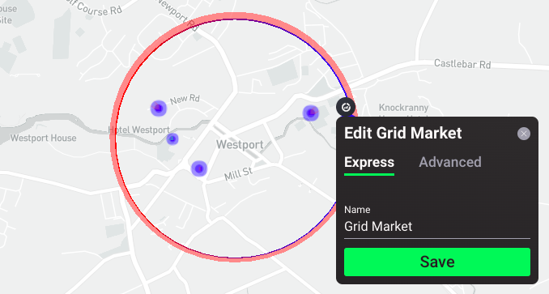
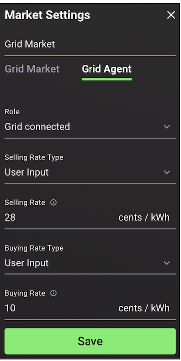

Energy markets are regulated exchange systems in which energy assets can buy, sell and trade energy. In the Grid Singularity Exchange, as a user models an energy community, that community by default exists in one, local energy market (LEM). LEM participants include the community assets and the external suppliers (the grid market). A LEM can contain submarkets, such as a home market where a solar panel is supplying a fridge and a battery, and the battery is supplying a television, etc. Markets follow a hierarchical structure and are interconnected, allowing bids and offers to pass between markets until they are matched, following a select market clearing mechanism and accounting for network costs.

Only one grid market can be set per simulation in the Grid Singularity web-based simulation interface, integrating the energy community with external suppliers that are able to sell an infinite amount of energy, thereby matching  any demand that cannot be supplied locally, and/or to buy an infinite amount of energy as with a feed-in-tariff scheme. By connecting through the [Asset API](asset-api-template-script.md), more than one grid market can be configured in backend code to represent an energy community supplied by more than one energy retailer.

Users can configure the grid market settings by selecting the black dot on the circle surrounding their energy community on the Singularity Map, the Grid Singularity Exchange simulation interface.

<figure markdown>
  {:text-align:center"}
  <figcaption><b>Figure 2.16</b>: Map view of the grid market settings in the Grid Singularity web-based simulation interface
</figcaption>
</figure>

##Grid Market configuration options
###Grid Market
Under the Grid Market tab, the user will provide the following information:

1. Name: select a unique name for the grid market;
2. Location:  the location selected by the user is automatically uploaded

###Grid Agent
Under the Grid Agent tab, the following settings are available as shown in the figure and explained below:

<figure markdown>
  {:style="height:600px;width:300px";text-align:center"}
  <figcaption><b>Figure 2.17</b>: Grid Agent Configuration Options of the Grid Market in the Grid Singularity web-based simulation interface
</figcaption>
</figure>

1. Role: select the option to either be grid connected or Islanded. The default role is set to grid connected, whereby the energy demanded of any consumer can be fulfilled and surplus generation can be absorbed.
2. Selling rate type: select the user input option to define a fixed selling rate or upload a custom selling rate profile with which the external grid sells deficit electricity to the community
3. Selling rate: enter a value in cents/kWh to set the rate at which external suppliers will sell their energy.
4. Buying rate type: select the user input option to define a fixed buying rate or upload a custom buying rate profile (dynamic prices) with which the external grid buys surplus energy from the community
5. Buying rate: enter a value in cents/kWh to represent the feed-in-tariff scheme
