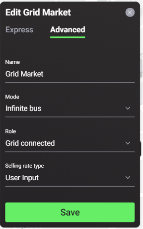

Energy markets are regulated exchange systems in which energy assets can buy, sell and trade energy. In the Grid Singularity Exchange, as a user builds an energy community, that community by default exists in one market. Its participants include the homes in the community and the grid market, if configured, which mimics the behaviour of a typical energy utility and can be used as a price reference point. Energy can be exchanged between the assets in this market, and this market can contain submarkets. For example, if the energy assets within a home in a community exchange energy (e.g. a solar panel supplying a fridge and a battery, the battery supplying a television…) then this home can be considered a market in and of itself, with trading strategies implemented if the user/asset owner chooses to do so. Energy assets can trade by posting bids and offers in the market(s) in which they exist, the details of which can be configured in the advanced settings of each asset in a community on the Singularity Map. Markets are modelled following a hierarchical structure and are interconnected, allowing bids and offers to pass between markets until they are matched, following a select market clearing mechanism.
Only one Grid Market can be set per simulation in the User Interface. The grid can be configured to sell an infinite amount of energy and/or to buy an infinite amount of energy, which can simulate a Feed-in Tariff scheme. By connecting through the [Asset API](asset-api-template-script.md), more than one grid market can be configured representing an example of a single energy community supplied by more than one energy retailer.

Users can configure the grid market settings by selecting the black dot on the circle surrounding their energy community on the Singularity Map.

***Figure 2.15***. *Map view of the grid market settings.*

##Grid Market Configuration Options
**Express Mode**
1. Name - Must be unique

**Advanced Mode**
1. Mode - Users can choose either infinite power plant or infinite bus.
   - Infinite power plant mode has the ability to meet the infinite energy demand of consumers at the highest energy rate possible in that grid.
   - Infinite bus mode has both the ability to meet the infinite energy demand of consumers but also absorbs the infinite generation surplus of prosumers/producers at the lowest rate possible in that grid.
2. Role - If users select infinite bus mode, this option is set to grid connected, whereby the energy demanded of any consumer can be fulfilled and surplus generation can be absorbed. If users select infinite power plant mode, they can choose either Grid connected or Islanded, whereby the Market Maker would only be used as a reference point for the highest possible energy rate in that grid.
3. Selling Rate Type - Either select User Input to define a fixed selling rate or upload their custom selling rate profile.
4. Selling Rate - Users can enter a value in cents/kWh to represent the rate at which it will sell their energy.
5. Buying Rate Type (infinite bus mode only) - Users can select either User Input to define a fixed buying rate or upload their custom buying rate.
6. Buying Rate (infinite bus mode only) - Users can enter a value in cents/kWh to represent the Feed-in Tariff scheme

***Figure 2.16***. *Advanced Configuration Options of the Grid Market.*
