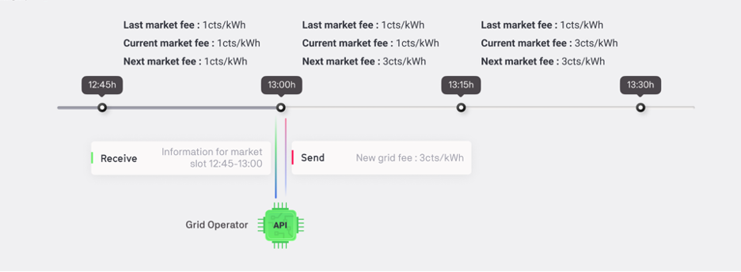

##Market Information

The Grid Operator API receives information concerning the markets that it manages. Different metrics are shared through the API :

*   Minimum, median, average and maximum trade price [€/kWh]
*   Total energy volume traded [kWh]
*   [Self-sufficiency / self-consumption [%]](self-sufficiency-self-consumption.md)
*   Import / Export [kWh]
*   Current market fee [cents/kWh]
*   Next market fee [cents/kWh]
*   Market fee revenue [cents]

##Interaction with the running exchange

As explained above the Grid Operator API function is triggered at the start of each market slot. Here is one example:



1. At the end of the `12:45` market slot, the Grid Operator API function `on_market_cycle` is triggered.
2. The Grid Operator agent receives a nested dictionary with information from the last market slot, including the grid tree (`12:45-13:00`).
3. Based on these inputs, the agent script sets a new grid fee for the markets it manages.
4. The grid fees sent during the `13:00` will be applied for the `13:15` market slot.

##API Events

In the Grid Operator there are 3 events that are triggered while a simulation is running.

###Each new market slot

```
def on_market_cycle(self, market_info):
```

As shown in the schematic above, this event triggered at the start of every market slot. When a new market slot is created the API receives the `market_info`, containing market information and the code within the script event is executed.

###On event or response

```
def on_event_or_response(self, message):
```

In this event, the API receives a message for every event (`on_market_cycle`) or response for each commands (e.g. submitting new grid fees)

###On finish

```
def on_finish(self, finish_info):
```

This event is triggered when the simulation/collaboration finishes. Within that function, information stored during the simulation could potentially be exported for further analysis.
