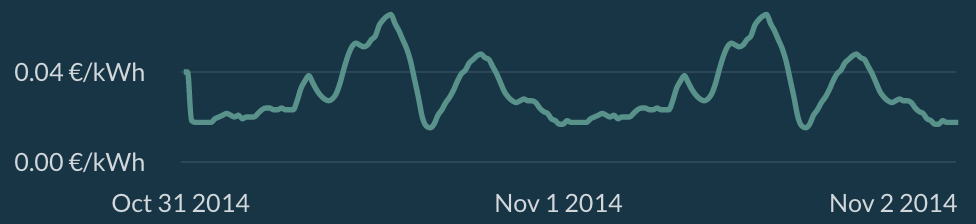
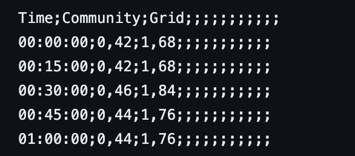

The Grid Operator API template scripts are flexible and versatile Python scripts that can be easily modified to implement dynamic grid fees in the Grid Singularity Exchange.

In this section, each script will be described along with its functionalities in order of complexity.

##Implement basic grid fees
A template file for managing the market fees through the gsy-e-sdk API client is available [here](https://github.com/gridsingularity/gsy-e-sdk/blob/master/gsy_e_sdk/setups/grid_operator_api_scripts/rest_grid_fees.py){target=_blank}. The script illustrates the most basic implementation of a Grid Operator API strategy: setting grid fees for different markets in the Grid Singularity Exchange.

Initially, the user needs to list the markets to be managed via  the API.  For simulations launched via the user-interface (UI), the CONNECT_TO_ALL_ASSETS parameter is available. If this parameter is set to True, the Grid Operator API connects automatically to all the markets for which the user is [registered](implement-grid-fees-walkthrough.md).

```python
# List of markets' names to be connected with the API
MARKET_NAMES = [
   "Grid",
   "Community",
]

ORACLE_NAME = "dso"
SLOT_LENGTH = 15  # leave as is
CONNECT_TO_ALL_MARKETS = True
```
At the beginning of each [market slot](asset-api-events.md#each-new-market-slot), the script loops through the markets configured in the simulation. For each market, it reads the market fee for the current time slot and sets it for the next.  That information is logged in the terminal in a table format.

```python
def on_market_cycle(self, market_info):
   current_market_fee = {}
   for area_uuid, area_dict in self.latest_grid_tree_flat.items():
       if area_dict["area_name"] in MARKET_NAMES:
           self.add_to_batch_commands.last_market_dso_stats(area_uuid)
           current_market_fee[area_dict["area_name"]] = area_dict[
               "current_market_fee"
           ]
   next_market_fee = self._set_new_market_fee()
   log_grid_fees_information(MARKET_NAMES, current_market_fee, next_market_fee)
```
Since there is no preconfigured pricing strategy in this script, the market fee is hardcoded in the _set_new_market_fee_ function (in this example, it was assigned a value of 10). Then, the batch commands are executed.

```python
def _set_new_market_fee(self):
   """Return the market fees for each market for the next time slot."""
   next_market_fee = {}
   for area_uuid, area_dict in self.latest_grid_tree_flat.items():
       if area_dict["area_name"] in MARKET_NAMES:
           next_market_fee[area_dict["area_name"]] = 10

           self.add_to_batch_commands.grid_fees(
               area_uuid=area_uuid,
               fee_cents_kwh=next_market_fee[area_dict["area_name"]],
           )
   self.execute_batch_commands()
   return next_market_fee
```
Later in the script, the _on_event_or_response_ is called. By default, the Asset API template does not perform any operation here but the user can add [events](asset-api-events.md). For instance, the user could record all the trades occurring in that event.  Lastly, the script overwrites the _on_finish event_ so that the script stops whenever the function is triggered. If the user wishes to save any information reported in the logs, it can be done by exporting it to an external file.

```python
def on_event_or_response(self, message):
   pass

def on_finish(self, finish_info):
   self.is_finished = True
```

The rest of the script is used to connect to the energy assets of a running simulation/collaboration/Canary Test Network. These lines should work as is and no changes are required.

```python
market_args = {
   "simulation_id": os.environ["API_CLIENT_SIMULATION_ID"],
   "domain_name": os.environ["API_CLIENT_DOMAIN_NAME"],
   "websockets_domain_name": os.environ["API_CLIENT_WEBSOCKET_DOMAIN_NAME"],
}

aggregator = Oracle(aggregator_name=ORACLE_NAME, **market_args)
if CONNECT_TO_ALL_MARKETS:
   registry = aggregator.get_configuration_registry()
   MARKET_NAMES = get_assets_name(registry)["Area"]

print()
print("Connecting to markets ...")

for i in MARKET_NAMES:
   market_uuid = get_area_uuid_from_area_name_and_collaboration_id(
       market_args["simulation_id"], i, market_args["domain_name"]
   )
   market_args["area_id"] = market_uuid
   market_registered = RestMarketClient(**market_args)
   market_registered.select_aggregator(aggregator.aggregator_uuid)
   print("----> Connected to ", i)

print(aggregator.device_uuid_list)

# loop to allow persistence
while not aggregator.is_finished:
   sleep(0.5)

```
For simulations ran in the backend, a similar script is available [here](https://github.com/gridsingularity/gsy-e-sdk/blob/master/gsy_e_sdk/setups/grid_operator_api_scripts/redis_grid_fees.py){target=_blank}.

##Implement dynamic grid fees with Time of Use strategy
In Time of Use (ToU) strategy, grid fees are applied depending on the time of the day (hours and minutes) regardless of the market conditions. After analyzing import and export patterns of their client, grid operators can create a time-based curve, increasing fees at peak predicted times (e.g. morning and dinner time). Below is an example of a ToU strategy used by the grid operators in one of the experiments at [Odyssey hackathon](https://gridsingularity.medium.com/energy-singularity-challenge-2020-testing-novel-grid-fee-models-and-intelligent-peer-to-peer-6a0d715a9063){target=_blank}.



A template script can be found [here](https://github.com/gridsingularity/gsy-e-sdk/blob/master/gsy_e_sdk/setups/grid_operator_api_scripts/rest_tou_strategy.py){target=_blank}. The ToU strategy is uploaded to the Grid Operator API script as a CSV file (an example can be found [here](https://github.com/gridsingularity/gsy-e-sdk/blob/master/gsy_e_sdk/setups/grid_operator_api_scripts/resources/ToU.csv){target=_blank}), with the following structure:

{:style="height:221px;width:329px;text-align:center"}


As shown in the table above, for each market (in this case, the Community market and the Grid market), a value in ct€/kWh is assigned with a granularity of 15 min. The file is loaded through the read_fee_strategy function:

```python
def read_fee_strategy():
   "Return a dictionary containing the Time of Use strategy loaded from the CSV input file."
   with open(
           os.path.join(module_dir, "resources/ToU.csv"), newline="", encoding="utf-8"
   ) as csvfile:
       csv_rows = csv.reader(csvfile, delimiter=" ", quotechar="|")
       headers = next(csv_rows)[0].split(";")
       market_indexes = {}
       planned_fee = {}
       for market_name in MARKET_NAMES:
           market_indexes.update({(market_name, headers.index(market_name))})
       for row in csv_rows:
           row = row[0].split(";")
           for market in MARKET_NAMES:
               planned_fee.update({(row[0], market): row[market_indexes[market]]})
   return planned_fee
```

As explained in the previous section, here the script sets the market fee for each market for the next time slot and prints that information in the terminal. Note that in this case, the value is taken from the uploaded CSV file instead of being hardcoded (inserted in the code). The _calculate_next_slot_market_fee_ function reads the scheduled fees from the spreadsheet and returns the corresponding grid fee value according to each  market and the current market slot.

```python
def calculate_next_slot_market_fee(market_time: DateTime, market_name:str) -> float:
   """Return the market fee for the next time slot."""
   slot_time = market_time.add(minutes=SLOT_LENGTH).format(TIME_FORMAT_SECONDS)
   if (slot_time, market_name) in fee_strategy:
       next_fee = fee_strategy[(slot_time, market_name)]
       if not isinstance(next_fee, (int, float)):
           next_fee = float(next_fee.replace(",", "."))
   else:
       next_fee = None
   return next_fee
```
The rest of the script has been covered in the previous section. For simulations ran in the backend, a similar script is available [here](https://github.com/gridsingularity/gsy-e-sdk/blob/master/gsy_e_sdk/setups/grid_operator_api_scripts/redis_tou_strategy.py){target=_blank}.

##Implement dynamic grid fees with Aziiz strategy

The Aziiz strategy, named after the researcher who suggested this [model](https://gridsingularity.medium.com/energy-singularity-challenge-2020-testing-novel-grid-fee-models-and-intelligent-peer-to-peer-6a0d715a9063){target=_blank}, is using past market information to determine the next grid fee. The model looks at past imports and exports on a specific market, applies a moving average and then based on this number sets the next grid fee for that market. This model has the advantage of integrating market conditions into its strategy. For instance, if past market slots experienced high imports, the model will increase fees in the relevant market to incentivise market participants to contain the energy within that market.

A template script can be found [here](https://github.com/gridsingularity/gsy-e-sdk/blob/master/gsy_e_sdk/setups/grid_operator_api_scripts/rest_aziiz_strategy.py){target=_blank}. With this strategy, two more parameters are available at the beginning of the script and can be tuned:

```python
MOVING_AVERAGE_PEAK = True
LOOK_BACK_INDEX = 4
```
If MOVING_AVERAGE_PEAK is set to True, the Aziiz strategy will compare the average of the last markets’ (how many is defined by the LOOK_BACK_INDEX parameter) peak import/export to the threshold.

The _on_market_slot_ event is used to request market statistics from the simulation, based on which import / export balance can be calculated for each market. This is the criteria to determine which grid fees to apply in each market.

```python
def calculate_import_export_balance(self):
   """Calculate the balance (import - export) for each market."""
   self.dso_stats_response = self.execute_batch_commands()
   for market_event in self.dso_stats_response["responses"].items():
       self.import_kwh[market_event[1][0]["name"]] = market_event[1][0][
           "market_stats"
       ]["area_throughput"]["import"]
       self.export_kwh[market_event[1][0]["name"]] = market_event[1][0][
           "market_stats"
       ]["area_throughput"]["export"]
       self.balance[market_event[1][0]["name"]] = (
           self.import_kwh[market_event[1][0]["name"]]
           - self.export_kwh[market_event[1][0]["name"]]
       )
   self.balance_hist.append(self.balance)
```
In the Aziiz strategy, grid fees can be set for every peak import/export threshold for each market. A JSON file containing this information is uploaded to the Grid Operator API script. An example can be found [here](https://github.com/gridsingularity/gsy-e-sdk/blob/master/gsy_e_sdk/setups/grid_operator_api_scripts/resources/aziiz.json){target=_blank}.

```python
{
   "Grid": [
       {"Import / Export threshold": 10, "Grid fee": 0.9},
       {"Import / Export threshold": 15, "Grid fee": 2.1},
       {"Import / Export threshold": 20, "Grid fee": 3},
       {"Import / Export threshold": 25, "Grid fee": 3.9},
       {"Import / Export threshold": 30, "Grid fee": 6},
       {"Import / Export threshold": 50, "Grid fee": 30}
   ],
   "Community": [
       {"Import / Export threshold": 10, "Grid fee": 0.9},
       {"Import / Export threshold": 15, "Grid fee": 2.1},
       {"Import / Export threshold": 20, "Grid fee": 3},
       {"Import / Export threshold": 25, "Grid fee": 3.9},
       {"Import / Export threshold": 30, "Grid fee": 6},
       {"Import / Export threshold": 50, "Grid fee": 30}
   ]
}
```
If the average is lower than the threshold, the relevant grid fee will be applied; for instance in the figure above, if the average peak is equal to 22 kWh, the next grid fee will be 3 cents/KWh.

Below is a snippet of the _set_new_market_fee adapted to the Aziiz strategy. All the fees are added to the batch command and then executed.

```python
def _set_new_market_fee(self):
   """Return the market fees for each market for the next time slot."""
   next_market_fee = {}
   for area_uuid, area_dict in self.latest_grid_tree_flat.items():
       if area_dict["area_name"] in MARKET_NAMES:
           if MOVING_AVERAGE_PEAK:
               fees = []
               for balance in self.balance_hist:
                   fees.append(balance[area_dict["area_name"]])
               max_ext_energy_kwh = abs(
                   sum(fees[-LOOK_BACK_INDEX:]) / len(fees[-LOOK_BACK_INDEX:])
               )
           else:
               max_ext_energy_kwh = max(
                   self.import_kwh[area_dict["area_name"]],
                   self.export_kwh[area_dict["area_name"]],
               )

           individual_market_fees = fee_strategy[area_dict["area_name"]]
           for market_fee in individual_market_fees:
               if max_ext_energy_kwh <= market_fee["Import / Export threshold"]:
                   next_market_fee[area_dict["area_name"]] = market_fee["Grid fee"]
                   break
               next_market_fee[area_dict["area_name"]] = 2000
           self.add_to_batch_commands.grid_fees(
               area_uuid=area_uuid,
               fee_cents_kwh=next_market_fee[area_dict["area_name"]],
           )
   self.execute_batch_commands()
   return next_market_fee
```
The rest of the script has been already covered in this previous section. For simulations run in the backend, a similar script is available here.

For a video tutorial on the Grid Operator API, please follow this [link](https://www.youtube.com/watch?v=3OMkWLSrl4c){target=_blank}.

The next step is to adapt the Grid Operator API template scripts developed by Grid Singularity to customize the grid fee strategies to implement dynamic grid fees in the Grid Singularity Exchange.
