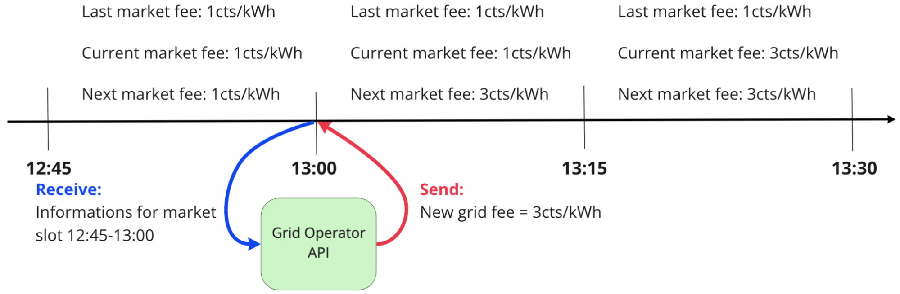
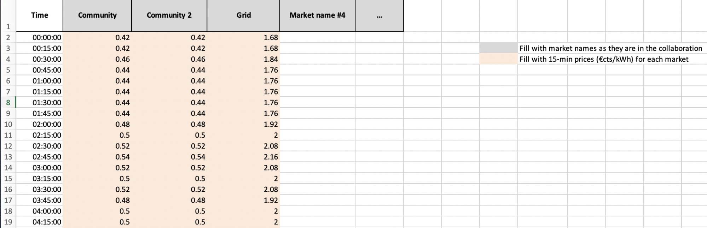
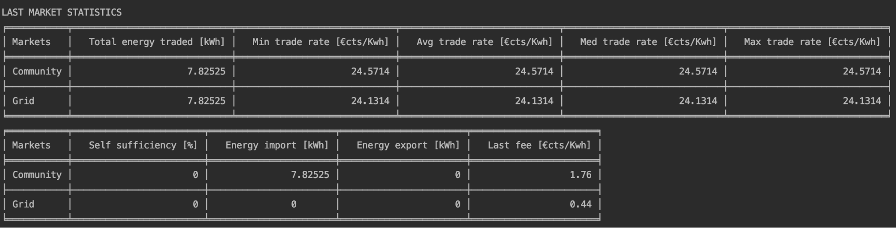
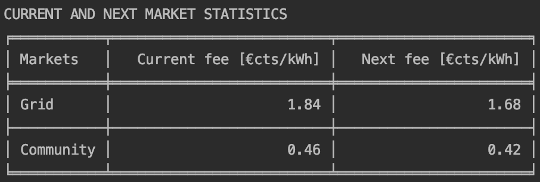

The Grid Singularity Grid Operator API client allows you to create agents that can dynamically change the grid fee in different markets. The agent can request and receive information through the Grid Operator API, feed that information into a tariff model, and submit grid fees through the API client to change grid fees on a live simulated exchange. The Grid Operator API is designed for grid operators (notably Distribution System Operators or DSOs) to manage congestion and grid constraints in different markets across the grid. The structure is designed so that multiple markets can be managed from a single agent, allowing information to be aggregated for integrated grid management.

##Market Information

The Grid Operator API receives information concerning the markets that it manages. Different metrics are shared through the API :

*   Minimum, median, average and maximum trade price [€/kWh]
*   Total energy volume traded [kWh]
*   Self sufficiency / self consumption [%]
*   Import / Export [kWh]
*   Current market fee [cents/kWh]
*   Next market fee [cents/kWh]
*   Market fee revenue [cents]

##Interaction with the running exchange

As explained above the Grid Operator API function is triggered at the start of each market slot. Here is one example:



1. At the end of the `12:45` market slot, the Grid Operator API function `on_market_cycle` is triggered.
2. The Grid Operator agent receives a nested dictionary with information from the last market slot, including the grid tree (`12:45-13:00`).
3. Based on these inputs, the agent script sets a new grid fee for the markets it manages.
4. The grid fees sent during the `13:00` will be applied for the `13:15` market slot

##API Events

In the Grid Operator there are 3 events that are triggered while a simulation is running.

###Each new market slot

```
def on_market_cycle(self, market_info):
```

As shown in the schematic above, this event triggered at the start of every market slot. When a new market slot is created the API receives the `market_info`, containing market information and the code within the script event is executed.

###On event or response

```
def on_event_or_response(self, message):
```

In this event, the API receives a message for every event (`on_market_cycle`) or response for each commands (e.g. submitting new grid fees)

###On finish

```
def on_finish(self, finish_info):
```

This event is triggered when the simulation/collaboration finishes. Within that function, information stored during the simulation could potentially be exported for further analysis.

##API command

The Grid Operator API can function once at the start of each [market slot](markets.md#market-slots). When the current market slot ends, a new one is automatically created and the client is notified via the on_market_cycle event. It is possible to capture this event and perform operations when it occurs by overriding the functionality of the [on_market_cycle](grid-operator-api.md#each-new-market-slot) method.

The Grid Operator API can send batch commands, grouping different commands, for different markets. The commands can be grouped and then all executed at the same time. Three different commands are available for the Grid Operator API :

###last_market_dso_stats()

This command is used to **request information** from different markets for the last market slot.

This batch command receives one argument : **area_uuid**. This latter is the Universal Unique Identifier of the requested market statistic. Here is an example:

```
self.add_to_batch_commands.last_market_dso_stats(area_uuid = "62f827ec-ef86-4782-b5c3-88327751d97d")
```

###grid_fees()

This command is used to **send the new grid fee** for a specific market. The grid fee needs to be set as a positive value and the unit is cents/kWh.

This batch command receives two arguments: **area_uuid** and **fee_cents_kwh**. Here is an example:

```
self.add_to_batch_commands.grid_fees(area_uuid=62f827ec-ef86-4782-b5c3-88327751d97d", fee_cents_kwh=3.2)
```

After adding all the wanted commands in the batch, the API can execute it with the following command:

```
response = self.execute_batch_commands()
```

In return the simulation will provide a response for all commands submitted.

##API template script

A Grid Operator API template script is available on [github](https://github.com/gridsingularity/d3a-api-client/blob/master/d3a_api_client/setups/grid_operator_api_template.py). This shows an example of what can be done with this API, and offers a flexible structure, easy to modify to implement custom grid fee strategies. In this script two template strategies are available already.

###Time-of-Use (ToU)

This is a strategy where grid fee is applied depending on the **time of the day** (hours and minutes) regardless of the market conditions. After analysing import and export patterns of their client, grid operators can create a time-based curve, increasing fees at peak predicted times (e.g. morning and dinner time). 

Here is an example of ToU strategy that was used by the DSOs in one of the experiments at [Odyssey hackathon](https://gridsingularity.medium.com/energy-singularity-challenge-2020-testing-novel-grid-fee-models-and-intelligent-peer-to-peer-6a0d715a9063).


 
###Aziiz pricing

The Aziiz model is using past market information to determine the next grid fee. The model looks at **past imports and exports** on a specific market, applies a moving average and then based on this number sets the next grid fee for that market. This model has the advantage of integrating market conditions into its strategy. For instance if past market slots experienced high imports, the model will increase fees in the relevant market to incentivise market participants to contain the energy within that area. 

###Script Configuration

As mentioned on this page, at the start of the API script the user needs to specify the markets she/he wishes to connect and manage and the oracle name. 

Right after that the user [selects](https://github.com/gridsingularity/d3a-api-client/blob/master/d3a_api_client/setups/grid_operator_api_template.py#L32-L34) the strategy to use (Time of Use or Aziiz model). To select the Time of Use strategy the user needs to set TimeOfUse to True and Aziiz to False. On the other hand, to select the Aziiz model, the user has to set TimeOfUse to False and Aziiz to True.

If the Aziiz model is selected, the user can tune [parameters](https://github.com/gridsingularity/d3a-api-client/blob/master/d3a_api_client/setups/grid_operator_api_template.py#L35-L36) such as applying the moving average and specifying the number of past market slots to average.

For both strategies, the script reads an Excel file to adjust the grid fees ([ToU.xlsx](https://github.com/gridsingularity/d3a-api-client/blob/master/d3a_api_client/setups/resources/ToU.xlsx) and [Aziiz.xlsx](https://github.com/gridsingularity/d3a-api-client/blob/master/d3a_api_client/setups/resources/Aziiz.xlsx)). 

In ToU.xlsx the user can define the grid fees for each market she/he manages for every quarter hours of the day.



In Aziiz.xlsx grid fees can be set for every peak import/export thresholds for each market. The Aziiz strategy will compare the average of the last markets’ peak import/export to the threshold. If the average is lower than the threshold the relevant grid fee will be applied (for instance on the figure below if the average peak is equal to 22kWh, the next grid fee will be 3 cents/KWh. Each sheet’s name represents the market connected to. 


[On_market_slot event](https://github.com/gridsingularity/d3a-api-client/blob/master/d3a_api_client/setups/grid_operator_api_template.py#L85) is used to gather market statistics and set the grid fees for the next market slot. In [these lines](https://github.com/gridsingularity/d3a-api-client/blob/master/d3a_api_client/setups/grid_operator_api_template.py#L111-L120), the API is requesting dso market statistics from the simulation. After that, the API is [storing](https://github.com/gridsingularity/d3a-api-client/blob/master/d3a_api_client/setups/grid_operator_api_template.py#L122-L138) some of the relevant market data to local variables, easier to manipulate. To improve the API monitoring, the script is [printing relevant data](https://github.com/gridsingularity/d3a-api-client/blob/master/d3a_api_client/setups/grid_operator_api_template.py#L140-L187) in the terminal: 



In [these lines](https://github.com/gridsingularity/d3a-api-client/blob/master/d3a_api_client/setups/grid_operator_api_template.py#L192-L228), the script applies the grid fee depending on the fee strategy defined at the start. If the Time of Use was set, the markets’ grid fee is set based on the ToU excel file. If the Aziiz model was chosen the next fee is defined based on the Aziiz excel file. Additionally if the peak import/export is higher than all threshold defined in the excel sheets [this](https://github.com/gridsingularity/d3a-api-client/blob/master/d3a_api_client/setups/grid_operator_api_template.py#L222-L224) sets the next fee as 2000cts/kWh. All the fees are [added to the batch command](https://github.com/gridsingularity/d3a-api-client/blob/master/d3a_api_client/setups/grid_operator_api_template.py#L226) and then [executed](https://github.com/gridsingularity/d3a-api-client/blob/master/d3a_api_client/setups/grid_operator_api_template.py#L228). 

After that the script [prints](https://github.com/gridsingularity/d3a-api-client/blob/master/d3a_api_client/setups/grid_operator_api_template.py#L230-L245) the current fee and next fee for each market. 



Later, the [on_event_or_response](https://github.com/gridsingularity/d3a-api-client/blob/master/d3a_api_client/setups/grid_operator_api_template.py#L247-L252) is overwritten. By default we do not perform any operation in this event but the user could add some if needed. For instance the user could record all the grid fee change responses received in that event.

Lastly the API script overwrites the [on_finish event](https://github.com/gridsingularity/d3a-api-client/blob/master/d3a_api_client/setups/grid_operator_api_template.py#L250-L252) so that whenever the function is triggered the script stops. If the user wishes to save some information recorded within the API client this would be the opportunity to export them to external files.

The [rest of the scrip](https://github.com/gridsingularity/d3a-api-client/blob/master/d3a_api_client/setups/grid_operator_api_template.py#L262-L333) is used to connect to a running simulation/collaboration/canary network. These lines should work as is and no changes are required.

