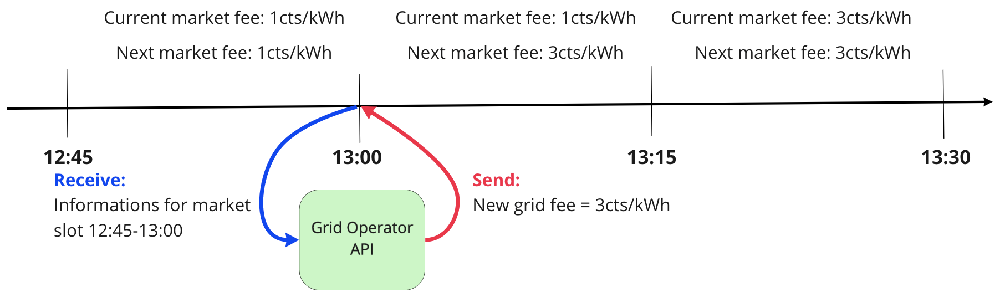

The Grid Singularity API client allows you to create agents that can dynamically change the grid fee in different markets. The agent can request and receive information through the Grid Operator API, feed that information into a tariff model, and change grid fees on a live simulated exchange. The Grid Operator API is designed for grid operators (notably Distribution System Operators or DSOs) to manage different markets on specific grid levels. The structure is designed so that multiple markets can be managed from a single agent. Notably this allows the agent to aggregate information to integrate a more efficient grid management. 

##Market Information

The Grid Operator API receives information concerning the markets that it manages. Different metrics are shared through the API :

* Minimum, median, average and maximum trade price [€/kWh]
* Total energy volume traded [kWh]
* Self sufficiency [%]
* Import / Export [kWh]
* Current market fee [cents/kWh]
* Next market fee [cents/kWh]
* Market fee revenue [cents]

##Interaction with the running exchange

As explained above the Grid Operator API function is triggered at the end of each market slot. Here is one example:



1. At the end of the 12:45 market slot, the Grid Operator API function on_market_cycle is triggered.
2. The Grid Operator agent receives a dictionary with information from the last market slot (12:45-13:00).
3. Based on these inputs, the agent script sets a new grid fee for the markets it manages.
4. The grid fees sent between 13:00 and 13:15 will be applied for the 13:15 market slot

##API command

The Grid Operator API can function once at the end of each market slot. When the current market slot ends, the client will get notified via an event. It is possible to capture this event and perform operations when it occurs by overriding the functionality of the on_market_cycle method e.g. def on_market_cycle(self, market_info):

The Grid Operator API can send batch commands, grouping different commands, for different markets. Three different commands are available :

###market stats

This command is used to request information from different markets for the last market slot.

A batch_command dictionary structure is used and the response is stored in a variable :

```python
batch_commands[area_uuid].append({"type": "market_stats","data": {"market_slots": market_slot}})
self.market_stats = self.batch_command(batch_commands_stats)
```


###dso market stats

This command is used to request information from different markets for the last market slot, more specific to grid operators (e.g. import and export of the market).

A batch_command dictionary structure is used and the response is stored in a variable:

```python
batch_commands_stats[area_uuid].append({"type": "dso_market_stats", "data": {"market_slots": market_slot}})
self.dso_stats = self.batch_command(batch_commands_stats)["responses"]
```

###grid fee

This command is used to send the new grid fee for a specific market. The grid fee needs to be sent as an integer and the unit is cents/kWh.

A batch_command dictionary structure is used:

```python
batch_commands[area_uuid].append({"type": "grid_fees", "data": {"fee_const": self.next_fee}})
self.batch_command(batch_commands)
```

For a video tutorial on the Grid Operator API, please follow this [link](https://youtu.be/HXNme8Rt3pI) and a template Grid Operator API script [here](https://github.com/gridsingularity/d3a/blob/master/src/d3a/setup/odyssey_momentum/markets_api_template.py).
