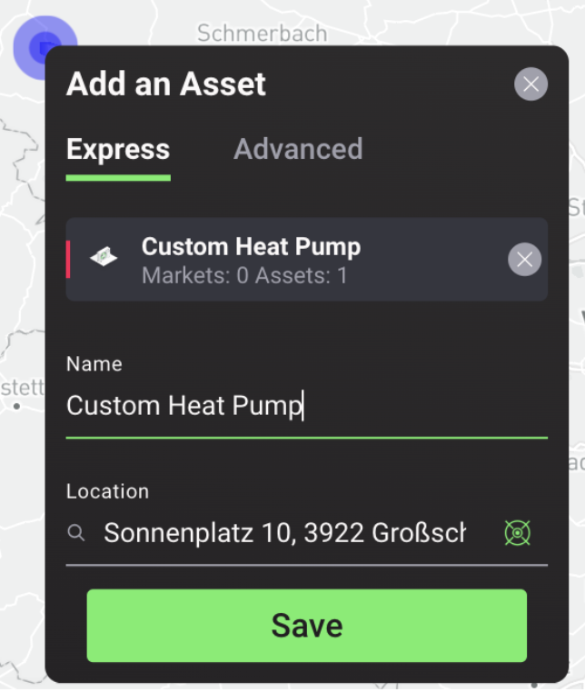
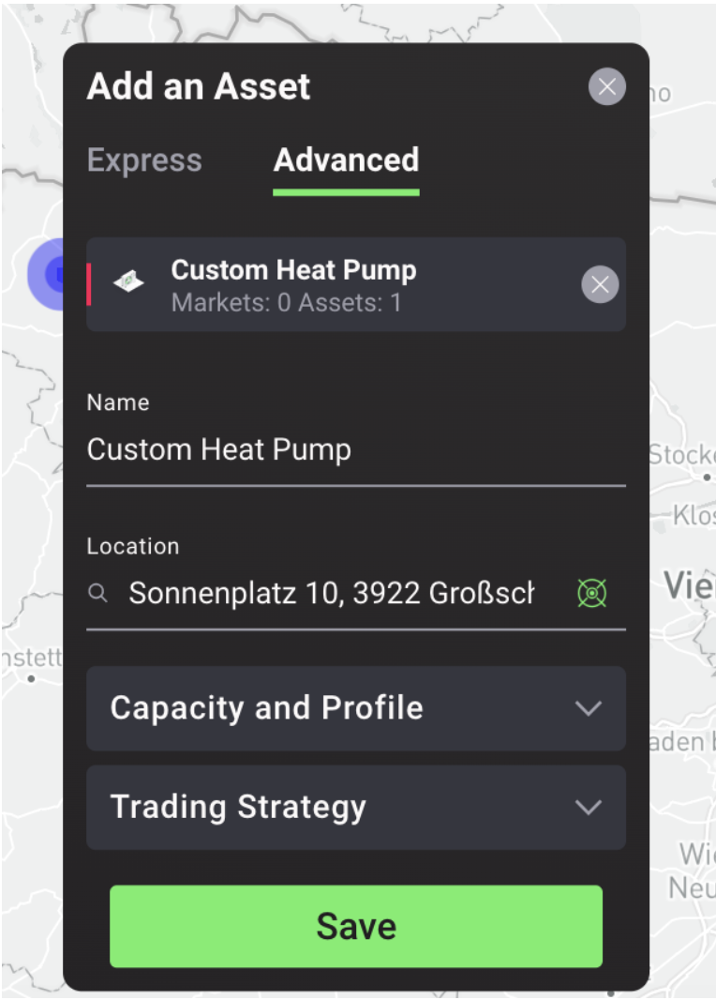
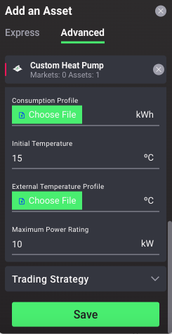
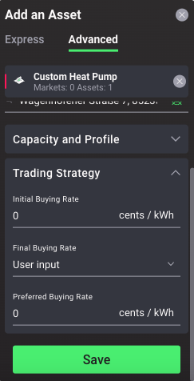
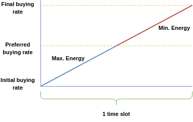
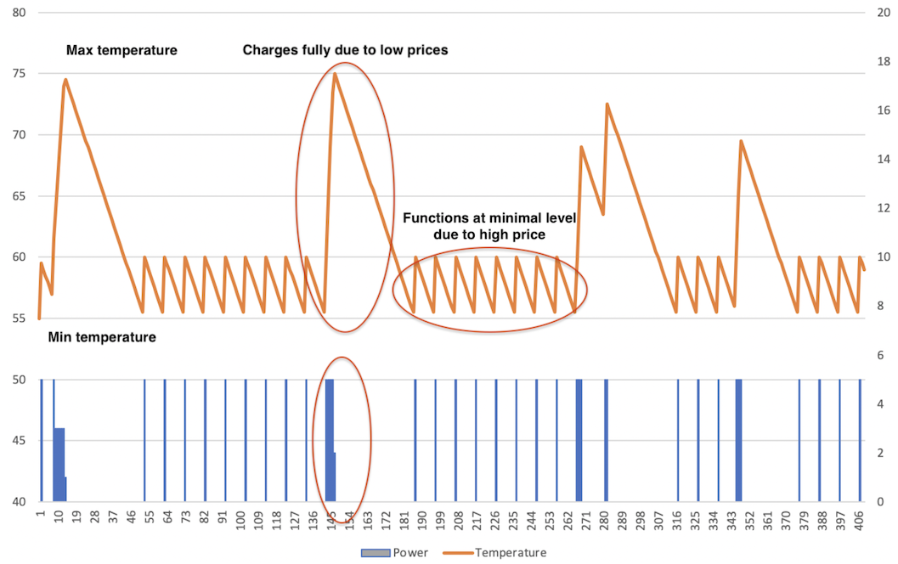

## Heat Pump Asset Configuration Options

### Heat Pump Configuration Express Mode
In the express heat pump configuration mode, the user is provided with a template (synthetic) heat pump model to include as an asset at a selected location in the simulated local energy market by naming the asset and setting its location:

1. Name: select a unique name for the heat pump;
2. Location: the location selected by the user is automatically uploaded.

<figure markdown>
  {:style="height:400px;width:300px";text-align:center"}
  <figcaption><b>Figure 2.23</b>: Heat pump express mode configuration options in the Grid Singularity Exchange web-based interface (Singularity Map)
</figcaption>
</figure>

For more information, on the parameters and default values used to create the template heat pump digital twin, see [Table below](#parameter-table).

### Heat Pump Configuration Advanced Mode
In the advanced heat pump configuration mode, there are two settings referring to its Capacity and Profile and the Trading Strategy as shown in the figure below:

<figure markdown>
  {:style="height:400px;width:300px";text-align:center"}
  <figcaption><b>Figure 2.24</b>: Heat pump advanced mode configuration options in the Grid Singularity Exchange web-based interface (Singularity Map)
</figcaption>
</figure>

Under the Capacity and Profile tab, the following parameters can be defined, described in **Table 2.1** below:

  * Heat pump type
  * Minimum and maximum temperature
  * Heat pump tank volume
  * Heat pump consumption profile
  * Initial temperature
  * External (ambient) temperature profile
  * Maximum power rating for the heat pump

<figure markdown>
  {:style="height:500px;width:250px";text-align:center"}
  <figcaption><b>Figure 2.25</b>: Capacity and profile inputs in the advanced mode heat pump configuration in the Grid Singularity Exchange web-based interface (Singularity Map)
</figcaption>
</figure>

Under the Trading Strategy tab, the following parameters can be defined, described in the **Table 2.1** below:

  * Initial buying rate
  * Final buying rate
  * Preferred buying rate

<figure markdown>
  {:style="height:500px;width:250px";text-align:center"}
  <figcaption><b>Figure 2.26</b>: Trading strategy inputs in the advanced mode heat pump configuration in the Grid Singularity Exchange web-based interface
</figcaption>
</figure>

**Table 2.1:** Heat Pump Configuration Parameters in the Grid Singularity Exchange

|          Parameters          | Description                                                                                                                                                                                                                                                                                                                                                                                                                                                                                                                                                                                                                                         |  Unit   |     Data Type     | Mandatory User Input |   Default Value   |
|:----------------------------:|-----------------------------------------------------------------------------------------------------------------------------------------------------------------------------------------------------------------------------------------------------------------------------------------------------------------------------------------------------------------------------------------------------------------------------------------------------------------------------------------------------------------------------------------------------------------------------------------------------------------------------------------------------|:-------:|:-----------------:|:--------------------:|:-----------------:|
|             Name             | Name of the asset                                                                                                                                                                                                                                                                                                                                                                                                                                                                                                                                                                                                                                   |    -    |       Text        |         Yes          |        N/A        |
|        Heat Pump Type        | Heat pump type specification from drop-down menu: Air-to-Water or Water-to-Water                                                                                                                                                                                                                                                                                                                                                                                                                                                                                                                                                                    |    -    |  Category value   |          No          |   Air-to-Water    |
|     Minimum Temperature      | Minimum water temperature of the heat pump storage (provided by the user based on personal preference; if unavailable, set at 25°C since this is the comfort temperature setting for underfloor heating)                                                                                                                                                                                                                                                                                                                                                                                                                                            |   °C    |  Constant Value   |          No          |        25         |
|     Maximum Temperature      | Maximum water temperature of the heat pump storage (provided by the user based on personal preference; if unavailable, set at 55°C based on analysis of specification sheets for several heat pumps)                                                                                                                                                                                                                                                                                                                                                                                                                                                |   °C    |  Constant Value   |          No          |        55         |
|         Tank Volume          | Volume/capacity of the thermal storage tank based on technical sheet (nameplate) of the storage tank (if unavailable average volume of 500l set as default based on analysis of specification sheets for consumer heat pump storages)                                                                                                                                                                                                                                                                                                                                                                                                               |    l    |  Constant Value   |          No          |        500        |
|     Consumption Profile      | Electricity consumption profile of the heat pump (amount of energy the heat pump consumes in kWh to produce heat), to be added by the user                                                                                                                                                                                                                                                                                                                                                                                                                                                                                                          |   kWh   | Profile /csv file |         Yes          |        N/A        |
|     Initial temperature      | Initial water temperature of the heat pump storage at the beginning of the simulation (provided by the user based on personal preference; if unavailable, set at the same value as the minimum temperature)                                                                                                                                                                                                                                                                                                                                                                                                                                         |   ºC    |  Constant Value   |          No          |        25         |
| External Temperature Profile | Ambient temperature profile at the community location based on historical weather data (user input, which can be derived from Copernicus Climate Change Service or similar service and resampled to the 15-minute or another [market slot](market-types.md) resolution)                                                                                                                                                                                                                                                                                                                                                                             |   ºC    | Profile /csv file |         Yes          |        N/A        |
|     Maximum Power Rating     | Maximum electricity demand by the heat pump based on technical sheet (nameplate) of the heat pump  _Note: If unavailable, it can be estimated by using the historical data to calculate the maximum electricity consumption over the coldest month for each heat pump in the community separately, since the heat demand during this month is at the highest level, and then deriving the mean value and setting this value as a standard heat pump capacity._                                                                                                                                           |   kW    |  Constant value   |          No          |         3         |
|     Initial buying rate      | Minimum buying price for the heat pump in each time slot (based on user input, can be set to feed-in-tariff or another value; the default is 0 since most heat pump owners prefer maximum storage / self-consumption)                                                                                                                                                                                                                                                                                                                                                                                                                               | cts/kWh |  Constant value   |          No          |         0         |
|      Final buying rate       | Maximum buying price for the heat pump in each time slot. The user can choose between “User Input” and “Market maker rate”.                                                                                                                                                                                                                                                                                                                                                                                                                                                                                                                         | cts/kWh |  Constant value   |          No          | Market-maker-rate |
|    Preferred buying rate     | Set to buy energy at a price that is equal or less than a certain value in each time slot based on a smart trading algorithm or input value that can be (i) Initial buying rate, in case your strategy is just to keep the heat pump operational to satisfy your own demand, or (ii) Feed-in-tariff in case your strategy is intending to maintain a minimum revenue level for another asset like PV, or (iii) Final buying rate, in case your strategy is intending to maximise storage regardless of the cost, or (iv) Average or another value between the feed-in-tariff and the market maker rate to balance cost and supply security preferences. | cts/kWh |  Constant value   |          No          |        15         |

_Note: The thermal losses of the water tank are not accounted for separately in the current model but considered as part of the heat demand._

Other heat pump configuration parameters can be modified to suit a particular use case in the backend, as described in the [Heat Pump Code Configuration](assets-installation.md#heat-pump-code-configuration) section.

## Heat Pump Asset Trading Strategy
The heat hump places bids for electrical energy ranging from an initial to final buying rate, with prices increasing incrementally within the market slot upon the update interval. Asset owners (or managers) can either set the final rate as a default preferred buying rate or select a preferred buying rate based on a smart trading algorithm.

When the heat pump bids are below the preferred buying rate, the heat pump tries to consume as much energy as possible to satisfy the demand, while also charging the thermal storage for future use, thus maximising the benefit from lower electricity prices ([case a](#a-bid-rate-preferred-buying-rate)). On the other hand, if the electricity price is higher than the specified buying price, the heat pump only consumes the required energy to maintain the storage at the same temperature level as the one before the energy trade occurs (i.e. consumes only the energy required to satisfy the asset owner’s heat demand), aiming to minimise the costs incurred by the increased energy prices ([case b](#b-bid-rate-preferred-buying-rate)).

### a. Bid rate <= Preferred buying rate

If the bid price is below the preferred buying rate, the heat pump strategy is to consume the maximum amount of energy. The maximum energy that the heat pump can buy at any point in time is calculated based on the following equation:

$$ E_{to buy} = min(P_{max} * t_{slot}, (T_{max} - T_{curr} + T_{decrease}) * (0.00116 * V_{tank} * \rho_{water}) / COP) $$

where

  * $P_{max}$ is the maximum power rating
  * $t_{slot}$ is the slot length
  * $T_{max}$ is the maximum temperature of the storage tank
  * $T_{curr}$ is the current temperature of the storage tank
  * $T_{decrease}$ is the temperature decrease of the storage tank due to heat consumption
  * 0.00116 is the energy required to heat one litre of water by 1 °C, in kWh
  * $V_{tank}$ is the volume of the storage tank
  * $\rho_{water}$ is the density of water
  * $COP$ is the coefficient of performance of the heat pump; depends on the heat pump type, and $\Delta T = T_{curr} - T_{ambient}$

Note: $COP$ calculation follows the model proposed by [Ruhnau et al.](https://www.nature.com/articles/s41597-019-0199-y){target=_blank} using the following input parameters:

  * Ambient temperature (temperature of the source of the heat, dependent on the type; this could be water (brine) or air)
  * Comfort temperature (temperature of the sink i.e. the current temperature of the heat pump storage)
  * Heat pump type (water-to-water or air-to-water)

To determine the [heat pump trading strategy](heat-pump.md#heat-pump-asset-trading-strategy), the COP is calculated for each market slot taking into account the current storage temperature and the ambient temperature.

### b. Bid rate > Preferred buying rate

In this situation, the heat pump strategy is to consume the least possible amount of energy in order to keep the temperature at the same level, since the prices are relatively high. Two different situations can arise:

  * $T_{curr} > T_{min} + T_{decrease}$: In this case, the heat pump does not consume any energy (it’s not commanded to function because the temperature will be within the temperature limits even if some heat is consumed in the market slot). Therefore, $E_{tobuy} = 0$
  * $T_{curr} <= T_{min} + T_{decrease}$: In this case the heat pump is forced to function, and it consumes the energy to maintain the temperature at the minimum, taking into account the energy consumption of the user’s premise.

In all cases, the maximum power rating is respected, meaning that not more energy is requested than the energy equivalent of the Maximum Power Rating, as illustrated in graphs below:

<figure markdown>
  
  <figcaption><b>Figure 2.27</b>: Grid Singularity Exchange Heat Pump Digital Twin:
 Initial, Final and Preferred Buying Rate in relation to Minimum and Maximum Energy Consumed
</figcaption>
</figure>

<figure markdown>
  
  <figcaption><b>Figure 2.28</b>: Grid Singularity Exchange heat pump digital twin example of function to maintain temperature within comfort limits, with the horizontal axis showing timestamps for the selected date and the vertical axis showing temperature in °C
</figcaption>
</figure>
