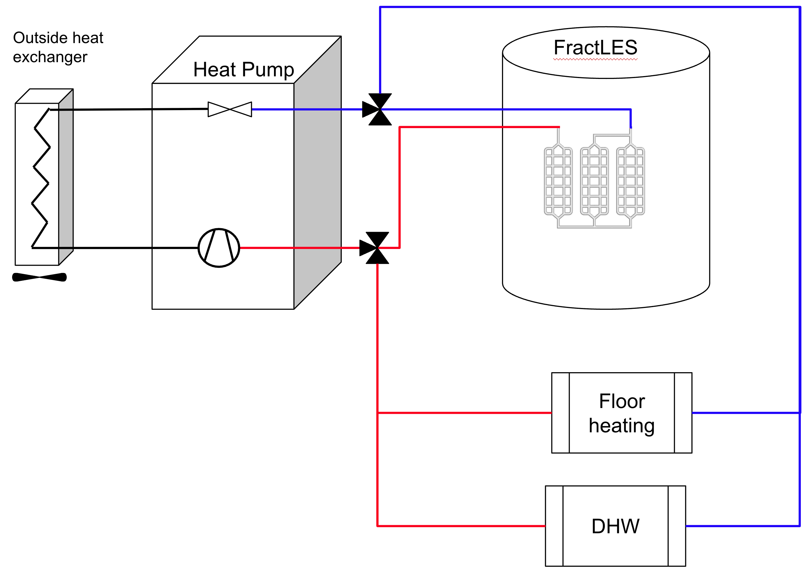
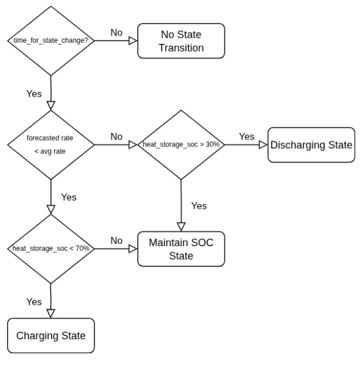
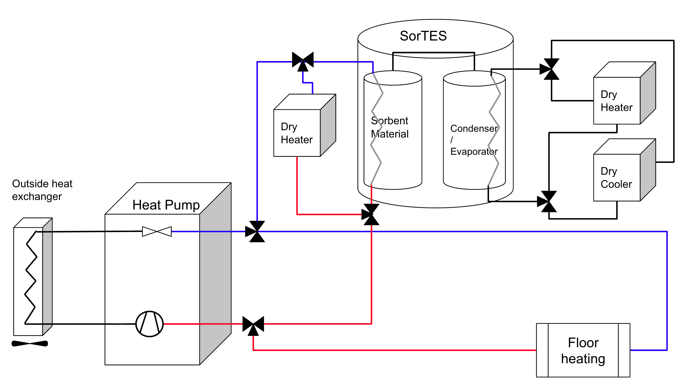

## Heat Storages

While the heat pump digital twin in the Grid Singularity maps is limited to a single water tank for heat storage, the Grid Singularity Exchange backend code allows users to configure and add different types of heat storage tanks:
Water tank

* Water tank
* FractLES short-duration latent thermal energy system, developed by the University of Birmingham (UoB), leverages Phase Change Materials (PCM) to store and release thermal energy by absorbing or releasing heat during their solid-to-liquid phase transition at a specific melting point
* SorTES long-duration sorption thermal energy system, developed by National Research Council of Italy (Consiglio Nazionale delle Ricerche - CNR), leverages thermochemical sorption technology to efficiently store thermal energy and keep it unaffected for long duration.

The following section describes the implementation methodologies of the FractLES and SorTES tanks, undertaken in the framework of the ThumbsUp project co-funded by the European Union's Horizon Europe Programme under Grant Agreement No. 101096921. Both storage types are available in the Grid Singularity Exchange backend code only; the Singularity Map interface continues to support a single water tank.

### FractLES (PCM) Storage Modelling

The FractLES tank contains an organic phase change material (PCM) that stores heat primarily as latent heat during the phase change between solid and liquid. The general design, drafted in Figure 2.24, consists of a container filled with PCM. Inside the container are multiple heat exchangers, also called plates, connected in parallel. These heat exchangers link the heat source (the heat pump) to the heat sink (such as the floor heating pipes or domestic hot water pipes).
When the tank is charged, the heat transfer fluid, water heated by the heat pump, runs through the plates and warms the PCM, which changes phase from solid to liquid. When the storage is discharged, a valve is turned to connect the heat sink, whose return temperature is lower than the PCM's melting point, causing the PCM to solidify again. For more detailed physical explanations we refer to the FractLES temperature model developed by the University of Birmingham within the ThumbsUp Project [publication pending].

<figure markdown>
  {:style="height:450px;width:600px";text-align:center"}
  <figcaption><b>Figure 2.24</b>: Schematics of Heat Pump with integrated FractLES Storage
</figcaption>
</figure>

In order to simulate the physical part of the FractLES tank, an external model was used. The FractLES temperature model developed by UoB was implemented in the GSY heat pump digital twin by integrating the estimation of the temperature reached by a FractLES storage that was heated by a heat transfer fluid (HTF) with a specific temperature in  the GSY twin’s heat storage model. The UoB FractLES model is essentially a mathematical model that comprises a set of differential, energy balance equations, each of which calculates the heat transfer for one control volume (a subdivision of the heat exchanger plate). Different equations are employed for charging and discharging calculation, requiring a dedicated submodel to simulate each of these operations. The inputs to both charging and discharging models are the mass flow rate and the HTF inlet temperature, and its outputs are the outlet temperatures of the HTF and the PCM, as well as the average state-of-charge (SOC) of all control volumes.

Since each material has different properties that affect heat charge and discharge potential, such as specific heat, phase change temperature, the GSY heat storage digital twin was parameterized to support multiple material types (OM37, OM42, OM46, OM50, OM55, OM65). This material type property selection feature of the GSY heat storage digital twin was implemented in a way that it would be open for extension, thereby facilitating the addition of more Organic Phase Change materials in the future.

#### Heat Storage Flexibility Management Function
For the FractLES tank, the default trading strategy is equal to the water tank [trading strategy](#heat-pump-asset-trading-strategy). However, the calculation of the energy that has to be bought by the heat pump is different, because the PCM temperature and the state of charge cannot be easily converted to heat energy (and subsequently electrical energy) due to the complexity of the FractLES model equations. The following simplified formula is used to estimate the heat energy:

$$ Q = V * \rho_{reference} * c_p * (T_{PCMmax}-T_{PCMcurrent})$$

Although this formula also introduced certain inaccuracies in estimating the available heat energy that can be stored in the heat storage, it was possible to mitigate and sufficiently limit the scope for error by continuously updating the energy estimate every 15 minutes throughout the course of the simulation.

Following the heat storage model available heat energy estimation, the electrical energy that has to be produced by the heat pump digital twin is calculated with the following formula implemented in the GSY heat pump digital twin (for more, see the [related GSY Wiki Documentation](#heat-pumps-and-district-heating) where the COP calculation generally follows the model proposed by [Ruhnau et al.](https://www.nature.com/articles/s41597-019-0199-y){target=_blank} using the following input parameters (termed here Universal COP model):

$$E_{tobuy} =min(P_{max}∙ t_{slot}, Q / COP) $$

where:

* $P_{max}$ is the maximum power rating
* $t_{slot}$ is the slot length
* $Q$ is the available heat energy estimated by the heat storage model
* $COP$ is the coefficient of performance of the heat pump; depends on the heat pump type, and $T = T_{curr} - T_{ambient}$

Due to the physical properties of the PCM heat storages, they are not capable of optimally switching between charge and discharge states. To mitigate this limitation, the GSY heat pump trading strategy was extended to support a heat storage SOC management algorithm that would leverage the preferred buying rate in conjunction with the estimation of the volume of heat that can be stored, thereby minimising the state changes between charges and discharges. That way, the PCM heat storages operate in accordance to their physical properties, while maximising the monetary benefits from the heat storage operation.

For the heat storage SOC management algorithm to adhere to the physical properties of the PCM heat storages (multiple hours required to fully charge), a time duration threshold is configured that guarantees the heat storage will not change its state from charging to discharging or discharging to charging for this duration, with two (2) hours as a default value. The algorithm has been programmed to follow the state change diagram illustrated in Figure 2.25 below.

In addition, the heat storage should not transition to a charging or discharging state without ensuring that there is sufficient SOC for charging / discharging for the duration that the time threshold prevents the state change. For this reason, two configurable minimum and maximum SOC values have been determined that control the minimum and maximum SOC that will allow a transition to the discharging and charging state respectively. The minimum SOC limit is set to a default value of 5%, while the maximum SOC limit is set to 95%, to ensure that the heat storage will not reach the maximum or minimum SOC when entering the charging or the discharging state.  Moreover, to ensure that charging the heat storage is economical, the heat storage will only enter the charge state if the energy that the heat storage can procure is less expensive than the average energy rate of the energy provider. Thus, the heat storage SOC management algorithm ensures the maximization of the economic benefits of the heat storage, while safeguarding its operation.

<figure markdown>
  {:style="height:450px;width:450px";text-align:center"}
  <figcaption><b>Figure 2.25</b>: State transition diagram of the Grid Singularity heat storage SOC management algorithm, part of the GSY heat pump trading strategy
</figcaption>
</figure>

### SorTES (TCM) Storage Modelling

The operational characteristics of the SorTES tank differ substantially from those of the FractLES. The general functionality of the SorTES thermal storage is outlined only at a high level, while its charging and discharging processes, which determine the trading strategy, are described in detail below. For more detailed information on this model, please see the following source [Gado et al., 2025](https://doi.org/10.1016/j.enconman.2025.119584){target=_blank}.

##### Charging
Due to inherent physical constraints, the thermochemical material requires elevated temperatures in the range of 60–90 °C to undergo charging, a temperature regime that cannot be supplied by a typical domestic heat pump. To circumvent this limitation, the digital twin implemented within the GSY simulation tool models the charging process via a resistive heater, which converts electrical energy into thermal energy with a COP=1. Following, the generated heat is transferred to the sorbent material, thereby driving the desorption of the adsorbate. In parallel, a dry cooler is operated to condense the released adsorbate in the condenser and to extract it from the sorbent matrix. Notably, the dry cooler exhibits a markedly higher efficiency than the resistive heater; the corresponding performance data have been supplied by CNR - Consiglio Nazionale delle Ricerche, the Italian National Research Council, as part of EU ThumbsUp project collaboration.

##### Discharging
The discharging process is initiated by re-evaporating the adsorbate, which is subsequently re-adsorbed by the sorbent material. This exothermic adsorption reaction releases thermal energy that is recovered via a heat exchanger and delivered to the building's underfloor heating system. The temperatures extracted in this process typically range between 25 °C and 45 °C; for the purposes of the digital twin in the GSY simulation tool, a representative value of 35 °C was adopted. Evaporation of the adsorbate is achieved by means of a dry heater or resistive heater, again assumed to operate at a COP=1.
Theoretical performance data provided by CNR encompass both the charging and discharging power values across a range of operating temperatures. In addition, the data include the heat consumed by the evaporator and the heat rejected by the condenser, both of which depend on the ambient temperature at the respective site.
These inputs informed the development of the heat pump model coupled with a SorTES tank, as implemented in the GSY simulation tool and illustrated in Figure 2.26.

<figure markdown>
  {:style="height:400px;width:700px";text-align:center"}
  <figcaption><b>Figure 2.26</b>: Schematics of Heat Pump with integrated SorTES Storage

</figcaption>
</figure>

##### Charging
The total electrical energy that the heat pump strategy must procure in a single market slot to charge the SorTES tank, denoted $E_{charge}$ is given by:

$$E_{charge} = E_{heater} + E_{condenser} +E_{demand}$$

where $E_{heater}$ denotes the energy required to operate the heater that charges the TCM, $E_{condenser}$ represents the energy consumed by the dry cooler for condensing the adsorbate, and $E_{demand}$ corresponds to the building's heat demand per market slot, converted into an equivalent electrical demand using the Universal COP model described previously.

##### Discharging
Analogously, the electrical energy that the heat pump strategy must purchase in one market slot during the discharging phase, $E_{discharge}$ , is expressed as:

$$E_{discharge} = E_{demand} - E_{storage} + E_{evaporator}$$

where $E_{storage}$ denotes the thermal energy that can be extracted from the TCM over the duration of one market slot, $E_{evaporator}$ is the energy required to operate the electric heater driving the evaporation of the adsorbate, and $E_{demand}$ is again the heat demand per market slot expressed as an electrical equivalent.

### SorTES Trading Strategy
The decision logic governing whether to charge, discharge, or operate the heat pump solely to meet the instantaneous heat demand of the building is implemented by a slightly modified variant of the [Heat Storage Flexibility Management Function](#heat-storage-flexibility-management-function). This function evaluates a user-configurable threshold for the energy price offered on the current market, together with a configurable number of future market intervals. Specifically, the trading strategy uses the forecasted average trading rate as its primary input: if the predicted average rate over the next n time slots falls below the specified threshold, the charging process is triggered. Conversely, if the average rate over the next n market slots exceeds the threshold and the storage is sufficiently charged, the discharging process is initiated. In the event that the storage is depleted and no affordable energy is available within the next n market slots, the strategy procures only the electrical energy strictly required by the heat pump to satisfy the building's heat demand.
The principal inputs to the SorTES heat pump trading strategy are therefore:

* The average trading rate as a function of time, spanning the entire simulation period.
* The preferred buying rate, which serves as the threshold determining whether to charge or discharge.

The trading strategy initiates a discharge event only under the condition that the prevailing thermal demand is greater than or equal to the quantity of thermal energy that can be extracted from the sorption thermal energy storage (SorTES) within a single market interval. Should this criterion fail to be satisfied, the discharging process is suspended for the duration of the corresponding market slot, and the heat pump is instead operated as the sole thermal supply unit, thereby covering the entirety of the heat demand during that interval.

The SorTES tank digital twin only operates in energy space rather than incorporating electrochemical state variables.
